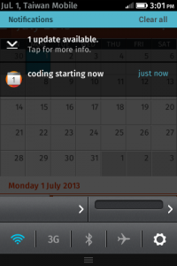

當使用者從 Firefox OS 手機收到一封新簡訊，在點下 Notification Bar 的簡訊通知後，預載的 SMS App 就會被啟動，但你知道在此過程中，預載的 SMS App 是如何切換到正確的簡訊串列來顯示簡訊內容的呢？

首先，使用 navigator.mozNotification.createNotification 可以在 Notification Bar 中加入一個 notification 通知。下面是建立一個 notification 通知的範例程式碼：

		
		

var title = " 886933123456";
var body = "Hello!";
var icon = "app://sms.gaiamobile.org/icon.png";
var notification = navigator.mozNotification.createNotification(title, body, icon);
			
				
					
				
					1234
				
						var title = " 886933123456";var body = "Hello!";var icon = "app://sms.gaiamobile.org/icon.png";var notification = navigator.mozNotification.createNotification(title, body, icon);
					
				
			
		

接下來，就是需要傳遞電話號碼參數給 SMS App，讓它知道要開啟哪個電話號碼的簡訊串。很可惜的，在使用 createNotification 函式建立 notification 時並沒有提供傳遞參數的機制。

讓我們來用 hacking 的方式來達成這個任務吧。我們可以在使用 createNotification 函式時，利用函式中的 iconURL 參數來傳遞電話號碼給 SMS App。iconURL 是一個圖示的 URL，它的值可能會是這樣：app://sms.gaiamobile.org/icon.png

而下面是 createNotification 函式的 Spec：

		
		

notification createNotification(
 in DOMString title, 
 in DOMString description, 
 in DOMString iconURL Optional 
);
			
				
					
				
					12345
				
						notification createNotification( in DOMString title,  in DOMString description,  in DOMString iconURL Optional );
					
				
			
		

接下來，在 iconURL 最後面先加入一個 ?，再把電話號碼放在 iconURL 參數的後面，像是這樣：

app://sms.gaiamobile.org/icon.png？ 886933123456

這樣在 SMS App 在接收到 notification 的 [オンライン ブラックジャック](https://www.theinnocents.org/)  system message 後，就可以在 navigator.mozSetMessageHandler 註冊的 callback 函式拿到電話號碼。下面是 SMS APP 接收電話號碼的範例程式碼：

		
		

navigator.mozSetMessageHandler("notification", function notificationClick(message) {
 if (!message.clicked) {
 return;
 }

 navigator.mozApps.getSelf().onsuccess = function(evt) {
 var app = evt.target.result;
 app.launch();

 // Getting back the number form the icon URL
 var notificationType = message.imageURL.split("?")[1];
 // Case regular "sms-received"
 if (notificationType == "sms-received") {
 var number = message.imageURL.split("?")[2];
 showThreadFromSystemMessage(number);
 return;
 }
 var number = message.title;
 // Class 0 message
 var messageBody = number "\n" message.body;
 alert(messageBody);
 };
});
			
				
					
				
					1234567891011121314151617181920212223
				
						navigator.mozSetMessageHandler("notification", function notificationClick(message) { if (!message.clicked) { return; }  navigator.mozApps.getSelf().onsuccess = function(evt) { var app = evt.target.result; app.launch();  // Getting back the number form the icon URL var notificationType = message.imageURL.split("?")[1]; // Case regular "sms-received" if (notificationType == "sms-received") { var number = message.imageURL.split("?")[2]; showThreadFromSystemMessage(number); return; } var number = message.title; // Class 0 message var messageBody = number "\n" message.body; alert(messageBody); };});
					
				
			
		

奇妙的事發生了，這樣就可以了，耶！

以上是一個 hacking 的做法，始終不是一個長久之計啊。我們來參考一下 [W3C Web Notifications](https://www.w3.org/TR/notifications/#api) 的標準吧。大家可以看到有一個 tag 的參數，在 SMS App 的例子中，我們可以用它來傳遞電話號碼給 SMS App，像是這樣：

		
		

new Notification(
 " 886933123456",
 { 
 iconUrl: "app://sms.gaiamobile.org/icon.png",
 body: "Hello!",
 tag: "tel= 886933123456"
 }
);
			
				
					
				
					12345678
				
						new Notification( " 886933123456", {  iconUrl: "app://sms.gaiamobile.org/icon.png", body: "Hello!", tag: "tel= 886933123456" });
					
				
			
		

接下來，Firefox OS 當然會支援 Web Notifications 的標準（[code 已經準備好了](https://bugzilla.mozilla.org/show_bug.cgi?id=782211)，就等 land 進去啦），之後我們就不用再這麼 hack 了。好，謝謝大家。:)

參考資料：

- [http://www.w3.org/TR/notifications/](https://www.w3.org/TR/notifications/)

- [https://developer.mozilla.org/en-US/docs/DOM/navigator.mozNotification](https://developer.mozilla.org/en-US/docs/DOM/navigator.mozNotification)

- [https://github.com/mozilla-b2g/gaia/blob/master/apps/sms/js/activity_handler.js#L175](https://github.com/mozilla-b2g/gaia/blob/master/apps/sms/js/activity_handler.js#L175)
