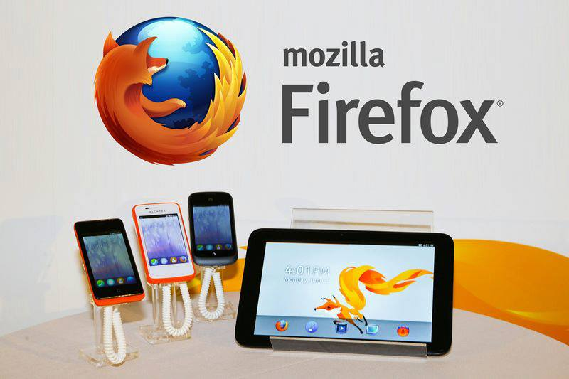
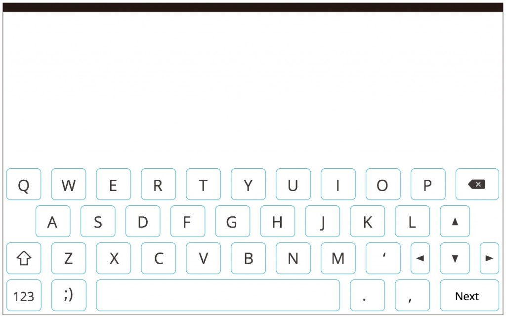
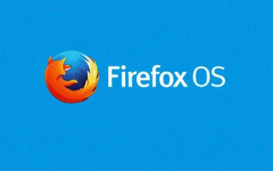
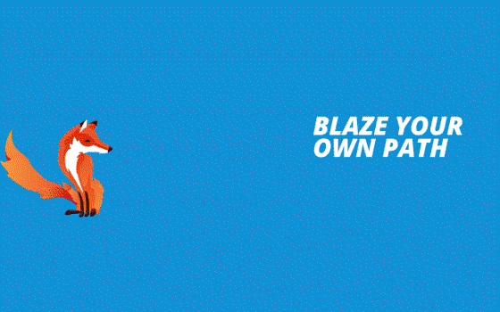

一個月前我們在 Computex 2013 發表了 Firefox OS 在平板上的預覽版，吸引了不少人的目光。(如果你還沒看過，本文最後有精華短片。)

雖然只是展示機器，但是當拿在手裡，身為工程師的我們，都會興奮的想讓它變成真的可以動的。

「那麼就來試試看吧！」我們有四週的時間。

現在就把時光倒回去，來看看我們如何用不到一個月的時間，做出可以操作的實機展示版(非成品)。

Week 0 » UX 重新設計版面

首先，我們的 UX 設計師針對平板的畫面大小以及平板不同於手機的使用方式，重新設計版面，包含：圖片大小、解析度、版面配置、佈景主題… 等等，也根據硬體規格，選擇要刪除的功能，以及要新增的功能，把更動範圍預估到是四週內可能完成的。

下面是一張設計師的草稿：針對虛擬鍵盤的按鍵大小、間距重新做了調整，完全參考真實鍵盤的配置(聽說他們精密測量了很久)，讓使用者打字更順手。

Week 1 » Milestone 1 大處著眼

後端工程師們拿到測試裝置後，一鍵把 Firefox OS 系統刷進去，竟然就能動了！不過繪圖速度有點慢，還有其他小細節需要調整。沒關係！還有三週可以慢慢調整。

前端工程師們開了 branch，並根據設計列出 issues、切 milestones，方便討論實作細節、掌握進度、回報新問題。這週我們的工作重點有幾項：

- 把不需要的功能移除。

- 能夠編譯出符合平板解析度的版本。

- 先進行畫面上比較大的版面更動，比如新的解鎖畫面、主畫面上的 App 按鈕變大且分散、設定變成雙欄設計… 等等。

利用 Firefox 的「適應式設計檢視模式」工具 (Responsive Design View) 可以切換到平板的解析度，讓手機版變平板版的工作簡單許多！

同時設計師團隊在製作各個 App 需要更動的設計稿圖(spec)，以及繪製高解析度的圖片。

這時候我們的畫面還很陽春，看起來是這樣：

Week 2 » Milestone 2 小處著手

後端工程師針對繪圖晶片、螢幕觸控感應器、以及其他硬體開始進行調整。這是一個困難的任務，要從 log 中找出一些蛛絲馬跡，調整各種可能的設定，仔細地檢查與測試。

前端工程師針對設計圖稿開始細部的調整，比如圖示大小與位置、系統視窗大小與置中、套用高解析度圖片…等等。當然不免會有一些更動後所造成的問題，也要記得開 issue 把它修掉。

此時我們也拿著這個半成品給設計師團隊看。這時候他們有了驚人之語：

「我覺得少了一點平板的特色… 我們加個數位相框功能吧！」

前端工程師們花了一個早上討論是否能在死線 (deadline) 之前把數位相框的效果做出來，結果發現是可行的！(尖叫歡呼)

設計師團隊當然也不是只出餿主意而已，他們馬上開始設計使用流程和相關設定。同時還要繪製新的開機動畫以及桌面背景。

這時候我們的畫面看起來是這樣：

Week 3 » Milestone 3 精雕細琢

後端工程師還埋首在 log 與設定調校之間，硬體開始表現得比較正常。

而前端工程師則開始精雕細琢每個 App 的細節，新的數位相框功能則由一位前端工程師開始實作。(沒錯，一人就可以。)

新的解鎖畫面完成、令人眼睛為之一亮的俏皮狐狸開機動畫也放上去了。

設計師團隊一邊補上所有高解析度圖片、一邊檢視我們的成果，哪怕只是一個像素的誤差，都難逃他們的法眼。

這時候我們的畫面已經變成這樣：

Week 4 » Milestone 4 大致底定

後端工程師把螢幕觸控調整正常，繪圖速度也達到一般水準。開始針對幾台展示機做一次整體的校準，並檢查是否有異常的機器。

前端工程師把數位相框實作完成、bug 們也通通修掉，其他 App 的細節也陸陸續續修改完畢。影片變成 3D 立體牆、桌面變成美麗大方的狐狸，也把展示時需要的資料放入。

「Firefox OS 平板展示機終於看起來有模有樣了！」

設計師團隊不停地把玩我們的成果，同時也開始錄製展示影片。

死線就在眼前，其實我們還有一些想做的… 但先就這樣吧！

2013年6月3日 » Computex 展示

x
[http://www.youtube.com/watch?v=KYXrZCxjArI](https://www.youtube.com/watch?v=KYXrZCxjArI)
最後列出平板預覽版與手機版差異的項目，讓大家參考。秉持着 Mozilla 開放原始碼與公開討論的精神，這一切的更動軌跡，有興趣的人不妨到我們的 Github 上面去追尋。

原始碼：[https://github.com/gaia-local](https://github.com/gaia-local)

Issues (以 Milestone 分)：[https://github.com/gaia-local/gaia/issues/milestones?state=closed](https://github.com/gaia-local/gaia/issues/milestones?state=closed)

更動項目：

- App 版面更動：系統、瀏覽器、主畫面、設定、圖庫、音樂、影片、鍵盤

- 重新製作 & 新功能：解鎖畫面、數位相框、3D 影片牆

- 未展示功能：電信通話相關、藍牙、相機
