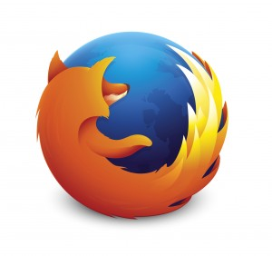
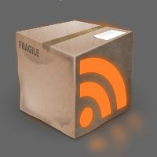

Scalable Vector Graphics (SVG)，可縮放向量圖形，是一種 XML 標記語言，用來描述二維向量圖形。SVG 對一般使用者而言， 也許是個相對陌生的名詞，但是我相信大家一定聽過 Adobe Flash，SVG 跟 Flash 一樣，其特點都是使用向量圖形，與事件觸發高度整合，非常適合用來開發互動式元件或是網頁。

我 Flash 用的好好的，幹嘛要換成什麼 SVG ?

你興沖沖的開啟某網頁，卻跳出必須下載並安裝播放器外掛，否則無法正常觀看內容的擾人經驗嗎？ SVG 是由 W3C 建議並制定的標準語言，特別設計用來跟 CSS、DOM 和 SMIL 一起共同運作的元件，當然，其技術也是公開共享。也就是說，這項技術不屬於任何一家營利公司，瀏覽器不需要安裝額外的 plug-in 來執行，使用者和開發者也不需要支付任何費用給特定的營利組織。

SVG 還有很多其他優點喔！

解析度不夠高的點陣圖（例如 .png、.jpg 格式的圖片），放大之後的影像會像馬賽克一樣模糊，邊緣也會呈現鋸齒狀。向量圖形顧名思義是由向量組成，電腦會根據這些向量或是其他數據計算出圖形，而其中最大的優點，就是在放大或是縮小圖形時，影像都不會失真。讓我們來看看這個例子 [[SVG – 經典火狐](https://tech.mozilla.com.tw/wp-content/uploads/2013/07/firefox-logos.htm)]：左邊的火狐 logo 是原始的 SVG 圖形，右邊的火狐 logo 是直接將它放大三倍的樣子，圖像的品質看起來是不是都一樣？另外值得一提的是，現今行動裝置百百種，螢幕大小也是相當多樣，相信行動裝置軟體的開發者一定不喜歡同樣的圖形元件要做好幾個不同大小的版本，如果要修改某個元件，其他大小的某元件也要一一修改，實在是件費時耗力的苦工。但是 SVG 只需要簡單幾個指令，就能達到想要的效果，例如將原圖 [line 1] 放大三倍，只需要加上 transform="scale(3.0)" 這個 attribute [line 2]，就能輕鬆改變圖形大小。

line 1 <use xlink:href="#Firefox"/>

line 2 <use xlink:href="#Firefox" transform="translate(200, 0) scale(3.0)"/>

最棒的是，SVG 檔案的大小遠小於點陣圖，這差距在高解析度的圖形上尤其明顯，下面這個火狐 logo [1]，是 jpg 格式，2485×2340，300dpi，703.9kB，而這個差不多大小的 SVG 火狐 logo [[SVG – 放大火狐](https://tech.mozilla.com.tw/wp-content/uploads/2013/08/firefox-big-logo.htm)]，只有 44.7kB 喔！[2] 在開發 Retina 或是 HD 螢幕顯示的行動裝置，足以省下不少資源。

[1] 圖片取自 [Firefox branding] [http://www.mozilla.org/en-US/styleguide/identity/firefox/branding/ 2] 由於無法取得一模一樣的 SVG firefox logo，所以只能說是粗略的比較。

另外，SVG 也非常適用於互動式的文件開發，由於 SVG 自身的每個標籤，都可視作 DOM 元件，所以可以輕鬆與滑鼠點擊或是鍵盤等的事件做結合。SVG 自身的檔案大小也不因圖像大小而有所改變，如果你想要開發的應用程式，包含大範圍的圖形顯示，並且參雜不少使用者互動，例如 Google Maps，SVG 絕對是你的首選！

動畫的部份，則由 SMIL (Synchronized Multimedia Integration Language)，同步多媒體整合語言來定義，同樣也是 W3C 為描述多媒體而提出的建議標準。對動畫的時間屬性，座標轉換，顏色成像，以及多媒體嵌入等都有不少的定義。以下這個例子 [[SVG – 旋轉火狐](https://tech.mozilla.com.tw/wp-content/uploads/2013/07/firefox-logo-rotate.htm)]，便是由 SMIL 的 animateTransform 標籤來旋轉火狐 logo 的呢！

最後為各位介紹一款 SVG 的編輯工具：[Inkscape](https://inkscape.org/)。一款向量圖形編輯器，同樣也是以開源軟體授權發布與使用。雖然還沒有動畫部份的整合，但是其他方面都開發的相當完善，也很容易可以找到 SVG 的示範教學喔！以下推薦幾個學習 Inkspace 的網站跟影片：

[Use Inkscape to Create a Grunge RSS Box Icon](https://vector.tutsplus.com/tutorials/icon-design/use-inkscape-to-create-a-grunge-rss-box-icon/)

[Drawing snowman in 3D with Inkscape](https://libregraphicsworld.org/blog/entry/drawing-3d-objects-in-inkscape)

[Youtube : Inkscape Flourish](https://www.youtube.com/watch?v=q8XORGTMjIs)
