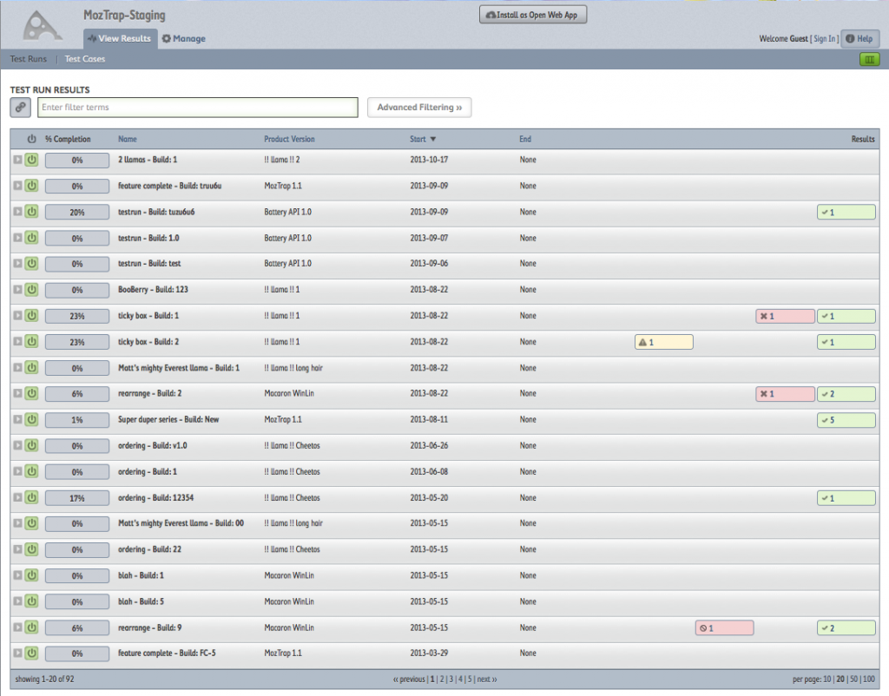

身為測試工程師，想要管理你的測試項目也是合情合理的。在 Mozilla 使用 bugzilla 來追蹤程式問題以及待辦事項，但如何發現並且驗證這些，便需要測試工程師分析功能以及使用者行為，轉化為測試項目並執行了。隨著時間推進、功能增加，測試項目並非只要將其逐一執行即達到目標，我們需要更好的工具讓不同目的的測試能夠容易的找到對應的測項，好的界面以便執行以及輸出結果。對於這樣的需求， Mozilla 推出了 MozTrap 。

#### 什麼是 MozTrap ？

MozTrap 是一個測試項目管理系統（ Test Case Manager ），以 Django 和 MySQL 打造而成。小y 的文章[想學-pythondjango-就從-mozilla-網站專案開始吧！](https://tech.mozilla.com.tw/tech.mozilla.com.tw/posts/2390/%E6%83%B3%E5%AD%B8-pythondjango-%E5%B0%B1%E5%BE%9E-mozilla-%E7%B6%B2%E7%AB%99%E5%B0%88%E6%A1%88%E9%96%8B%E5%A7%8B%E5%90%A7%EF%BC%81) 介紹了 Django。MozTrap 是完全開源的，你可以下載他並且使用於自己 project 的測試中。

先來看看他的界面吧！你可以透過這個[測試網站](https://moztrap.allizom.org/results/runs/)來瀏覽 MozTrap 的部份操作。

#### 安裝 MozTrap

Mozilla 安裝說明裡有[詳細的步驟](https://moztrap.readthedocs.org/en/1.4.6/installation.html)，如果你只想使用 MozTrap ，可以參考以下的步驟。

- 建議準備一台 Linux 平台的電腦，Mac 亦可

- 檢查你的環境是否安裝了以下的軟體， Python 2.6/2.7 、MySQL 5.1+ 、git、virtualenv、virtualenvwrapper

- 執行以下的腳本： git clone --recursive git://github.com/mozilla/moztrap cd moztrap mkvirtualenv moztrap bin/install-reqs echo "CREATE DATABASE moztrap CHARACTER SET utf8" | mysql ./manage.py syncdb --migrate ./manage.py create_default_roles ./manage.py runserver 1 2 3 4 5 6 7 8 9 git clone -- recursive git : //github.com/mozilla/moztrap cd moztrap mkvirtualenv moztrap bin / install - reqs echo "CREATE DATABASE moztrap CHARACTER SET utf8" | mysql . / manage . py syncdb -- migrate . / manage . py create_default _ roles . / manage . py runserver

- 用你的瀏覽器造訪 http://localhost:8000 ，可以看到登入畫面的話，恭喜你！

#### 管理者界面

目前大部分的相關文件都可以在 MozTrap 官網上面看到，我們簡單敘述一些使用方法。注意，想要操作管理者界面，你必須有 admin 權限。

管理使用者

使用者管理須經由 Navigator bar → Manage → Users 開啟。並且需要有最高管理權限。你可以在此作使用者的新增，刪除，啟用，關閉，以及賦予角色（角色與權限相關）
管理專案版本（Product Version）

每個專案都會產生許多版本，而版本號碼是測項的一個重要性質。想像沒有版本的測項，測試者無從得知版本便無法知道應有的測試步驟以及前置步驟。建立一個新版本時，該專案底下所有測試項目都會增加一個對應該版本的測試項目。版本號碼本身以點符號隔開，分別可以排序。特別要注意有些特別字串提供不同的排序規則。正式版本定義上與 pre-release 相同，也就是 2.1a ， 2.1alpha ， 2.1beta 在排序上會在 2.1 之前。而 rc ， pre ， Release ， Pre-release 這些詞與 c 是等價的（同時可以想到， 2.1g 這樣的版本可以被考慮是 release 之後的版本）。最特別是 dev 會被排在所有詞之前， 像是 2.1a ， 2.1b 將要排在 2.1dev 之後。
管理測試集（ Test Suite）

進行 test suite 管理，可以從 Navigator bar 找到 Manage → Suites 。 Test suite 是一個測試項目的集合，並且是匯入大量測試項目的唯一方法。管理 test suite 方法是藉由篩選並挑出適合的測試項目，再匯入至所選的 test suite 。移除也是透過同樣的界面，在 suite 中尋找並移除。
管理環境

環境是指測試的一種配置。在 MozTrap 裡，可以分為 Element 以及 Category 。 Element 包含各種獨立的環境因素，例如平台，可以為 windows XP，而 Category 是同一種 Element 的集合，像是 windows 98 ， windows XP ， linux 形成三個元素的 Category。 Environment profile 則是蒐集許多 Environment 參數所得。一個 project 可以使用不同的 profile 而一個 profile 也可能為多個 project 所用。這可能是 MozTrap 中最複雜的一個功能，可以在找到更詳細的說明。
管理 Test Run

Test Run 即是一次的執行測試，他包含了測試項目在某種環境設定下的集合。同樣透過 Navigator bar 找到 Manage → Runs 。
撰寫與管理測試項目需要登入才能夠開始。 MozTrap 支援 Open ID ， WordPress Login ， Mozilla Persona 以及直接在 MozTrap 系統註冊。前面的步驟完成，就可以開始編寫測試項目。趕快試試看吧！
MozTrap 目前版本到 1.4.7，歡迎對測試管理有興趣的人使用，也可以參加開發以加入你的巧思！

#### 參考資源

- 首頁: https://moztrap.readthedocs.org/en/latest/#

- Forum: https://groups.google.com/forum/?fromgroups#!forum/moztrap

- github: https://github.com/mozilla/moztrap/

- 回報問題: https://bugzilla.mozilla.org/enter_bug.cgi?component=MozTrap&product=Mozilla%20QA
