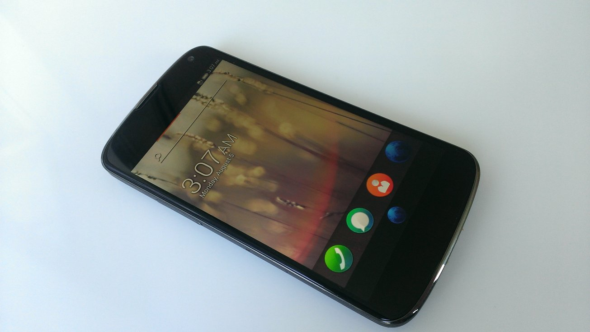

Firefox OS 的誕生早就不是新聞，但是你也許不知道 Firefox OS 早就貼心提供了平易近人的 build code 環境，以免各位在一開始徬徨無助的時候，就被奇怪的 build failed 給嚇跑了。

沒錯只要跟著下面的三個步驟，就可以 build 好 Firefox OS 的 image 喔！

不過，在開始之前要根據不同的作業系統做些[準備](https://developer.mozilla.org/en-US/docs/Mozilla/Firefox_OS/Firefox_OS_build_prerequisites?redirectlocale=en-US)。

		
		

$ git clone git://github.com/mozilla-b2g/B2G.git .
$ ./config.sh (device name)
$ ./build.sh
			
				
					
				
					123
				
						$ git clone git://github.com/mozilla-b2g/B2G.git .$ ./config.sh (device name)$ ./build.sh
					
				
			
		

第一步驟的 git clone 是要將我們指定的 git repository 抓到我們的 local machine ，別擔心，這部分花不了多少時間。主要是一些 shell script 可以幫助接下來的步驟簡單的完成，以及一些 debug 相關的 tool。

但是，到第二步驟的時候馬上就冒出了問號，要怎麼知道括號裡面的 device name 要填什麼呢？你的問題我們也都想到了，所以在決定之前，只要打 ./config.sh 就可以知道現在 support 的 device 有哪些囉

		
		

Valid devices to configure are:
- galaxy-s2
- galaxy-nexus
- nexus-4
- nexus-s
- nexus-s-4g
- otoro
- unagi
- inari
- keon
- peak
- leo
- hamachi
- helix
- wasabi
- tara
- pandaboard
- emulator
- emulator-jb
- emulator-x86
- emulator-x86-jb
			
				
					
				
					123456789101112131415161718192021
				
						Valid devices to configure are:- galaxy-s2- galaxy-nexus- nexus-4- nexus-s- nexus-s-4g- otoro- unagi- inari- keon- peak- leo- hamachi- helix- wasabi- tara- pandaboard- emulator- emulator-jb- emulator-x86- emulator-x86-jb
					
				
			
		

這個表列出來現在我們支援的所有 device ，當然這個表會持續的增加，一段時間之後想要 update 的話，使用下面的 command 就可以更新現有的 B2G repository

		
		

$ git fetch origin
$ git checkout origin/master
			
				
					
				
					12
				
						$ git fetch origin$ git checkout origin/master
					
				
			
		

這邊我們拿一隻膾炙人口的 nexus-4 當做例子，並且透過指定 branch 的方式確保我們使用的是 master branch，所謂的 master 就是跟著全世界的腳步走在第一線的 code，所有的 history 或是新的 feature 都可以從這邊一探究竟。

		
		

$ BRANCH=master ./config.sh nexus-4
			
				
					
				
					1
				
						$ BRANCH=master ./config.sh nexus-4
					
				
			
		

這步驟其實需要一點時間，既然有點時間，剛好可以把 config.sh 打開來看看到底什麼事情要做那麼久。

		
		

./repo init -u git://github.com/mozilla-b2g/b2g-manifest -b master -m nexus-4.xml
./repo sync
			
				
					
				
					12
				
						./repo init -u git://github.com/mozilla-b2g/b2g-manifest -b master -m nexus-4.xml./repo sync
					
				
			
		

結果其實是在抓 code ！難怪需要一點時間，既然這樣就來看看到底 B2G 的 code 究竟是從哪來的呢？首先看到的是 remote 端到底有哪些 source, 這邊很清楚的定義了一個 aosp 以及兩個 mozilla 的 repository。[這裡](https://git-repo.googlecode.com/git-history/v1.6.8.2/docs/manifest-format.txt)提供了關於 manifest 的詳細說明。

		
		

 <remote fetch="https://android.googlesource.com/" name="aosp"/>
 <remote fetch="git://github.com/mozilla-b2g/" name="b2g"/>
 <remote fetch="git://github.com/mozilla/" name="mozilla"/>
			
				
					
				
					123
				
						 <remote fetch="https://android.googlesource.com/" name="aosp"/> <remote fetch="git://github.com/mozilla-b2g/" name="b2g"/> <remote fetch="git://github.com/mozilla/" name="mozilla"/>
					
				
			
		

接下來就看到了其實 manifest 裏面分成了三大部份，下面就節錄部份內容解釋

1. B2G 的 code，都是放在 github 上的，其中當然包含了遠近馳名的 Gecko 以及 Gaia。最酷的部份就是一段時間就會有好多 commit 跑出來，隨時有任何想法或是意見，都可以 feedback 給 Mozilla ！

		
		

 <!-- B2G specific things. -->
 <project name="platform_build" path="build" remote="b2g" revision="b2g-4.3_r2.1">
    <copyfile dest="Makefile" src="core/root.mk"/>
 </project>
 <project name="mozilla-central" path="gecko" remote="mozilla" revision="master"/>
 <project name="gaia" path="gaia" remote="b2g" revision="master"/>
 <project name="gonk-misc" path="gonk-misc" remote="b2g" revision="master"/>
			
				
					
				
					1234567
				
						 <!-- B2G specific things. --> <project name="platform_build" path="build" remote="b2g" revision="b2g-4.3_r2.1">    <copyfile dest="Makefile" src="core/root.mk"/> </project> <project name="mozilla-central" path="gecko" remote="mozilla" revision="master"/> <project name="gaia" path="gaia" remote="b2g" revision="master"/> <project name="gonk-misc" path="gonk-misc" remote="b2g" revision="master"/>
					
				
			
		

2. 這部份都是從一些既有的 open source 像是 linux ， aosp ， arm 抓下來的。

		
		

 <!-- Stock Android things -->
 <project groups="linux,arm" name="platform/prebuilts/gcc/linux-x86/arm/arm-eabi-4.7" path="prebuilts/gcc/linux-x86/arm/arm-eabi-4.7"/>
 <project groups="linux,arm" name="platform/prebuilts/gcc/linux-x86/arm/arm-linux-androideabi-4.7" path="prebuilts/gcc/linux-x86/arm/arm-linux-androideabi-4.7"/>
 <project name="platform/abi/cpp" path="abi/cpp"/>
 <project name="platform/bionic" path="bionic"/>
			
				
					
				
					12345
				
						 <!-- Stock Android things --> <project groups="linux,arm" name="platform/prebuilts/gcc/linux-x86/arm/arm-eabi-4.7" path="prebuilts/gcc/linux-x86/arm/arm-eabi-4.7"/> <project groups="linux,arm" name="platform/prebuilts/gcc/linux-x86/arm/arm-linux-androideabi-4.7" path="prebuilts/gcc/linux-x86/arm/arm-linux-androideabi-4.7"/> <project name="platform/abi/cpp" path="abi/cpp"/> <project name="platform/bionic" path="bionic"/>
					
				
			
		

3. 最後的 Nexus 4 部份就是針對 device 本身的 component 以及設計上的差異，所需要的那些相對應的支援。所以這邊往往都會透露了許多的硬體規格喔！

		
		

 <!-- Nexus 4 specific things -->
 <project name="device-mako" path="device/lge/mako" remote="b2g" revision="b2g-4.3_r2.1"/>
 <project name="platform/hardware/broadcom/wlan" path="hardware/broadcom/wlan"/>
 <project name="platform/hardware/qcom/audio" path="hardware/qcom/audio"/>
 <project name="platform/hardware/qcom/msm8960" path="hardware/qcom/msm8960"/>
			
				
					
				
					12345
				
						 <!-- Nexus 4 specific things --> <project name="device-mako" path="device/lge/mako" remote="b2g" revision="b2g-4.3_r2.1"/> <project name="platform/hardware/broadcom/wlan" path="hardware/broadcom/wlan"/> <project name="platform/hardware/qcom/audio" path="hardware/qcom/audio"/> <project name="platform/hardware/qcom/msm8960" path="hardware/qcom/msm8960"/>
					
				
			
		

其實看完 manifest.xml 也知道了 Firefox OS 並沒有打算根據某些特定的 BSP 去做什麼架構上的改變，反而是要跟底層做出切割，也就是說不管底層怎麼換，Firefox OS 都是要可以跑的！

第三步驟就是直接 ./build.sh 了，這邊基本上不會有什麼問題，畢竟全部的人都是從這些 open source 的地方去取得 source code 的，就放心的等待吧。

image 檔 build 出來之後就可以準備變身 FireFox OS 囉！

