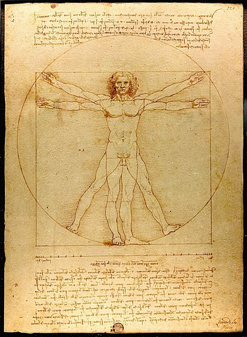
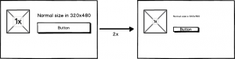
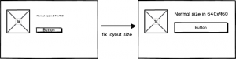
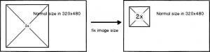
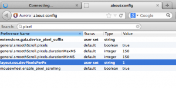

credit http://en.wikipedia.org/wiki/File:Da_Vinci_Vitruve_Luc_Viatour.jpg

使用網頁技術開發應用的好處，是讓使用者不管在什麼設備上，只要有瀏覽器支援，基本上都能使用自己習慣的服務。同時若有需要，也可以較容易地透過 [Apache Cordova](https://cordova.apache.org/) 等技術，將網頁應用封裝成不同平台的原生應用。在多種手持設備作業系統並存的今日，開發者也能在同一個（廣闊的）技術領域累積自己的技術能力，以應對越來越複雜的挑戰。

因為我相信以上的想法，所以今年初因緣際會進入了 Mozilla，得以用全部的時間嘗試「開源 x 移動 x 網頁」技術（Open x Mobile x Web）。（想要參與 Firefox OS 前端開發的朋友，可以先看我整理的 [Steps to Contribute Gaia](https://www.slideshare.net/gasolin/steps-to-contribute-to-firefox-os-2)簡報）。

## 讓網頁應用支援多種設備

在這邊想和大家分享近期正要解決的工程難題，並在開始動工的早期，收集大家的意見：

如何讓 Gaia 網頁應用（web app）和其他的網頁應用也能支援多種設備？

所謂的多種設備，需要考量的除了各種大小的手機、平板之外，還包含可能使用的電腦、電視等設備。

我們想要達到的，是用最小的修改，支援盡量多的設備。經過一段研究與試驗的過程，得到要讓網頁應用支援多種設備，開發者需要根據設備的「像素密度」（Pixel Density）與「螢幕大小」（Screen Size），處理相對應的「排版」與「圖片」問題。本篇將闡述處理「像素密度」（Pixel Density）相關問題的方式。

## 「像素密度」

螢幕能顯示的大小，通常都使用「像素」來表示。例如 Firefox OS 剛開始時支援的手機螢幕解析度是 320×480。表示使用的是能顯示寬 320 點像素，長 480 點像素的手機螢幕。這時基本的像素密度是 1x（x 通常代表倍數）。如果想在一樣實體大小的手機上，將螢幕解析度增加到 640×960 （iPhone 4 是其中的代表），拿出其中一個維度來看，就像是在一把共 320 個刻度的尺上刻上 2 倍的刻度。為了在同樣大小的尺上擠進 2 倍的刻度，我們得將原來尺上的每一個刻度再更細地劃分成 2 個刻度（320 x 2 = 640），這時像素密度是 2x。

當然像素不是尺，所以除了 2x 之外，還有 1.5x 等倍數出現。

## 「設備像素」（Device Pixel） 和 「CSS像素」（CSS Pixel）

解析度翻倍，畫面更細緻，但使用者介面變得太小

我們原本所理解螢幕上的像素，是螢幕上每個負責顯示圖像的物理單位。每個像素都可以顯示獨立的顏色、亮度，每個像素的大小是固定的。

曾經我們在瀏覽器中使用「window.screen.width」或「window.innerWidth」等方法所取得的像素，與實際設備上的像素是一致的。但 2011 年 Apple 推出了 iPhone 4。在一樣的螢幕尺吋下，將原本 320×480 解析度的螢幕一舉升級成了 640×960 解析度。但這麼一來，原本透過偵測「螢幕寬度小於 320/480px，就顯示手機版」這樣的邏輯，來特化手機版網頁的眾多網站就要出問題了。

為了解決相容性問題，從此在不同像素密度的機器上，網站透過瀏覽器所取得的像素，不再與實際的像素相同，透過瀏覽器所得到的像素是「實際的像素/像素密度」的值。為了區別兩種「像素」，硬體上的實際像素被稱為設備像素（Device Pixel）。而在瀏覽器中透過 CSS/JS 取得的像素值被稱為 CSS 像素（CSS Pixel）。

從另一個角度來看，因為不同機種上的像素密度不同，可能會出現同樣是 960×1280 解析度的機種，但一個是手機（3~5吋），一個是平板（5~10吋）的情況。考慮到手機的螢幕小多了，要是在上面使用相同的像素來顯示一樣的按鈕（介面元件），按鈕很容易小到變得難以觸摸。若使用 CSS 像素來定義介面元件大小，則可以在畫面上維持相近的排版。

## 「像素密度」 x 「排版」

使用’rem’為排版單位，使版面維持一致

我們在開發網頁時，以同尺寸、但三種不同像素密度的機種來看，實際的像素是320px（320 x 1x）、480px（320 x 1.5x）、640px（320 x 2x）（設備像素），但透過 「window.screen.width」API 一樣會取得 320px（CSS 像素），以盡量減少不同像素密度可能造成應用的排版問題。

在[前一篇文章（伸縮自如 – Gaia 的多解析度支援）](https://tech.mozilla.com.tw/posts/2360/%e4%bc%b8%e7%b8%ae%e8%87%aa%e5%a6%82-gaia-%e7%9a%84%e5%a4%9a%e8%a7%a3%e6%9e%90%e5%ba%a6%e6%94%af%e6%8f%b4) 裡，同事已分享了我們在目前的開發分支（v1.1.0hd）中，對不同像素密度（Pixel Density）機種所做的支援。提到了在開發分支中我們已使用[rem](https://developer.mozilla.org/en-US/docs/Web/CSS/length#rem)取代px作為基本排版單位，參照「html」標籤定義的「font-size」作縮放，讓版面在不同像素密度機種上維持排版的一致 [3]。

Firefox OS 中在 1x 像素密度的環境下，將每 1 個 rem 定義成 10 個設備像素。因此在修改的過程中，我們將原本使用的 10 CSS像素 (px) 單位改為 1 rem。

對於網頁應用來說，不同像素密度機種排版的特色，是整體因為從 JS/CSS 取得的寬高仍維持不變，所以排版大致維持不變。但因為實際的像素已有提升，所以在同樣尺寸的機種上，卻可以看到更多網頁內容。

## 「像素密度」 x 「圖片」

使用高解析圖片並固定圖片寬度，得到相同大小但更犀利的圖片

為了支援多重像素密度機種，在Gaia中已經提供了基本圖片(.png)和使用@1.5x.png、@2x.png來滿足不同像素密度的需求。

至於圖片與像素密度的關係，我們先來看在 1x像素密度下的原圖（logo.png）

在 2x 像素密度的機種上，因為實際的解析度是原來的2倍，呈現在畫面上是每個像素被放大 2 倍的樣子：

我們看到，因為原來的圖片解析度比較差，在高解析度設備上放大後可以看到細節上出現了鋸齒。

我們可以做的，是提供2x解析度的圖片（logo@2x.png，通常以後綴@2x.png命名）

有趣的是，因為在沒有設定大小的情況，圖片在網頁上排版會以它的像素大小為準，在畫面上顯示的圖片大小會是原本的2倍，於是畫面上看到的樣子是這樣：

解決的方法，是在每個圖片上加入寬高設定。例如原本加圖片只寫：

background: url(‘/style/images/loading_spinner.png’);

要支援多重像素密度的機種，需要明確指定圖片的大小：

background: url(‘/style/images/loading_spinner.png’);

background-size: 6rem;

修改之後，在高像素密度設備上的圖片，終於再次回到原本應顯示的大小。

## Gaia 如何提供不同像素密度的圖片

另一個「像素密度」 x 「圖片」的問題，是如何提供不同像素密度的圖片。因為 Gaia 的目的是提供各 Firefox OS 機種預裝，裝在同一個機種上時，只會有其中一種像素密度，並不需要同時提供不同像素密度的圖片。所以可使用編譯工具來在不同像素密度之間切換。

前篇文章中使用的「HIDPI=1」參數，已被「GAIA_DEV_PIXELS_PER_PX=像素密度」替換。例如想替換成 2x 像素密度圖片，可以使用如下命令：

$ make DEBUG=1 GAIA_DEV_PIXELS_PER_PX=2

## 透過 Firefox 瀏覽器測試像素密度

執行後使用 Firefox Nightly 或 Aurora 版本來執行 Gaia 測試。這時預設的像素密度還是 1x。

我 們可以開啓「about:config」分頁，搜尋「pixel」，修改「layout.css.devPixelsPerPx」參數值成「2」（代表2 倍像素密度），則整個瀏覽器會被設定成對應的像素密度。（因為實際桌面的解析度並沒改變，提高像素密度的效果就是整個瀏覽器畫面「長大」了）。

## 總結

開發者要根據設備的「像素密度」（Pixel Density）與「螢幕大小」（Screen Size），處理相對應的「排版」與「圖片」問題。

要支援不同像素密度的機種：

- CSS像素 = 設備像素 / 像素密度

- 用 rem 取代 px 作為基本排版單位

- 圖片上加入寬高設定

## 參考資料

（如果讀者想知道這主題有多難寫，看看繞口的相關文章標題就可以一窺一二）

- [A pixel is not a pixel](https://developer.mozilla.org/en-US/docs/Mozilla/Mobile/Viewport_meta_tag#A_pixel_is_not_a_pixel)

- [A pixel is not a pixel is not a pixel](https://www.quirksmode.org/blog/archives/2010/04/a_pixel_is_not.html)

- [Relative is the new absolute: the rem unit](https://www.css3files.com/2012/10/11/relative-is-the-new-absolute-the-rem-unit/)
