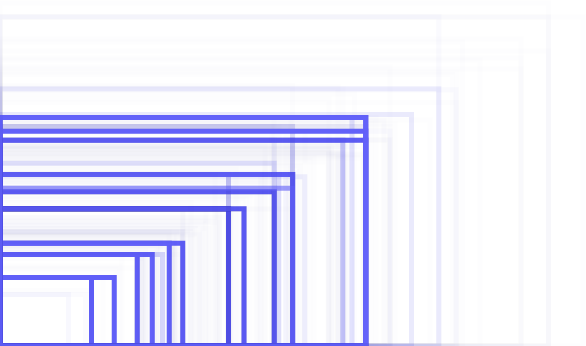

各種常見的螢幕大小

我們發現到：要讓網頁應用支援多種設備，開發者需要根據設備的「像素密度」（Pixel Density）與「螢幕大小」（Screen Size），處理相對應的「排版」與「圖片」問題。接續前一篇，本篇將闡述處理「螢幕大小」（Screen Size）的方式。

（現在Gaia關於多重設備支援的工作正開始著手進行，以下建議都還有修改的可能性，歡迎大家提出自己的建議。想要直接參與 Firefox OS 前端開發的朋友，可以先看我整理的 [Steps to Contribute Gaia](https://www.slideshare.net/gasolin/steps-to-contribute-to-firefox-os-2)簡報）

## 「螢幕大小」（Screen Size）

螢幕大小指的是整部機器「放大了」，在螢幕上的「像素」變多了，能同時顯示或操作更多的內容。從手機、平板、筆電、電視，我們可以看到各種不同大小、解析度的螢幕，並且都有各自慣用的使用界面和操作方式。

「像素密度」要解決的，是在相同的使用界面下，各種排版與圖片的問題。而「螢幕大小」則需要解決如何因應不同螢幕大小來提供不同使用者界面，與在不盡相同的使用界面下，各種排版與圖片的問題。因為我們很有可能需要因應不同螢幕大小的操作習慣，而有不同的設計。

要解決這些「螢幕大小」的問題，最主要的工具就是 CSS media query。

## 因應不同螢幕大小來提供不同使用者界面 – 使用 MediaQuery

Mozilla Developer 網站上有很清楚地關於 [CSS Media Queries](https://developer.mozilla.org/en-US/docs/Web/Guide/CSS/Media_queries)的使用與介紹。簡單地說 Media Query 的功用是讓開發者可以透過過濾網頁的寬、高等條件，來讓網頁套用不同的排版方式。也可以根據不同Media Query的結果，來套用不同大小的圖片。例如：

		
		

			
				
					
				
					12345678
				
						 
					
				
			
		

@media 是 Media Query 語法的標籤，「max-width」屬性設定表示要執行以下排版的條件，是螢幕的最大寬度必須小於「600px」。

## 「螢幕大小」x 「排版」

看起來美好，但實行起來還有很多細節需要注意。因為 Gaia 專案上同時間有近百位開發者在協作，每個人對於不同設備的認知莫衷一是：到底什麼樣的長、寬屬於手機？什麼樣的屬於平板？現在的大手機（Phone Tablet）又屬於什麼版型哩？

於是我們要研究的排版問題就變成：

- 應該用什麼版型作為預設值？

- 如何選擇適當的分隔點/斷點（break point），來簡單區分不同大小的機種？

這兩個問題其實都可以向外找到解答。我們參考了多家 UI framework 如 [Bootstrap](https://getbootstrap.com/)、[Fundation](https://foundation.zurb.com/)、[tuktuk](https://tuktuk.tapquo.com/) 等的做法，發現移動設備優先（Mobile First）已經是各家 UI Framework 的趨勢。而 Firefox OS 原本已有的就是手機的版型，想要擴展支援其他設備的版型，正好作為參考。

再來的問題是如何區分不同大小的機種。進一步查看各家作為區分機種大小的斷點（break point）參數，發現每家用的參數與命名也都不盡相同。我認為更重要的是開發前選擇其中一種規則，並讓大家用相同的斷點參數，保持整個系統的一致性。最後我們選擇追隨 [Bootstrap 3](https://github.com/twbs/bootstrap/blob/3.0.0-wip/less/variables.less)  的規則，來區分不同螢幕大小的機種。

因為現在的機種分界越來越模糊，單純使用「phone」「tablet」「desktop」這些名詞，反而可能造成誤解。可以把螢幕的大小當作T恤的Size來區分，搭配斷點來看，螢幕大小可以區分如下：

- Tiny ( 1200)

在現階段，我們將使用「768px」來分辨出相對手機螢幕的「大」設備（平板大小的螢幕）。

如此這般，我們的基本指南就出來了：

1. 在原本的手機排版外，針對不同螢幕大小，使用 Media Query 搭配斷點（768px）來加入不同機種的排版。

2. 附加的 Media Query 排版只修改原排版中需改動的部分，不需全部複製。

/* general */

.apps ol > li {

position: relative;

width: 25%; /* 4 app in a line*/

display: inline-block;

float: left;

text-align: center;

}

/* large device */

@media (min-width: 768px) and () {

.apps ol > li {

   width: 20%; /* five a line */

}

}

另外，如果排版改動很大，在匯入CSS時也可以另外建立一個原檔案加上「_large」後綴的檔案。

<!– normal style –>

<link rel=”stylesheet” href=”dock.css” />

<!– large specific style –>

<link rel=”stylesheet” media=”(min-width: 768px)” href=”dock_large.css” />

同時，在Gaia專案中，我們也會提供一個共用的 shared/js/screen_layout.js 工具，可以在程式中呼叫 ScreenLayout.getScreenLayout() 來確認網頁應用當時的螢幕大小，在一般手機上會回傳「tiny」字串，在不同尺寸的平板上會回傳「medium」或「large」字串。

## 「螢幕大小」x 「圖片」

因為不同螢幕大小機種的排版不同，所使用的圖片也可能完全不同。我們可以同樣使用 Media Query 來為不同機種提供圖片：

background-image: url(images/img.png”);

}

@media (min-width: 768px) {

background-image: url(images/img_large.png);

}

## 螢幕比例 Aspect

Media Query 還可以順便解決因螢幕長寬比例（如 4:3 和 16:9）不同，所造成一些圖片不滿版的問題

@media (device-aspect-ratio: 16/9) {

}

@media (device-aspect-ratio: 4/3) {

}

@media (min-width: 768px) and (device-aspect-ratio: 16/9) {

}

@media (min-width: 768px) and (device-aspect-ratio: 4/3) {

}

## 總結

要支援不同螢幕大小的設備：

- 善用MediaQuery

- 提供對應的圖片與圖示
