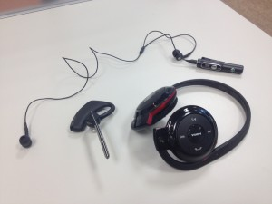
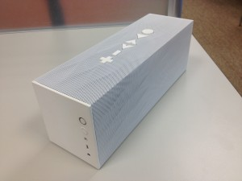
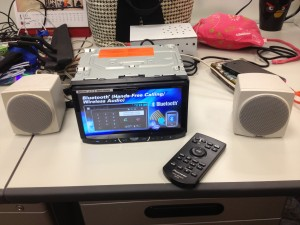

（圖片來源：[http://www.flickr.com/photos/intelfreepress/8401881183/](https://www.flickr.com/photos/intelfreepress/8401881183/)）

身為一個完全沒碰過藍牙的新手，在加入 Firefox OS 藍牙團隊開始開發後，接觸到的一切都令我感到新奇有趣：包括藍牙的軟體架構及傳輸概念、各種不同用途的 Profiles、以及千奇百怪的測試要求等。而其中最讓我印象深刻的，就是各式各樣琳琅滿目的藍牙配件，這些配件不只用來開發新用途的 Profile，同時也能驗證 Firefox OS 裝置跟不同配件間的相容性。下面就來介紹我們平常開發使用的這些配件吧！

#### 耳機

這是我們最常使用的配件。目前 Firefox OS 支援的 Hands-Free Profile (HFP) 和 Headset Profile (HSP) 都是用藍牙耳機進行開發。HFP 跟 HSP 讓 Firefox OS 裝置利用藍芽耳機接聽及撥打電話。每支耳機的行為及支援功能有些差異，有的耳機更提供音樂播放及控制的功能。

#### 喇叭

開發 Advanced Audio Distribution Profile (A2DP) 及 Audio/Video Remote Control Profile (AVRCP) 所使用的藍牙喇叭。A2DP 讓 Firefox OS 裝置可以透過藍牙串流播放高音質立體聲音訊；而 AVRCP 則提供音訊播放的控制功能，例如暫停、快轉、倒退等。

#### 

#### 車機

我們有時會收到使用藍牙車機遇到的問題，像 [bug 869902](https://bugzilla.mozilla.org/show_bug.cgi?id=869902) 就是使用者利用保時捷車機接聽電話的問題。因為無法真的買一台汽車來測試，所以我們直接買了一台車機作為參考，方便觀察行為及驗證功能。車機比起耳機和喇叭，最大的不同是多了螢幕，能夠顯示更多資訊：像是通話中顯示所有接通及保留中的通話，或是在播放音樂時顯示歌曲資訊及播放列表等。

#### 鍵盤 & 滑鼠

最近為了開發 Human Interface Device Profile (HID) 所使用的藍牙鍵盤及滑鼠。HID 讓 Firefox OS 裝置可以連接使用不同的藍牙輸入設備，例如鍵盤或是滑鼠。雖然在手機上用途不大，但對平板來說卻相當實用。

#### 結語

看完介紹後是否對我們使用的藍牙配件有更進一步的了解了呢？如果仔細留意，大家會發現生活周遭有更多帶給我們便利的藍牙小物喔！

同場加映：測試工具之便當盒。便當盒跟藍牙有什麼關係呢？難道藍牙可以拿來熱便當嗎？不不不， 這兩個便當盒非但不支援藍牙，相反地，它們是用來阻絕藍牙的訊號。這是因為有些測試要求 Firefox OS 裝置模擬「離開傳輸範圍」的狀況，為了不要真的拿著手機來回跑來跑去，我們用便當盒阻絕訊號來模擬「離開傳輸範圍」的情境，而且要兩層才足夠完全阻絕。

