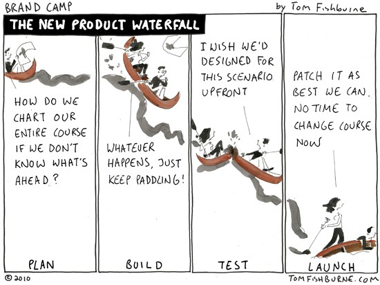

今天就聽我這小小測試工程師，娓娓道說 Firefox OS 快樂的工作史!!

這根本可以媲美澳洲大堡礁的工作阿！~This is really good and happy job in Taiwan!!!

…你還等什麼，快點加入謀智台灣阿，就缺你一個！

~以上，工商廣告時間結束！

——————————————————————————————————————————-

讓我們開始進入主題吧！在早期 Firefox OS 測試，主要採用了 Winston Royce 在1970年提出的 Waterfall model[1] 來測試 Firefox OS ；該模型給出了固定的順序，將生存期活動從上一個階段向下一個階段逐級過渡，如同流水下瀉，最終得到所開發的軟體產品。如下圖。

圖一、Waterfall process – 圖片引用自 tomfishburne.com[2]

但是經過 Firefox OS v.1.0.x 到 v.1.1.0 的版本釋出後，我們發現這個開發程序不足以應付現有廠商的需求，也無法快速反應工程師的想法。 因此在 v1.2 的開發過程中，導入了敏捷開發程序 (Agile development process)[3]， 但並非全盤採用整個開發程序，因為 Mozilla 的工程師、合作廠商散布在全球24個不同時區裡，沒辦法一次把不同時間、空間和文化的謀智人 (Mozillian) 聚集在一起跑敏捷開發程序。為了解決這個難題，讓整個開發過程更為彈性，因此我們採用一種混和 (Hybrid) 的開發、測試方式， 降低謀智人對開發程序轉換的痛苦。

以下為開發、測試 Firefox OS 所採用的程序、方法，

1. 常規會議 (Regular Meeting)

– 在敏捷開發過程中，因為變動是非常迅速的；為了要讓大家能在短時間抓住開發的方向，通常會有以下的常規會議，Kick off meeting, Standup meeting[4], Weekly meeting, Triage meeting 和 Retrospective meeting。

2. 專案需求以及規格的討論 (Requirements/Specification discussion)

– 我們利用 Work week 方式，增進了溝通的效率；以及利用此機會協調專案所需的資訊。

3. PRD/HLD/UX 文件 (PRD/HLD/UX document creation)

– 文檔！？ 因為開發的週期即為短暫，任何的文檔通常是能精簡就精簡；但是該有的還是要有，像是 UX[5] 文件；而主要產品的需求被記錄在一份備忘錄 (Backlog) 裡，所有討論過程都會利用以下工具記載，並同步所有人的資訊。

( i ) MoPad [6]

( ii) Trello [7]

(iii) Pivotal Tracker [8]

4. 時間估計 (Effort estimation)

– 每個版本被規劃成4個 sprint 開發、測試；開發測試前，會利用 Planning Poker [9] 來估計每一項任務的所需時間。

5. 測試計畫 (Test plan)

– 測試計畫的提交通常在我們開發過程會被省略，因為在敏捷開發過程在短時間有太多的變動，導致測試計畫並不是那麼的準確、可參考。相對的，我們會產出一些縮小版測試計畫 Mini test plan，規劃每個 Sprint 需要達到的目標。

6. 產出測試用例 (Test case creation)

– 測試用例的產出是 QA 很重要的工作， QA 所有的測試用例都在 Mozilla MozTrap[10] 上，歡迎大家隨時上去參觀。

7. 審查測試用例 (Test case review)

– 測試用例準備好之後，會進入審查的程序，但因為跨時區工作的關係，大部分的程序會透過電子郵件或是視訊會議完成。

8. 執行測試 (Run testing)

– 因為每個 Sprint 的測試時間通常只有一週，所以我們捨棄了 Waterfall 的測試方式 (Stage-> Alpha->Beta-> -> Production) 。把測試分為 1~N run ，第一 run 會注重在軟體的功能性以及標準 (Criteria) 有沒有達到，第二 Run 以後會注重整合測試 (Integration testing) 的結果。

9. 臭蟲的提交、解決以及驗證 (Bug submission, solving, and verifying)

– 這過程是所有軟體開發必經之路；在 Mozilla ，我們利用了 Bugzilla[11] 記錄開發及測試時所遇到的問題、臭蟲 (Bug) 。

10. 代碼/測試用例維護 (Code/Test case maintenance)

– QA 通常會在測試結束後，檢查所創建的測試用例是符合產品需求，以及挑選適合自動化 (Automation test) 的測試用例。

目前Firefox OS v1.2 版進入 Code complete 階段 (9/15)，不如就用這活生生的例子跟讀者解釋整個測試週期！在時間上，一個將要釋出的版本 (Release Build) 通常會歷經4週的策劃、討論，8週的開發、測試，時間表如下：

 

圖二、測試計畫表

如 上圖表，在開發初期，為了讓產品開發更順利， Mozilla 利用 work week 來討論產品需求以及標準，取得不同文化的謀智人對產品開發的共識；通常這時候謀智台北辦公室，根本像座空城，世界有多遼闊，謀智人就跑多遠，這是 一場很棒的知識及文化盛宴，有興趣的讀者歡迎搜尋 “Mozilla Workweek” 。 Work week 結束之後，通常就是Manager  、Developer 和 QA 努力發想，如何設計、測試、開發產品的階段；當取得大家的共識後，就是第一個 Sprint 開始啟程的時候。

在每一個 Sprint 的初期， QA 必須確保所有開發需求的內容以及完整性，不明確的內容，必須盡可能的與 Developer 或是 UX Designer 討論，而且要能提出開發的風險以及可能遭遇的問題，因為時間不能重來，錯誤的決策很容易影響到往後產品的釋出。當有明確的設計規格和需求後， QA 就會開始創造測試用例，測試用例的好壞和適用性通常取決於 QA 對產品以及相關知識的熟悉度；所以 Mozilla 的 QA 都像個活字典，隨時都準備好 讓人詢問相關產品規格、內容。通常在開發的過程中， QA 會保留半天來審查竭盡腦汁想出的測試用例；審查的過程，可以透過不同謀智人的觀點，快速的找出自己的盲點，加以改善測試用例的品質。開始運行測試之前， QA 必須要能針對測試的範圍、層面、平台、資源、時間等，組合出一個適合的測試策略讓其他的成員審 查。從上圖可以看出， V1.2 版的測試策略，主要由下列方法組成，冒煙測試 (Smoke Test) 、驗收測試 (Release Acceptance Test) 、整合測試 (Integration test) 、完整的運行測試 (Full run test) 和回歸測試 (Regression test) 。

一切就緒後，相關的測試就會如火如荼的展開，通常可以在 MozTrap 和 Bugzilla 上輕易的看出目前的測試狀態，兩個系統的效能也跟隨著 QA 的工作量成反比，就如同 Github 的提交量 (commit) 和 Developer 的工作量成正比的道理是類似的！

歷經幾回合的測試後，最終QA會提交一份測試報告給所有的利益相觀者 (Stakeholder) ，分析找到的問題以及軟體的品質，並提出相關風險評估。

就這樣沒了嗎? 怎麼可能!!!

最後一關，是對測試用例的分析，QA 會開始從手動測試中挑選適合做自動化測試 (Automation test) 的用例，並且整理測試用例。

這下應該真的沒了吧?!

不不不~在敏捷開發過程中，還有一個重要的一環-“回顧會議 (Retrospective meeting) ”，會議中會針對每一個 Sprint，做的對、做得好的項目提出來討論、表揚，該反省、檢討的事項會用備忘錄 (Backlog) 記載，並 提出改善方案，在下一次的回顧會議中，會拿出備忘錄來檢視是否改善。

以上，通常就是一個 Sprint 的運作過程。讀者可能會感到疑惑，採用以上敏捷測試的過程跟傳統測試流程有什麼大不同呢? 最明顯之處莫過於，我們把測試點提早，需求切割到最小，很多問題通常能在早期被發現，及早被解決；而不像傳統開發過程，整個專案都跑一半了才發現一堆漏洞、問題，想要分配人力解決，又發現所需的資源不足，陷入兩難的局面，造就無限期加班、無限期延長專案釋出。

目前 v1.2 版還算是敏捷測試的磨合期，一定會有讀者覺得美中不足的地方， Mozilla QA 正在竭盡可能的讓這一切變得更美好，相信 QA 會在 v1.3 的測試流程能有所突破。也礙於版面，沒能跟讀者分享太多細節，需要任何訊息嗎? 歡迎隨時跟我們聯絡，竭誠的歡迎您！

Mozilla Taiwan – “Doing good is part of our code”!

參考文獻：

[1] [http://en.wikipedia.org/wiki/Waterfall_process](https://en.wikipedia.org/wiki/Waterfall_process)

[2] [http://tomfishburne.com/2010/04/the-new-product-waterfall.html](https://tomfishburne.com/2010/04/the-new-product-waterfall.html)

[3] [http://en.wikipedia.org/wiki/Agile_software_development](https://en.wikipedia.org/wiki/Agile_software_development)

[4] [http://en.wikipedia.org/wiki/Stand-up_meeting](https://en.wikipedia.org/wiki/Stand-up_meeting)

[5] [http://en.wikipedia.org/wiki/User_experience_design](https://en.wikipedia.org/wiki/User_experience_design)

[6] [https://etherpad.mozilla.org/](https://etherpad.mozilla.org/)

[7] [https://trello.com/](https://trello.com/)

[8] [http://www.pivotaltracker.com/](https://www.pivotaltracker.com/)

[9] [http://msdn.microsoft.com/zh-tw/library/hh765979.ASPX](https://msdn.microsoft.com/zh-tw/library/hh765979.ASPX)

[10] [https://moztrap.mozilla.org](https://moztrap.mozilla.org/)

[11] [http://www.bugzilla.org/](https://www.bugzilla.org/)
