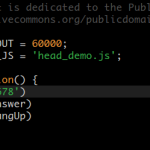

在 Firefox OS 中，我們經常使用 [marionette](https://tech.mozilla.com.tw/posts/563/b2g-marionette-test-on-emulator) 這套測試框架來進行 web API 的測試，當 test case 越寫越多時，開始會有一些 bad smell 浮現，在這邊我們用 telephony 的 marionette test case 為例，看看目前的 test case 是長什麼樣子的，然後想想 — Could we do better？

請先大概瀏覽一下這兩個 test case：

- [test_outgoing_answer_hangup.js](https://goo.gl/vUeHzb)

- [test_outgoing_answer_local_hangup.js](https://goo.gl/vUeHzb)

你會發現，這兩個檔案看起來非常的像，看起來有許多重複的程式碼，沒錯這就是第一個問題：duplicated code，要寫出好的程式，有個很重要的 DRY（Don’t Repeat Yourself） 守則，我們要盡可能的讓同樣邏輯的程式碼只出現在一處。再來第二個問題則是，測試的流程無法一目了然，而且綁得很死。

在 test_outgoing_answer_hangup.js 中，測試流程可以歸納為這幾個步驟：

- 播出電話

- 對方接起

- 對方掛斷

而在 test_outgoing_answer_local_hangup.js 中則是：

- 播出電話

- 對方接起

- 我方掛斷

兩者的差別僅在第 3 步驟，我們希望在對方接起後（第 2 步驟）可以有不同的行為。

接下來讓我們更進一步看看在 test_outgoing_answer_hangup.js 中，測試的流程是如何控制的，想想怎樣才能共用多數的程式碼，彈性地寫出兩種 test case。

		
		

function dial() {
  outgoing = telephony.dial(number);
  outgoing.onalerting = function onalerting(event) {
    answer();
  };
}

function answer() {
  outgoing.onconnected = function onconnected(event) {
    hangUp();
  };
  emulator.run("gsm accept " + number);
}

function hangUp() {
  emulator.run("gsm cancel " + number);
}
			
				
					
				
					1234567891011121314151617
				
						function dial() {  outgoing = telephony.dial(number);  outgoing.onalerting = function onalerting(event) {    answer();  };} function answer() {  outgoing.onconnected = function onconnected(event) {    hangUp();  };  emulator.run("gsm accept " + number);} function hangUp() {  emulator.run("gsm cancel " + number);}
					
				
			
		

hangUp() 的執行是寫死在 answer() 中的，如果我們希望可以選擇 answer() 後要做 hangUp() 或是 localHangUp()，則必須為 answer() 增加一個參數：

		
		

function answer(callback) {
  outgoing.onconnected = function onconnected(event) {
    callback();
  };
  emulator.run("gsm accept " + number);
}
			
				
					
				
					123456
				
						function answer(callback) {  outgoing.onconnected = function onconnected(event) {    callback();  };  emulator.run("gsm accept " + number);}
					
				
			
		

如此便可使用 answer(hangUp) 或是 answer(localHangUp) 來呼叫。繼續往前追，answer() 是寫在 dial() 中的，所以同理，我們必須多給 dial() 一個參數，然後把 answer(hangUp) 傳進去，最後寫出來的就是：

		
		

function dial(callback) {
  outgoing = telephony.dial(number);
  outgoing.onalerting = function onalerting(event) {
    callback();
  };
}

function answer(callback) { ... }

// test_outgoing_answer_hangup
dial(function() {
  answer(hangUp);
});

// test_outgoing_answer_local_hangup
dial(function() {
  answer(localHangUp);
});
			
				
					
				
					123456789101112131415161718
				
						function dial(callback) {  outgoing = telephony.dial(number);  outgoing.onalerting = function onalerting(event) {    callback();  };} function answer(callback) { ... } // test_outgoing_answer_hangupdial(function() {  answer(hangUp);}); // test_outgoing_answer_local_hangupdial(function() {  answer(localHangUp);});
					
				
			
		

在這個例子中，因為我們的測試步驟只有簡單的 3 項，看起來還好，如果有 10 項呢？寫出來的程式碼就會有很深的巢狀，這個問題稱之為 [callback hell](https://callbackhell.com/)，可以使用 Promise 改寫，把巢狀攤平。

Promise 是 javascript 中處理 asynchronous operation 的一種模式，當我們呼叫一個函式的時候，他回傳一個代表承諾的 Promise 物件，其內部有三種狀態：pending、resolved (fulfilled)、rejected，pending 代表操作還在進行，結果尚無法取得，隨著時間前進，其狀態可以轉移為 resolved 或是 rejected，以表示成功或失敗。Promise 物件可以用 .then(resolvedHandler, rejectedHandler) 串接，當狀態變為 resolved 或 rejected 時則執行對應的 handler，因此可以實現跟原本一樣的 callback 操作。其他關於 Promise 的使用與介紹，可以參考 MDN 文件 [[1](https://developer.mozilla.org/en-US/docs/Mozilla/JavaScript_code_modules/Promise.jsm), [2](https://developer.mozilla.org/en-US/docs/Mozilla/JavaScript_code_modules/Promise.jsm/Promise), [3](https://developer.mozilla.org/en-US/docs/Web/API/Promise)]。

接著我們把原本的 dial() 改寫為 Promise 形式，首先讓 dial() 執行後回傳一個 pending 狀態的 Promise 物件。

		
		

function dial(number) {
  let deferred = Promise.defer();
  ...
  return deferred.promise;
}
			
				
					
				
					12345
				
						function dial(number) {  let deferred = Promise.defer();  ...  return deferred.promise;}
					
				
			
		

原本在 alerting event 發生時，dial 會執行 callback，這部份則改為 alerting 時，讓該 Promise 由 pending 轉為 resolved，並用 .then(callback) 串接，如此便能達到一樣的效果。

		
		

function dial(number) {
  let deferred = Promise.defer();
  let call = telephony.dial(number);

  call.onalerting = function onalerting(event) {
    deferred.resolve(call);
  };

  return deferred.promise;
}

dial(number).then(callback);
			
				
					
				
					123456789101112
				
						function dial(number) {  let deferred = Promise.defer();  let call = telephony.dial(number);   call.onalerting = function onalerting(event) {    deferred.resolve(call);  };   return deferred.promise;} dial(number).then(callback);
					
				
			
		

.resolve(call) 內傳入的參數，會成為 .then(callback) 中 callback 呼叫時的參數，也就是在 alerting 後，程式會呼叫 callback(call)。最後整個改寫後的程式碼如下：

		
		

let Promise = SpecialPowers.Cu.import("resource://gre/modules/Promise.jsm").Promise;

function dial(number) {
  let deferred = Promise.defer();
  let call = telephony.dial(number);

  call.onalerting = function onalerting(event) {
    deferred.resolve(call);
  };

  return deferred.promise;
}

function answer(call) {
  let deferred = Promise.defer();

  call.onconnected = function onconnected(event) {
    deferred.resolve(call);
  };
  emulator.run("gsm accept " + call.number);

  return deferred.promise;
}

function hangup(call) {
  let deferred = Promise.defer();

  call.ondisconnected = function ondisconnected(event) {
    deferred.resolve(call);
  };
  emulator.run("gsm cancel " + call.number);

  return deferred.promise;
}

function localHangUp(call) { ... }

// test_outgoing_answer_hangup
dial(number)
.then(answer)
.then(hangup);

// test_outgoing_answer_local_hangup
dial(number)
.then(answer)
.then(localHangUp);
			
				
					
				
					12345678910111213141516171819202122232425262728293031323334353637383940414243444546
				
						let Promise = SpecialPowers.Cu.import("resource://gre/modules/Promise.jsm").Promise; function dial(number) {  let deferred = Promise.defer();  let call = telephony.dial(number);   call.onalerting = function onalerting(event) {    deferred.resolve(call);  };   return deferred.promise;} function answer(call) {  let deferred = Promise.defer();   call.onconnected = function onconnected(event) {    deferred.resolve(call);  };  emulator.run("gsm accept " + call.number);   return deferred.promise;} function hangup(call) {  let deferred = Promise.defer();   call.ondisconnected = function ondisconnected(event) {    deferred.resolve(call);  };  emulator.run("gsm cancel " + call.number);   return deferred.promise;} function localHangUp(call) { ... } // test_outgoing_answer_hangupdial(number).then(answer).then(hangup); // test_outgoing_answer_local_hangupdial(number).then(answer).then(localHangUp);
					
				
			
		

可以看到，透過 Promise，我們可以把原本難看的深層巢狀攤平，兩個 test case 的執行流程都可以一目了然，不像先前要一個個 function 追進去。到目前為止，第二個問題解決了。而第一個 duplicated code 的問題呢？雖然這兩個 test case 的 dial()、answer() 是可以共用的，但我們必須將這兩個 case 分別寫在不同的兩個檔案，要怎樣才能讓 dial()、answer() 不在兩個檔案重複呢？[Bug 805838](https://bugzilla.mozilla.org/show_bug.cgi?id=805838) 為 marionette test case 增加了一個 head.js 的功能，我們可以把 common code 放在 head.js 然後在各自的 test file 中寫：

		
		

MARIONETTE_HEAD_JS = 'head.js';
			
				
					
				
					1
				
						MARIONETTE_HEAD_JS = 'head.js';
					
				
			
		

就可以有類似 include 的功能，問題一解決！

未來我們可以在 head.js 中放入 common 的 action function，例如 dail()、answer()、hangUp()、hold()、resume()，而在各個 test file 中，利用 Promise 的 .then()，就可以輕易串接出各種 test scenario！

[1] [https://developer.mozilla.org/en-US/docs/Mozilla/JavaScript_code_modules/Promise.jsm](https://developer.mozilla.org/en-US/docs/Mozilla/JavaScript_code_modules/Promise.jsm)

[2] [https://developer.mozilla.org/en-US/docs/Mozilla/JavaScript_code_modules/Promise.jsm/Promise](https://developer.mozilla.org/en-US/docs/Mozilla/JavaScript_code_modules/Promise.jsm/Promise)

[3] [https://developer.mozilla.org/en-US/docs/Web/API/Promise](https://developer.mozilla.org/en-US/docs/Web/API/Promise)
