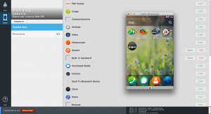
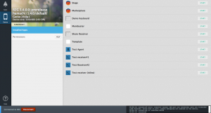
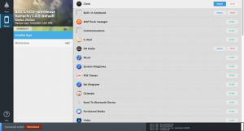
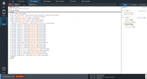
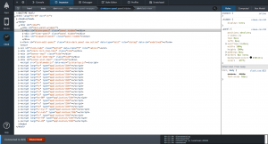
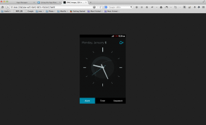
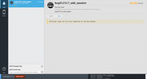
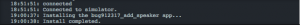

App Manager

最近在 Firefox 瀏覽器有釋出一個新工具「應用程式管理員 (APP Manager)」，只要按照這篇 MDN 文件的步驟下載與安裝 ([https://developer.mozilla.org/zh-TW/docs/Mozilla/Firefox_OS/Using_the_App_Manager](https://developer.mozilla.org/zh-TW/docs/Mozilla/Firefox_OS/Using_the_App_Manager))，就可以輕鬆的開始使用，這個工具可以直接在 Firefox OS 手機和模擬器 (Simulator) 上去進行除錯，開發，和測試等程序。

為什麼要在這裏介紹這個工具呢？理由很簡單，如果你是一個剛開始在 Firefox OS 上做開發，對於程式碼偵錯流程不熟的工程師，或是像我身為一個測試人員，有一些測試個案與流程是需要將測試自動化。假使直接去看原始碼，這是一份吃力不討好的工作。因為你要找的物件如、 HTML 元件等可能散佈在不同的檔案中，此時你就需要有個好工具，可以輕鬆的找到所需的元件或物件，而 APP Manager 就是一個可以輕鬆勝任的工具。

所以，在這篇文章中我將先介紹一些簡單但是實用的功能，不管你是測試人員或是研發人員，都可以輕鬆的操作，達到你的需求：

(A) 手機上的基本資料：

- 當手機連上線之後，可以輕鬆地在 APP Manager上找到一些基本、但是重要的資料，如 B2G 版本，Gecko 版本，如圖ㄧ。  圖一：左上角有顯示手機版本等資訊，右邊則是安裝的程式

(B) 找到程式中元件的 ID：

- 打開 APP Manager，選擇 Device panel。

- 用 ADB 接上手機或是模擬器，，如果不知道 ADB 如何操作，也可以用瀏覽器的附加元件 (ADB Helper) 來連接 (註一) ，它已經將連結與操作的命令整合在 APP Manager 內。

- 當手機連上後，會出現手機裡的內容與軟體，如圖一的右邊程式資訊。

- 先啟動程式，點選 Start。

- 再點選要測試軟體的旁 Debug 按鈕，如圖二。  圖二：點選Debug

- 按完 Debug，會出現另一個工具視窗，裡面有幾個功能，顯示了該軟體的相關程式碼，詳細的介紹在稍後的「E: 程式碼與手機軟體對照」，這裡點選 Inspector。

- 選擇左上角有個箭頭指示的按鈕，如圖三。  圖三

- 此時，請用滑鼠或是手點該軟體，將可以看到被點到的元件 ID 顯示在工作視窗上。在此是打開 Clock 的程式，點選該程式的 New Alarm，此時該元件會如圖四顯示。  圖四：顯示在被打開的元件上

(C) 螢幕截取：當手機出現臭蟲 (bug) ，此時 RD 常會需要問題發生時的畫面來去判斷問題，這時要如何做呢？

- 只要手機仍然跟 App Manager 連著時，按下截圖 (SCREENSHOT)，就可以輕鬆獲得手機當時的畫面。

- 這個畫面會被載入到另一個 Firefox 視窗顯示出來，按下另存圖片即可轉存成圖片檔案，如圖五。  圖五：截圖顯示

(D) 安裝軟體: 輕易地將想測試的軟體 APP 透過這個工具上傳到手機去。

- 準備好軟體。

- 選擇 APP Manager 的 Apps panel。

- 選擇從本地裝、或是從網址去裝。在此，我們選擇了本地來安裝，選擇所在路徑上的 App 後，會顯示該軟體於 App Manager，如圖六。  圖六：要安裝的程式資訊

- 選擇「UPDATE」 ，就可以完成安裝，在右下角的 Console 裡可以看到安裝完成，如圖七。  圖七： Console Window上顯示已安裝成功

- 再切回 Device panel，你可以看到該程式顯示於安裝清單上。

(E) 程式碼與手機軟體對照：這部分對於程式開發者而言，是可以輕鬆的找到所需的程式碼或是協助偵錯的。只要將程式啟動，點選 Debug ，此時該程式的 panel 出現在 APP Manager 的左邊，而在該視窗上方有不同的選項可供使用。這裡先介紹一些常用的選項，之後會有更詳細的介紹。

- Console : 會有該程式的一些 log 輸出

- Inspector : 這裡會秀出程式的 HTML 與一些元件的程式碼。

- Debugger : 可以看到對應的程式碼，也可以一步一步 trace 。

這個工具才剛在2013年中釋出沒多久，相信未來會有更多的功能被加進去，不管你是 RD 還是 QA 抑或是任何 Firefox OS 開發有興趣的人 ，都可以從這個簡單的小工具得到不少幫助。

註一：在此可以下載模擬器與 ADB Helper：[https://ftp.mozilla.org/pub/mozilla.org/labs/fxos-simulator/](https://ftp.mozilla.org/pub/mozilla.org/labs/fxos-simulator/)

詳細的說明文件請參閱 MDN：[https://developer.mozilla.org/zh-TW/docs/Mozilla/Firefox_OS/Using_the_App_Manager](https://ftp.mozilla.org/pub/mozilla.org/labs/fxos-simulator/)
