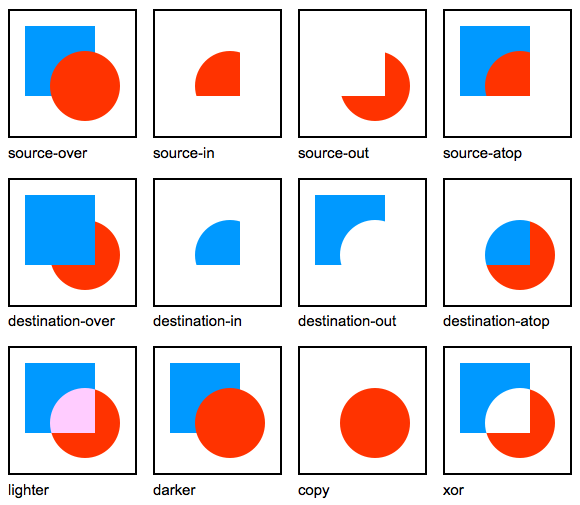

我就先不賣關子，底下這個 fiddle 就是這篇文章的刮刮樂範例完整版。

可以玩玩看，試著瞭解裡面的程式腳本，或是 fork 來改改看。

有興趣但看不太懂 code 的話， 就跟著本篇文章的介紹帶你入門吧！

如果大家有看過九月份的「[Firefox OS 讓你儘情享受每一刻](https://firefox.club.tw/campaign/every-moment/)」活動網頁（註 1），

應該很好奇一開始的刮刮樂是如何做到的吧？

在研究該如何實作這個功能的時候，因為刮刮樂和繪圖的概念很類似，

所以第一直覺就是想到要用 HTML5 Canvas。

但 Canvas 如此博大精深，究竟要從何做起呢？讓我們繼續看下去……

## 瞭解 Canvas 的合成參數設定

Canvas 的 globalCompositeOperation 屬性設定可以打破原本圖形只能依繪製順序往上覆蓋的限制，它可以將圖形畫在另一圖形之下，也可用來遮蔽、清除圖形區域。讓圖形的繪製組合更有彈性。在 [MDN 的 Canvas 合成效果教學文件](https://developer.mozilla.org/zh-TW/docs/Web/Guide/HTML/Canvas_tutorial/Compositing)（註 2）裡可以看到各種不同合成參數的執行效果：

（注意其中 darker 已從 canvas 標準規範中移除並不再支援）

圖例中藍色是設定合成參數之前繪製上去的，也就是 destination；

紅色則是設定合成參數之後繪製上去的，也就是 source。

哇靠 12 種也太多了吧！簡直是大海撈針！

但冷靜下來仔細想想，其實刮刮樂不就和小畫家的橡皮擦功能差不多嗎？

如果藍色方塊是我想要擦掉的圖形，

而紅色的圓圈是橡皮擦工具，刮完後剩下的不就是一個缺圓角的方塊了嗎？

因此答案很明顯了：登登登－ destiniation-out 就是你啦！

## 用滑鼠刮掉圖案

要開始寫一個功能時，第一件要做的事絕對不是建立一個空白的 javascript 檔案，重新發明輪子，

網路上充滿了熱心的神人，你想得到的功能幾乎早就有人做出來並公開原始碼。

我們只需要想出對的關鍵字，去把它找出來就行了。

於是我在谷歌輸入「javascript scratcher」，運氣很不錯，

第一個搜尋結果（註 3）就是我需要的範本。

但仔細研究以後發現三個問題：

- 我想讓刮刮樂好刮一點，讓滑鼠經過之後就開始刮，而不需要點下滑鼠左鍵。

- 我的刮刮樂圖形是圓的，且有透明背景，套用在上面時透明部分會刮出不必要的顏色來。

- 刮完後我想用 CSS 在底圖上加上簡單動畫特效，底圖若載入 canvas 內就無法做到。

於是我做了一些修改：

首先我把程式裡處理 mouseup/mousedown 的部分刪去，只留下 mousemove 的部分，

用來判斷是否按下滑鼠的 flag 則一律設定成 true，如此一來就可以直接刮不需要按滑鼠左鍵。

接下來我把原本初始化時，傳進的前後景兩張圖的部分，改成只剩下刮刮樂的前景，

讓 canvas 只用在處理刮除的前景部分，而背景則放在 canvas 外的另一個元素中。

最後因為原腳本中兩張圖時用的合成模式是 source-atop ，

這部分改成前面提到的 destination-out。並把原本處理兩張圖合成的部分刪去。

如此一來就可以做出刮刮樂（橡皮擦）的效果。

有了這段刮刮樂腳本後，只要像 fiddle 中那樣把 HTML 元素和其 CSS 寫好，

再加入這段程式腳本，你就有一個基本的網頁刮刮樂了！

var scratcher = new Scratcher("fx-scratcher");
scratcher.addEventListener("imagesloaded", scratcherLoadingHandler);
var scratcherImage = "/static/img/event/every-moment/scratch/scratch-gray.png";
scratcher.setImages(scratcherImage);

					1234

						var scratcher = new Scratcher("fx-scratcher");scratcher.addEventListener("imagesloaded", scratcherLoadingHandler);var scratcherImage = "/static/img/event/every-moment/scratch/scratch-gray.png";scratcher.setImages(scratcherImage);

上面的腳本中 "fx-scratcher" 是 canvas 元素的 id 。你也可以換成自訂的 id。

而 scratcherImage 是刮刮樂圖片（灰色圓形圖）的檔案路徑。

在前面的 fiddle 中因為 canvas 載入的外部圖片會因為安全性限制，

而無法進行我們下面要接著介紹的「取得刮除進度」。

所以我改成用 data url 的方式嵌入圖片，若在本機用自己的圖測試則用檔案路徑即可。

以上只點出修改的重點，完整的變動差異比較可以在[這個 Gist Revisions](https://gist.github.com/elin-moco/7858787/revisions) 裡看到。

## 取得刮除進度

Scratcher.prototype.fullAmount = function (stride) {
 var i, l;
 var can = this.canvas.main;
 var ctx = can.getContext("2d");
 var count, total;
 var pixels, pdata;

 if (!stride || stride < 1) {
 stride = 1;
 }

 stride *= 4; // 4 elements per pixel

 pixels = ctx.getImageData(0, 0, can.width, can.height);
 pdata = pixels.data;
 l = pdata.length; // 4 entries per pixel

 total = (l / stride) | 0;

 for (i = count = 0; i < l; i = stride) {
 if (pdata[i] != 0) {
 count ;
 }
 }

 return count / total;
};

					123456789101112131415161718192021222324252627

						Scratcher.prototype.fullAmount = function (stride) { var i, l; var can = this.canvas.main; var ctx = can.getContext("2d"); var count, total; var pixels, pdata;  if (!stride || stride < 1) { stride = 1; }  stride *= 4; // 4 elements per pixel  pixels = ctx.getImageData(0, 0, can.width, can.height); pdata = pixels.data; l = pdata.length; // 4 entries per pixel  total = (l / stride) | 0;  for (i = count = 0; i < l; i = stride) { if (pdata[i] != 0) { count ; } }  return count / total;};

這個函式是原本的範本程式裡就寫好的，用途是取得目前刮剩下的部分比例。

我只把原本前面的 canvas.draw 改成 canvas.main ，

因為前面修改過後我們只需要一個 canvas 即可。

這段程式腳本的重點是透過 ctx.getImageData 將圖片轉為陣列資料，

再用迴圈去檢查陣列內還留有顏色的比例。

stride 參數是用來設定檢查的頻率，數字愈大則檢查的頻率愈低，

避免每次都要掃過所有資料影響執行效能。

若 pdata[i] = 0 代表已被刮除。

腳本中的函式最後回傳的是一個介於 1 ~ 0 之間的小數，

代表的意義是「未刮除部分所佔比例」。

function scratcherProgressHandler(ev) {
 // Test every pixel. Very accurate, but might be slow on large
 // canvases on underpowered devices:
 //var pct = (scratcher.fullAmount() * 100)|0;

 // Only test every 32nd pixel. 32x faster, but might lead to
 // inaccuracy:
 var pct = (this.fullAmount(32) * 100) | 0;
 if (pct < 3) {
 if (!$(".scratcher").hasClass("complete")) {
 $(".scratcher").addClass("complete");
 if (!$("#moment").hasClass("appear")) {
 <a href="https://www.dgfev.de/">online casino</a>  $("#moment").addClass("appear")
 }
 }
 }
}

scratcher.addEventListener("scratch", scratcherProgressHandler);

					12345678910111213141516171819

						function scratcherProgressHandler(ev) { // Test every pixel. Very accurate, but might be slow on large // canvases on underpowered devices: //var pct = (scratcher.fullAmount() * 100)|0;  // Only test every 32nd pixel. 32x faster, but might lead to // inaccuracy: var pct = (this.fullAmount(32) * 100) | 0; if (pct < 3) { if (!$(".scratcher").hasClass("complete")) { $(".scratcher").addClass("complete"); if (!$("#moment").hasClass("appear")) { <a href="https://www.dgfev.de/">online casino</a>  $("#moment").addClass("appear") } } }} scratcher.addEventListener("scratch", scratcherProgressHandler);

瞭解 fullAmount 的運作方式和回傳值意義之後，

接著只要在 scratch 事件發生時去檢查 fullAmount 的回傳值，

即可依據目前的刮除進度做出對應的效果。

上面這段腳本是判斷剩餘未刮除的部分小於 3% 時就當作刮除完成，

並在刮刮樂元素上加上 "complete" 的 class ，

接下來的「開獎」效果只要透過 CSS 來處理即可。

## One more thing – 做個假掰的開獎效果

我要做的開獎效果分成兩個部分，先是讓剩下沒刮完的部分淡出消失，

再來就是讓 Firefox 的圖示放大淡出，以做出開啟 App 的效果。

.scratcher #fx-scratcher {
 transition: opacity 0.5s ease-out 0s;
}
.scratcher.complete #fx-scratcher {
 opacity: 0;
}
.scratcher #fx-icon {
 transition: all 0.5s ease-out 0.5s;
 left: 0;
 top: 0;
 width: 125px;
 height: 125px;
}
.scratcher.complete #fx-icon {
 width: 300px;
 height: 300px;
 opacity: 0;
 left: -83px;
 top: -100px;
}

					1234567891011121314151617181920

						.scratcher #fx-scratcher { transition: opacity 0.5s ease-out 0s;}.scratcher.complete #fx-scratcher { opacity: 0;}.scratcher #fx-icon { transition: all 0.5s ease-out 0.5s; left: 0; top: 0; width: 125px; height: 125px;}.scratcher.complete #fx-icon { width: 300px; height: 300px; opacity: 0; left: -83px; top: -100px;}

要用 CSS 達成這些效果就要靠 CSS 的轉場功能 － 也就是 transition 啦！

這裡腳本中使用的 transition 屬性是四個轉場屬性的簡易表示式，

transition: opacity 0.5s ease-out 0s;

					1

						transition: opacity 0.5s ease-out 0s;

這行裡指定的屬性依序為轉場套用屬性 (transition-property)、轉場持續時間 (transition-duration)、

轉場速率變化曲線函式 (transition-timing-function)、轉場延遲時間 (transition-delay)。

要注意的是 transition-property 若在不需要太多屬性同時進行轉場的狀況下，

建議明確列出所有需要轉場的屬性（而不要使用 all），以防執行效能被拖慢。

詳細的說明可參考 MDN 的 [CSS 轉場文件](https://developer.mozilla.org/zh-TW/docs/CSS_%E8%BD%89%E5%A0%B4)（註 4）。

寫好轉場效果的設定後，接下來就是在 .scratcher.complete CSS 選擇器底下，

指定各別元素的樣式變化。只需要簡單幾行 CSS 就能達成。

完成之後，只要當刮除進度超過 97 %，並執行到這行腳本時：

$(".scratcher").addClass("complete");

					1

						$(".scratcher").addClass("complete");

CSS 就會偵測到 class 的改變，並開始執行漸變轉場效果。

是不是很有趣呢？你也來試著動手做做看吧！

## 參考連結：

- 註 1：[線上活動：Firefox OS 讓你儘情享受每一刻](https://firefox.club.tw/campaign/every-moment/)

- 註 2：[MDN – Canvas Tutorial – Compositing](https://developer.mozilla.org/zh-TW/docs/Web/Guide/HTML/Canvas_tutorial/Compositing)

- 註 3：[HTML5 Canvas and globalCompositeOperation](https://beej.us/blog/data/html5-canvas-globalcompositeoperation/)

- 註 4：[MDN – CSS 轉場](https://developer.mozilla.org/zh-TW/docs/CSS_%E8%BD%89%E5%A0%B4)
