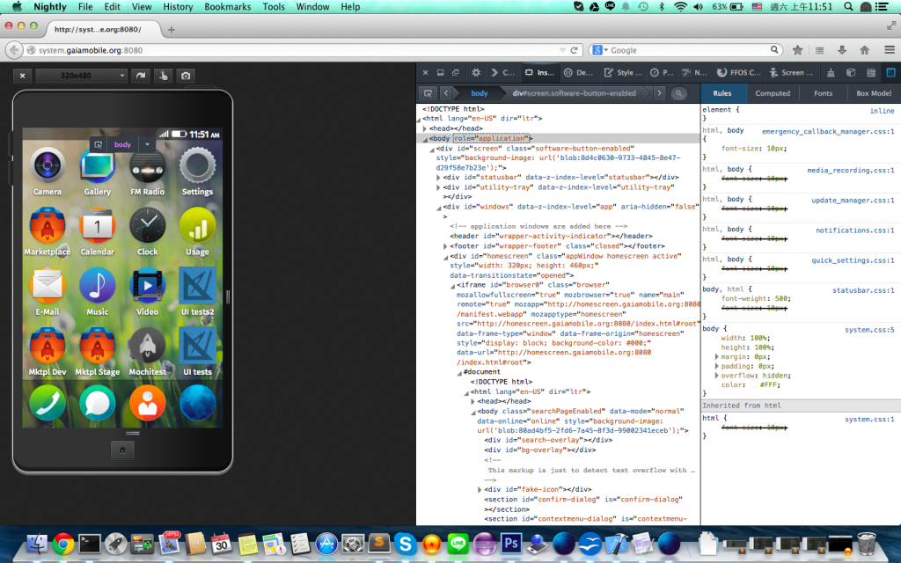
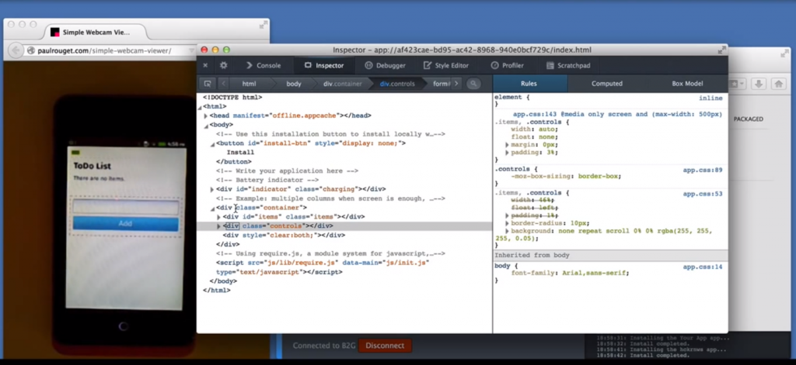

開發前端的程式，一個基本的前端 debug 工具會幫我們及時揭露大部份的 HTML，CSS 和 JS，並且及時改 HTML 與 CSS，為 JS 下斷點，目前各大瀏覽器包括 Firefox，Chrome 以及 IE 都有這方面的支援，我就不在此一一贅述。那今天有什麼好用的工具可以幫助我在 Firefox OS 上 debug 呢？這篇今天主要介紹的兩項 debug 神器 Firefox Nightly 和 App Manager。

### Firefox Nightly

前置準備：電腦必須支援 git 和 make 的指令

- 請至[http://nightly.mozilla.org/](https://nightly.mozilla.org/) 下載最新的版的Firefox Nightly。並安裝到您的電腦，並記住您 Nightly 執行檔的路徑 e.g., on mac, “/Applications/FirefoxNightly.app/Contents/MacOS/firefox”

- 請把 gaia 的 git repository 下載至電腦內 git clone https://github.com/mozilla-b2g/gaia

- 在下載的 gaia 目錄下，執行 DEBUG=1 make

- 執行 /path/to/firefox -profile /path/to/gaia/progile-debug -no-remote

跟隨以上步驟，您便可以用 Nightly 開啟一個 Firefox OS，所有 Gaia 的程式碼便在 debug 面板裡向您展露無疑。

用 Nightly 來 debug 最大的好處是，我們直接透過重新整理頁面就可以立即看到修改過的樣貌與邏輯，不過有些 App 為了追尋最佳化，可能有另外進行壓縮合併，那樣的話還是必須再重新執行上述步驟 3，但在大部分情況是不需要的。除此之外，我們也可直接調整螢幕大小與 devicePixel，便可大概知道在不同裝置下是否有破版或功能的不正常。

然而在 Nightly 上也有缺點，就是它的執行結果不必然等於實際在手機上的狀況，最顯著的例子便是瀏覽器是沒有 SIM 卡的，因此我們不能在上面傳簡訊或打電話以及所有跟 SIM 相關的功能都跟手機不一樣，因此我們需要另外個遠端 debug 的工具，就是App Manager！

### App Manager

前置條件，您必須擁有 Firefox OS phone 1.2+，電腦必須支援 adb 指令

- 必須確保手機的 Firefox OS 版本是在 1.2 以上的，並在 Settings App 裡關掉 Screen Lock 並遠端除錯 (Remote Debugging) 功能打開。

- [https://ftp.mozilla.org/pub/mozilla.org/labs/fxos-simulator/](https://ftp.mozilla.org/pub/mozilla.org/labs/fxos-simulator/) 安裝Simulator 和 ADB Helper

- 在 Nightly 裡打開App Manager，連接裝置，便可以開始除錯了！

遠端除錯最厲害的功能就是它簡直跟你用瀏覽器除錯完全一樣，差別只在於把螢幕從瀏覽器轉移到你的手機上，您依然可以看到他所有的html/css/js ，甚至可以即時修改它們和下斷點，並在手機上直接看到修改結果，除此之外，也可透過手指點選螢幕的方式找尋物件在 html 的位置。

而它不方便的是必須花時間把修改過的程式碼重新安裝到手機裡，才可以看到結果，而且目前該工具仍在開發階段，仍然有些小問題有待解決，不過大體上而言，搭配 Nightly 來除錯應該解決大部份前端的問題。

如果看倌們有任何問題，歡迎至參考資料中尋找更詳細的說明並留下您的問題在裡面噢！

#### 參考資料：

[https://developer.mozilla.org/en-US/Firefox_OS/Using_the_App_Manager](https://developer.mozilla.org/en-US/Firefox_OS/Using_the_App_Manager)

[https://developer.mozilla.org/en-US/Firefox_OS/Using_Gaia_in_Firefox](https://developer.mozilla.org/en-US/Firefox_OS/Using_Gaia_in_Firefox)
