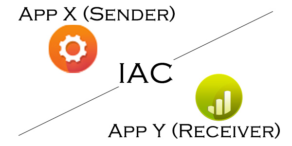
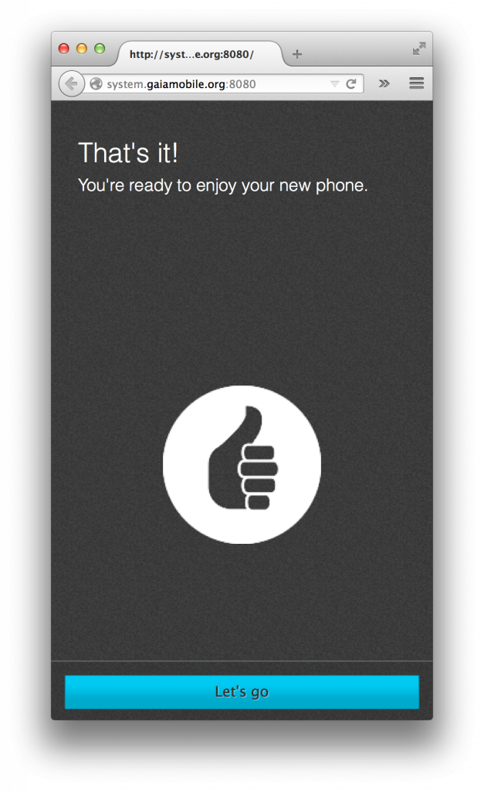
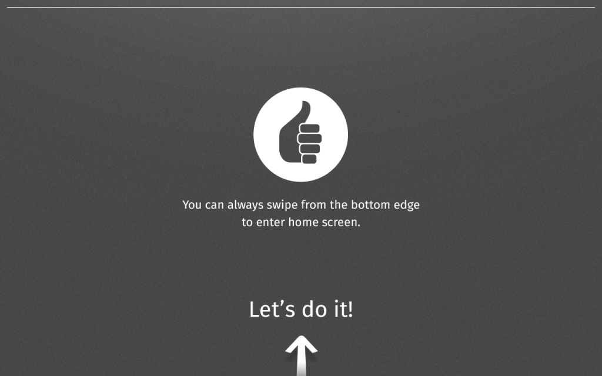

在開發 App 的時候，我們有時候需要在App之間傳遞資訊，而今天我們要介紹的主角就是新引入的 [WebAPI: IAC (Inter App Communication)](https://wiki.mozilla.org/WebAPI/Inter_App_Communication)，有了這個好東西，我們就可以輕易的在 App 間傳遞訊息，以下就用筆者遇到的例子來說明吧：

## User story

當使用者拿到 Firefox OS 手機，第一次開機的時候，會自動先開啓 FTU (First Time Use) App 作導覽。當導覽進行到最後一步的時候，會看到這個畫面，可以按下「Home」鍵回到主畫面。

而在 Firefox OS 平板上，最後一步的導覽畫面會是這樣，但是改透過由螢幕下方往上滑動的手勢回到主畫面：

大家可能還不是很明白為什麼這個 User Story 下面要使用 IAC，讓我解釋一下。因為在手機剛啟動的時候，我們的 FTU 是一個獨立的 App，而這個 App 是被 System App 所呼叫起來的，兩個 App 之間如果需要溝通，就需要透過 IAC 來傳遞資料。

之所以 FTU App 需要跟 System App 做溝通，是因為「使用者在 FTU 導覽過程中，是無法按 Home 鍵離開的」，但很不巧的這個需求在 Firefox OS 平台是 Tablet 的時候反而變成是一種限制，怎麼說呢，因為對 Tablet 來說，我們並沒有實體的 Home 鍵，因此「Swipe 向上的手勢」就被我們定義成「使用者按 Home 鍵」，但是在先前 Mobile 的需求下，使用者在 FTU 是不允許按 Home 鍵的！！因此這就產生了一個問題，我要怎麼判別使用者現在的情境是：

- Tablet 使用者

- FTU 已經導覽到最後一步

- 使用者可以透過螢幕下方往上滑動的手勢（等同按 Home 鍵）離開 FTU App

這個時候…我們就需要 IAC 的幫助！

## IAC , we need your help

這邊要解釋一下 FTU App、System App 及 IAC 的角色。

FTU App 的功用主要是在教導使用者如何初始設定 FxOS 及透過 step by step 的教學來了解如何使用 FxOS 的裝置，所以他可以知道使用者目前的 step 到哪個階段了。

System App 在這裡的功用是在處理使用者按下 Home 鍵時要處理的事情，他只知道目前使用者是不是按下 Home 鍵（在 Tablet 就是 Swipe 向上的手勢），然後依照各個平台做相對應的事情。

而 IAC 的角色就是 FTU App 及 System App 溝通的橋樑，因為 System App 不知道目前 FTU App 是不是到了最後一步，所以自然就無法解除阻擋 Home 鍵這件事情，所以在這個 User Story 下，當使用者來到最後一個 Step 的時候（而且是在 Tablet 的平台），FTU App 就會透過 IAC 和 System App 溝通，然後請求 System App 可以讓我們以透過 Swipe 向上的手勢（等同按 Home 鍵）離開 FTU App。

在 Gaia 我是這麼做的：

In FTU App :

		
		

    if (this.currentStep > this.numTutorialSteps) {
      Tutorial.tutorialScreen.classList.remove('show');
      Tutorial.tutorialFinish.classList.add('show');

      // for large devices, we have to use IAC to tell system ftu is done
      if (this.layout !== 'tiny') {
        navigator.mozApps.getSelf().onsuccess = function(evt) {
          var app = evt.target.result;
          app.connect('ftucomms').then(function onConnAccepted(ports) {
            ports.forEach(function(port) {
              port.postMessage('done');
            });
          }, function onConnRejected(reason) {
            console.log('FTU is rejected');
            console.log(reason);
          });
        };
      }
    }
			
				
					
				
					12345678910111213141516171819
				
						    if (this.currentStep > this.numTutorialSteps) {      Tutorial.tutorialScreen.classList.remove('show');      Tutorial.tutorialFinish.classList.add('show');       // for large devices, we have to use IAC to tell system ftu is done      if (this.layout !== 'tiny') {        navigator.mozApps.getSelf().onsuccess = function(evt) {          var app = evt.target.result;          app.connect('ftucomms').then(function onConnAccepted(ports) {            ports.forEach(function(port) {              port.postMessage('done');            });          }, function onConnRejected(reason) {            console.log('FTU is rejected');            console.log(reason);          });        };      }    }
					
				
			
		

從程式碼中可以看到我們透過 app 實體去連接一個 keyword（在這個例子中就是 ftucomms），FTU App 跟 System App 之間就是透過這個 keyword 來當做識別並透過 port 來溝通，我們只需要把東西通通塞進 port.postMessage 做雞精就對了！

聰明的你可能會問，所以 App 只需要隨便用個 keyword 就可以連結並傳東西嗎？當然不行，接收訊息的 App （傳送訊息的不需要）還需要去它的 manifest.webapp 設定如下：

		
		

{
  "connections": {
    "ftucomms": {
      "description": "Communicate between communications/ftu and System",
      "rules": {}
    }
  }
}
			
				
					
				
					12345678
				
						{  "connections": {    "ftucomms": {      "description": "Communicate between communications/ftu and System",      "rules": {}    }  }}
					
				
			
		

這樣子我們 System App 就可以接收來自 FTU App 的訊息了！在 System App 只要我們確定傳送進來的 message 是我們當初預期的 ‘done’ 就可以放行讓使用者可以透過 Swipe 向上的手勢離開 FTU App 了！

不過你可能又會問我要怎麼讓 System App 來接這個訊息呢，這是個好問題。如果你需要透過 IAC 來做資料傳遞的時候，你需要使用 mozSetMessageHandler 來掛載相對應的 Handler。

下面是 IAC 的基本使用方法：

		
		

window.navigator.mozSetMessageHandler('connection', 
  function onConnected(request) {
   var keyword = request.keyword;
   var port = request.port;

   port.onmessage = function onReceivedMessage(evt) {
     // this is the message you sent
     var message = evt.data;
     // do whatever you want to do later
   };
});
			
				
					
				
					1234567891011
				
						window.navigator.mozSetMessageHandler('connection',   function onConnected(request) {   var keyword = request.keyword;   var port = request.port;    port.onmessage = function onReceivedMessage(evt) {     // this is the message you sent     var message = evt.data;     // do whatever you want to do later   };});
					
				
			
		

但是要注意的是因為這個 API 只會執行最後一個掛上去的 Handler，所以當你一個 App 要做多組 IAC 資訊傳遞的時候就需要自己做額外的處理。

但在寫程式的時候沒注意到件事情，所以當時 Music App 的另一個 contributor – Jim Porter 同時也自己在 System App 建立了一個 Handler，而我的 Handler 又是在他建立之前建立的，因此所有我 FTU 有關的 Handler 不會執行到，因為通通都被它的 Handler 蓋過去了。

所以為了讓後面的人不要發生這個問題，之後就和 Jim Porter 討論出一個 IACHanlder，每個 App 只要引入這段 javascript ，我們就會自動幫他建好一個共用的 Handler，所有的資料都是這個 Handler 統一管理，然後以一個固定的 naming 用 Custom Event 的方式傳播出去，讓有需要的人可以自己接 Event。（有興趣了解實作的人可以看[這裡](https://github.com/mozilla-b2g/gaia/blob/e0120f015b108d12c50cd020a1f29d88d9cc11e1/shared/js/iac_handler.js)）

所以最後 System App 只要用這樣簡單一行程式碼就可以接 Event 然後做解除限制的動作了：

		
		

window.addEventListener('iac-ftucomms', function() {
  var message = evt.detail;
  if (message === 'done') {
    self.setBypassHome(true);
  }
});
			
				
					
				
					123456
				
						window.addEventListener('iac-ftucomms', function() {  var message = evt.detail;  if (message === 'done') {    self.setBypassHome(true);  }});
					
				
			
		

是不是很簡單呢！希望這篇能夠幫助到也需要使用 IAC 的開發者朋友哦 🙂

參考資料： [Inter App Communication wiki 文件](https://wiki.mozilla.org/WebAPI/Inter_App_Communication_Alt_proposal#Music_controls_in_the_lockscreen)

—

My Blog : [http://eragonj.me](https://eragonj.me/)

My Twitter : [http://twitter.com/EragonJ](https://twitter.com/EragonJ)
