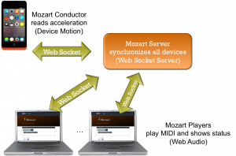
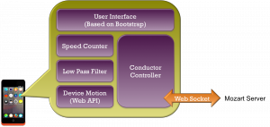
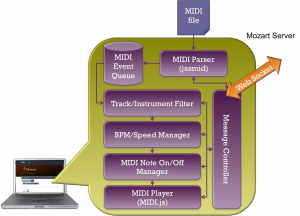
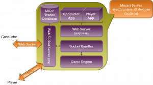

Mozart 專案是一個利用多個 Web API 來完成的線上遊戲，它使用了 1. [Device Motion](https://developer.mozilla.org/en-US/docs/Web/Reference/Events/devicemotion) 來讀取使用者透過手機晃動的幅度, 2. [Web Audio](https://developer.mozilla.org/en-US/docs/Web_Audio_API) 來當成 MIDI 的聲音輸出, 3. [Web Socket](https://developer.mozilla.org/en-US/docs/WebSockets) 來當成手機與伺服器之間的即時通訊。我們只要簡單的搖晃手機，身邊的電腦就如同交響樂團般演奏出音樂。下面就是它的架構圖：

Mozart 專案裡面的角色分成三個主要的角色：

- 指揮家(Mozart Conductor)：指揮家是由使用者進行操作的應用程式。為了能讓我們能像一般指揮家那樣進行指揮，它是一個行動裝置的應用程式。我們只需要拿著手機進行晃動，就可以發出指揮的訊號，以控制每個演奏家。指揮家應用程式是採 Web App 的方式進行開發，所以它可以直接在 Firefox for Android、Chrome、及 Safari for iOS 上執行，只須打開前述瀏覽器即可，完全不需要安裝任何的應用程式。指揮家的應用程式採用了 [Device Motion](https://developer.mozilla.org/en-US/docs/Web/Reference/Events/devicemotion) 的 Web API 來讀取手機中的加速計，並且透過公式換算來轉換成速度資訊。

- 演奏家(Mozart Player)：演奏家可以由一般的電腦或平板所組成。它主要的任務是依照指揮家的指揮，將音樂依照指揮的速度演奏出來。所以，演奏家是使用 [Web Audio](https://developer.mozilla.org/en-US/docs/Web_Audio_API) 來控制每個音符的度速。演奏家主要是讀取 MIDI 檔案，所以，可以由多台電腦組成不同樂器的演奏家。隨著加入的機器，每個演奏家會自動分配成不同的樂器，並且當指揮家開始指揮時，進行多個演奏家同時合奏。

- Mozart 伺服器(Mozart Server)：Mozart 伺服器是使用 node.js 開發，它使用 express.js 整合 Web Socket Server 技術，只需啟動一個伺服器就能同時提供 Web Server 及 [Web Socket](https://developer.mozilla.org/en-US/docs/WebSockets) 的功能，而且它只佔用一個連接埠(port)而己。不論指揮家或是演奏家的應用程式都是先透過 Mozart伺服器的 Web Server 將程式發佈到裝置上，接著再透過 Web Socket 將同一組指揮家及演奏家連結在一起。連結完成後，Mozart 伺服器僅提供資料傳輸的服務。

Mozart 專案在實作的過程中，並不是完全手工打造，而且大量採用開放源碼專案。以下就是 Mozart 每個角色的實作介紹及其使用的 Open Source 或 Web API：

1. 指揮家(Mozart Conductor)

指揮家的核心是透過 Device Motion Web API 來計算出我們晃動的速度，所以，整個的計算公式分成1. 讀取三軸加速計、2. 套用低通濾波器將數值線性化、及3. 加速度與遊戲速度轉換。這裡使用的低通濾波器是使用移動平均數的方式來做計算。另外，加速與遊戲速度的轉換也是採用類似的低通濾波器，但是除了濾波器外，還依照不同的平台加入不同的權重。除了核心的速度計算外，指揮家還負責提供使用者介面讓指揮家控制要參與的演奏家數量及啟動程式。這裡的使用者介面全都是採用開放源碼的 [bootstrap](https://getbootstrap.com/) 製作完成。其細項的架構圖如下：

2. 演奏家(Mozart Player)

演奏家主要是負責每個音符的播放與停止，它的核心是從兩個開放源碼專案整合而來：[jasmid](https://github.com/gasman/jasmid) 及 [MIDI.js](https://github.com/mudcube/MIDI.js)。jasmid 是負責分析 MIDI 檔案，並將其轉換成 jasmid 的 MIDI 事件。而 MIDI.js 是負責載入各種不同的樂器，並依照播放器的指示開啟或停止每個音符。由於演奏家的速度是由指揮家來控制，所以，我們並沒月採用 jasmid 或 MIDI.js 的播放器功能，而是依照 jasmid 的 MIDI 事件開發一個可以調整速度的播放器，且其底層接上 MIDI.js。這個播放器分成 1. 樂器過濾器、2. 速度控制器、及 3. 音符控制器三個。樂器過濾器是依照 Mozart 伺服器的指示，將與這個演奏家無關的樂器全部過濾掉。速度控制器則是依照 Mozart 伺服器傳來的資訊動態地調整播放的速度。最後則是音符控制器用來控制多個音符按下及放開的狀態。其細項的架構圖如下：

3. Mozart 伺服器(Mozart Server)

Mozart 伺服器是整個專案的核心，它負責與指揮家及多個演奏家連線，並當成它們間溝通的橋樑。Mozart 伺服器會將一個指揮家與多個演奏家組成一個群組。當有多個指揮家出現時，它能同時支援多個群組內的通訊，讓每個指揮家控制屬於自己的演奏家。Mozart 伺服器是這三個角色中使用最多開放源碼專案的地方，它是執行於 [node.js](https://nodejs.org/) 的環境，由 [express](https://expressjs.com/) 當成網站伺服器，並外掛 [ws](https://github.com/einaros/ws) 當成 Web Socket 伺服器，且在同一個 port (80 port)中執行。當使用者連上 Mozart 伺服器後，它會依照需求將指揮家與演奏家的程式碼傳輸出去，且會依照 MIDI 的種類，自動分配每個演奏家所負責的樂器。其中，Mozart 伺服器還有一個很重要的功能，就是計算遊戲的分數，並將分數顯示在演奏家的畫面上。

如果大家有興趣想玩一下 Mozart 的話，可以前往 [Mozart 的程式碼](https://github.com/moz-art/mozart)下載，並參考下面的影片來開始遊玩啦：

x
還是要不免俗地介紹一下 Mozart 計畫的團隊成員：

-  [evanxd](https://github.com/evanxd/) — Taoyuan — UX and server

-  [huchengtw](https://github.com/huchengtw/) — Taichung — music player

-  [yurenju](https://github.com/yurenju/) — Taipei — conductor device

-  [rexboy7](https://github.com/rexboy7/) — Taiwan — MIDI

-
