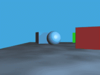

前面介紹過了去年[九月份活動頁](https://firefox.club.tw/campaign/every-moment/)的 [Canvas 刮刮樂](https://tech.mozilla.com.tw/posts/3502/)、以及[照片上傳元件](https://tech.mozilla.com.tw/posts/3738/)。

這次重頭戲來啦！

登登登！傳說中的～視差動畫！

## 設定你的視差捲軸動畫

視差效果（圖片取自 Wikipedia）

先構思好動畫的進行方式，[視差](https://zh.wikipedia.org/wiki/%E8%A7%86%E5%B7%AE)故名思義就是景物因遠近不同造成視線內移動速度的差異，

最常見的例子是在坐車時，距離較近的建築物很快從窗前經過，遠方的山卻看不出來有移動，

因此本文前面展示的範例就是示範如何處理遠、中、近不同距離物體的動畫效果：

三支 Firefox OS 手機從天而降！有沒有一種喜從天降的 fu 啊？

想好動畫的進行方式後，就可以開始製作了，首先當然要先在網頁中放上三個手機圖，

用 CSS 依據遠、中、近的不同設定好大小和位置，

範例中的手機會從畫面外掉進來，所以 top 的啟始值都是負值，

設定好後接下來就可以開始處理 Javascript 的部分，

在看範例之前先簡單介紹函式庫 [TweenMax](https://www.greensock.com/tweenmax/) + [Superscrollerama](https://johnpolacek.github.io/superscrollorama/)：

簡單來說 TweenMax 是一套轉場動畫運算的套件，

只要設定好啟始值和終點值，加上路徑、時間函式，

TweenMax 就會依照目前動畫播放的時間長度比例幫你算好目前的值。

而 Superscrollerama 則是幫你把捲軸位置當作目前播放位置傳遞給 TweenMax。

如此一來就可以在網頁上實作捲軸動畫了。以下是實際範例：

    var controller = $.superscrollorama({
        playoutAnimations: false
    });
    var fallHook = $('#fall-hook');

					1234

						    var controller = $.superscrollorama({        playoutAnimations: false    });    var fallHook = $('#fall-hook');

第一行的作用是先初始化 superscrollerama 控制器並放在 controller 變數備用，

而 fallHook 則是用來對應捲動進度的元素，你可以把 hook 元素的高度當作時間軸的長度，

一個網頁中可以有多個 hook 來控制不同角色的出場時機和長度，

本範例內容較為簡單，只用了一個 hook，在 CSS 裡可以看到它的高度是 3000px，

在這 3000px 被捲軸捲完之前三支手機掉落的動畫就會結束。

    var phone1Fall = TweenMax.to($('#phone1'), 1, {
        css: {
            top: '450px'
        }
    });
    var phone2Fall = TweenMax.to($('#phone2'), 1, {
        css: {
            top: '450px'
        }
    });
    var phone3Fall = TweenMax.to($('#phone3'), 1, {
        css: {
            top: '450px'
        }
    });

					123456789101112131415

						    var phone1Fall = TweenMax.to($('#phone1'), 1, {        css: {            top: '450px'        }    });    var phone2Fall = TweenMax.to($('#phone2'), 1, {        css: {            top: '450px'        }    });    var phone3Fall = TweenMax.to($('#phone3'), 1, {        css: {            top: '450px'        }    });

這段程式利用 TweenMax.to() 函式設定元素的動畫終點位置，

第一個參數是套用此動畫的元素，例如 #phone1，第二個參數原本是用來指定動畫長度，

但因為動畫的長度已改為由 hook 元素決定，這裡設定為 1 就好，

第三個參數則是指定動畫最終的位置，本範例的手機目標是掉到畫面下方，

fiddle 的高度是 400px左右，所以三支手機最終的 top 都設定為 450px。

重點來了，最後只要把 TweenMax 物件加進 superscrollerama 控制器，

並告訴控制器對應的 hook 元素、動畫的持續時間（捲動長度）和啟始時間（捲軸位置）即可：

    controller.addTween(fallHook, phone3Fall, 3000, 0);
    controller.addTween(fallHook, phone2Fall, 2100, 500);
    controller.addTween(fallHook, phone1Fall, 800, 1000);

					123

						    controller.addTween(fallHook, phone3Fall, 3000, 0);    controller.addTween(fallHook, phone2Fall, 2100, 500);    controller.addTween(fallHook, phone1Fall, 800, 1000);

controller 的 addTween() 的第一個參數設定 fallHook 為動畫的時間軸，

第二個參數則是把上一段的 TweenMax 物件加進去，告訴控制器終點值為何，

第三和第四個參數則分別是動畫的持續時間和啟始時間，且皆以像素為計算單位。

遠景的手機移動最慢，所以持續時間最長 3000，

而為了讓三支手機能在動畫進行到中間時可以連成一線，

遠景的手機要先進場，進景的手機則要過了 1000px 以後才進場。

才幾行 code，就完成一個捲軸動畫了，是不是比想像中的簡單多了？

## 實作小白點導覽列

要在捲軸動畫中實作導覽列很容易，

只要把元素安排在目標位置，設定 id 或 name，例：
			
 ，

運用網頁原本就有的井號頁內連結功能即可：
			<a class="nav" href="#anchor2"> ，

但點下去後發現一個問題－動畫畫面很容易整個跑版！

這是因為頁內連結直接跳過中間的捲動過程，

因此很多要在捲動過程中驅動的動畫沒有跑到，

本範例的解決方式是運用一個 JQuery 外掛 [localScroll](https://github.com/flesler/jquery.localScroll)：

    $.localScroll({
        target: 'body', // could be a selector or a jQuery object too.
        queue: true,
        duration: 500,
        hash: true
    });

					123456

						    $.localScroll({        target: 'body', // could be a selector or a jQuery object too.        queue: true,        duration: 500,        hash: true    });

加上這段 JQuery 程式後，點下頁內連結就不會直接跳到目的地，

而是會變成流暢的捲動，動畫跟著捲動一起進行，自然就不容易跑版了。

導覽列的另一個問題是，如果想要在捲動到目標時，

讓相對應的導覽列元素亮起來，該怎麼做呢？

這時就要引用一個 JQuery 外掛 [waypoints](https://imakewebthings.com/jquery-waypoints/)，

它的作用是偵測特定元素在捲動過程中進入畫面的時間點，

透過 waypoint 就可以在捲動至目標元素時，將相對應的導覽列元素亮起來：

    var $side_nav = $('#side-nav');

    var side_nav_targets = [];
    // store possible nav targets in array for easier searching
    $side_nav.find('a').each(function (index, anchor) {
        side_nav_targets.push(anchor.getAttribute('href'));
    });
    $('.nav-anchor').waypoint(function (direction) {
        $side_nav.find('a').removeClass('curr');

        if (direction === 'down') {
            $side_nav.find('a[href="#' + $(this).attr('id') + '"]').addClass('curr');
        } else {
            // find index in nav array of currently scrolled to target
            var cur_target_index = $.inArray('#' + $(this).attr('id'), side_nav_targets);

            // if there's a previous target, update the active navs
            if (cur_target_index > 0) {
                $side_nav.find('a[href="' + side_nav_targets[cur_target_index - 1] + '"]').addClass('curr');
            }
        }
    });

					12345678910111213141516171819202122

						    var $side_nav = $('#side-nav');     var side_nav_targets = [];    // store possible nav targets in array for easier searching    $side_nav.find('a').each(function (index, anchor) {        side_nav_targets.push(anchor.getAttribute('href'));    });    $('.nav-anchor').waypoint(function (direction) {        $side_nav.find('a').removeClass('curr');         if (direction === 'down') {            $side_nav.find('a[href="#' + $(this).attr('id') + '"]').addClass('curr');        } else {            // find index in nav array of currently scrolled to target            var cur_target_index = $.inArray('#' + $(this).attr('id'), side_nav_targets);             // if there's a previous target, update the active navs            if (cur_target_index > 0) {                $side_nav.find('a[href="' + side_nav_targets[cur_target_index - 1] + '"]').addClass('curr');            }        }    });

## One more thing…假掰的模糊效果

如果想做出假掰的淺景深效果，又不會用 photoshop，

可以試著運用一個實驗性的 CSS 屬性：[filter](https://developer.mozilla.org/en-US/docs/Web/CSS/filter)

由於此屬性還在 Working Draft 階段，只有較新版本的瀏覽器支援，且寫法尚未統一：

.blur {
    -webkit-filter: blur(5px);
    filter: url("data:image/svg+xml;utf8,<svg height=\"0\" xmlns=\"http://www.w3.org/2000/svg\"><filter id=\"svgBlur\" name=\"svgBlur\" x=\"-5%\" y=\"-5%\" width=\"110%\" height=\"110%\"><feGaussianBlur in=\"SourceGraphic\" stdDeviation=\"5\"/></filter></svg>#svgBlur");
}

					1234

						.blur {    -webkit-filter: blur(5px);    filter: url("data:image/svg+xml;utf8,<svg height=\"0\" xmlns=\"http://www.w3.org/2000/svg\"><filter id=\"svgBlur\" name=\"svgBlur\" x=\"-5%\" y=\"-5%\" width=\"110%\" height=\"110%\"><feGaussianBlur in=\"SourceGraphic\" stdDeviation=\"5\"/></filter></svg>#svgBlur");}

這段 CSS 可以把原本清晰的手機圖變得模糊，

把近景和遠景都變模糊，只留下中距離的物件是清晰的，

看起來就像是淺景深了對吧？
