## [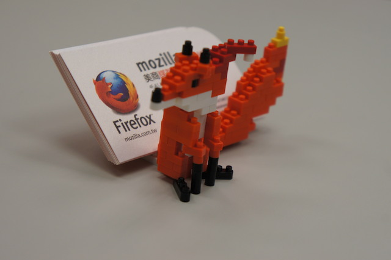](https://tech.mozilla.com.tw/wp-content/uploads/2013/12/nanoblock-firefox-preview.jpg)

難得破例不講技術，耶誕節快到了，應該要來點輕鬆的。

狐迷們，今天我們一起用積木來做一隻小火狐吧！

首先要準備的積木材料如下圖：

[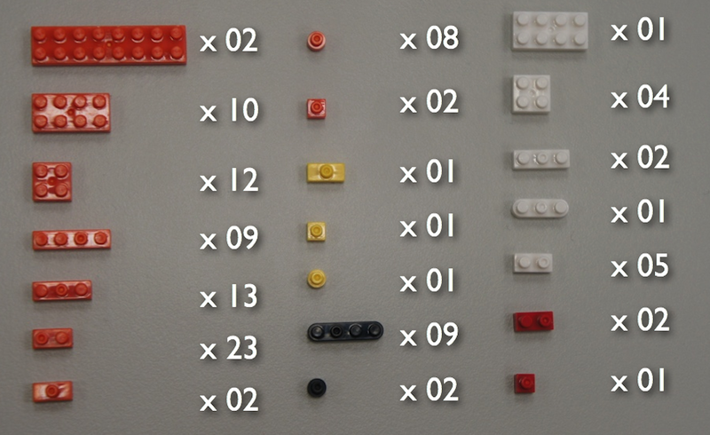](https://tech.mozilla.com.tw/wp-content/uploads/2013/12/nanoblock-firefox-blocks.png)

## 從頭到尾分解步驟

底下開始詳細的圖文分解步驟，只要一步步照著做，很快就可以完成你的積木小火狐囉！

[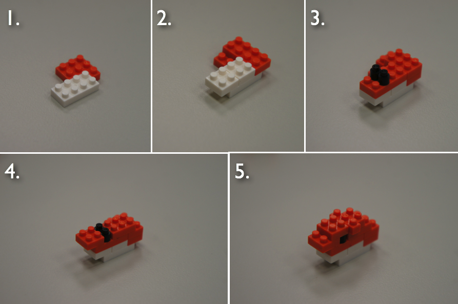](https://tech.mozilla.com.tw/wp-content/uploads/2013/12/nanoblock-firefox.01.head_.png)

1. 首先照上圖把小火狐的頭組裝起來，注意第四步最左邊的方塊底下要裝鼻子（如[圖 3](https://tech.mozilla.com.tw/#step3) ），

所以不要讓底部的卡榫擋住中間，否則鼻子會裝不上去。

[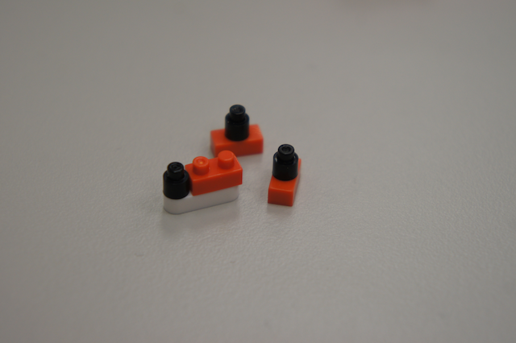](https://tech.mozilla.com.tw/wp-content/uploads/2013/12/nanoblock-firefox.02.ear-nose.png)

2. 準備一對耳朵和一個鼻子。

[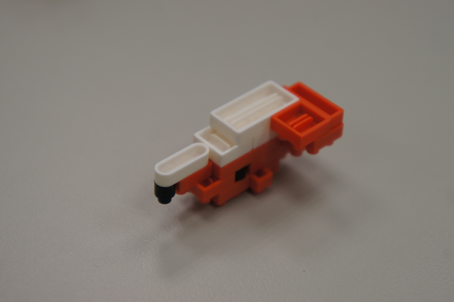](https://tech.mozilla.com.tw/wp-content/uploads/2013/12/nanoblock-firefox.03.nose_.png)

3. 把鼻子裝在前面中間的地方。

[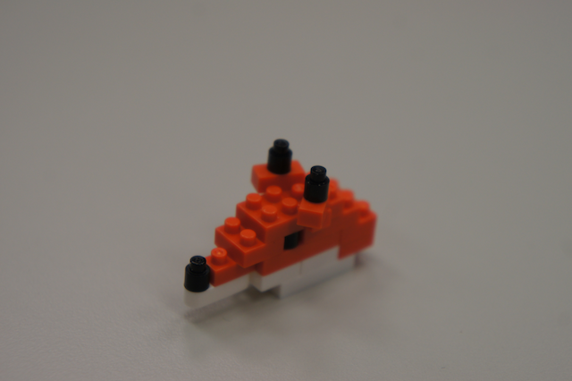](https://tech.mozilla.com.tw/wp-content/uploads/2013/12/nanoblock-firefox.04.ear_.png)

4. 把兩個耳朵往外斜 45 度裝上去。

[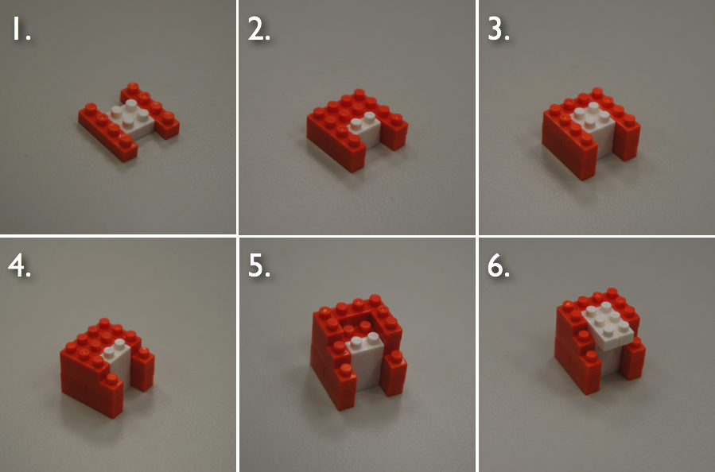](https://tech.mozilla.com.tw/wp-content/uploads/2013/12/nanoblock-firefox.05.chest_.png)

5. 接著照上圖組裝小火狐的胸。

[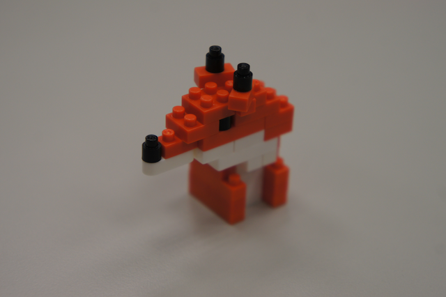](https://tech.mozilla.com.tw/wp-content/uploads/2013/12/nanoblock-firefox.06.head-chest.png)

6. 把頭和胸結合起來如上。

[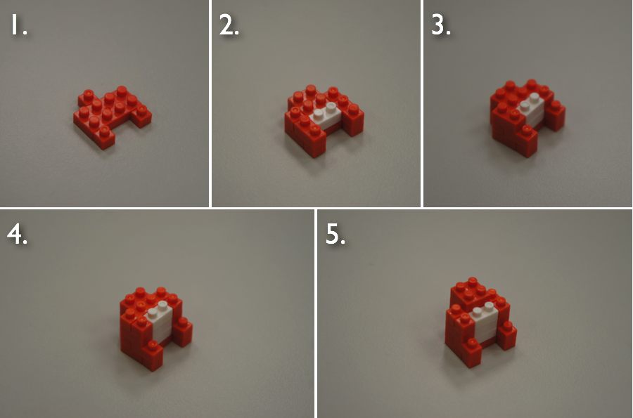](https://tech.mozilla.com.tw/wp-content/uploads/2013/12/nanoblock-firefox.07.belly_.png)

7. 依照上圖組裝小火狐的腹部。

[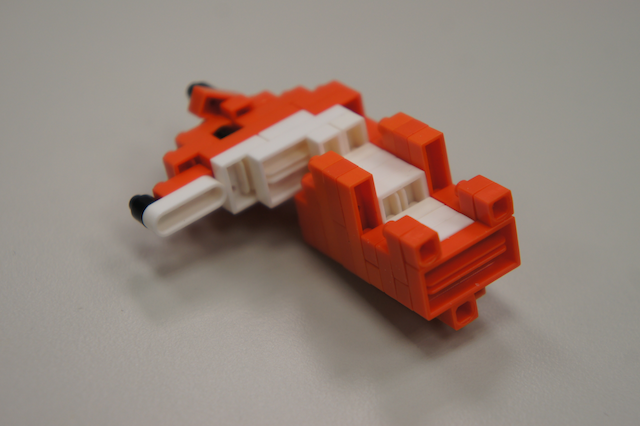](https://tech.mozilla.com.tw/wp-content/uploads/2013/12/nanoblock-firefox.08.chest-belly.png)

8. 把腹部和剛才（[圖 6](https://tech.mozilla.com.tw/#step6) ）的頭、胸結合起來。

[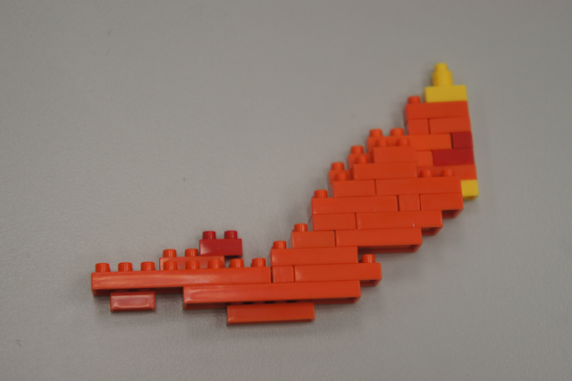](https://tech.mozilla.com.tw/wp-content/uploads/2013/12/nanoblock-firefox.09.tail_.png)

9. 接著先做尾巴，因為尾巴是平面的，照上圖組合即可，就不提供分解圖囉。

[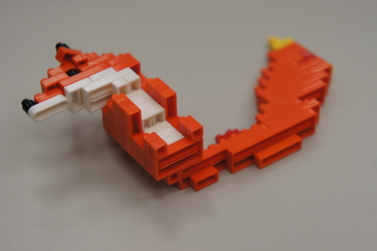](https://tech.mozilla.com.tw/wp-content/uploads/2013/12/nanoblock-firefox.10.belly-tail.png)

10. 把尾巴接上剛才（[圖 8](https://tech.mozilla.com.tw/#step8)）腹部的底部後方。

[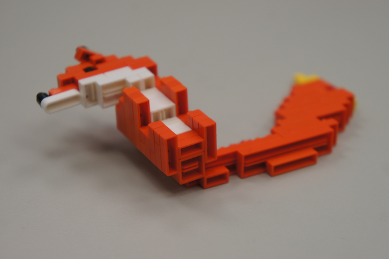](https://tech.mozilla.com.tw/wp-content/uploads/2013/12/nanoblock-firefox.11.butt_.png)

11. 在腹部底下再加疊一層固定。

[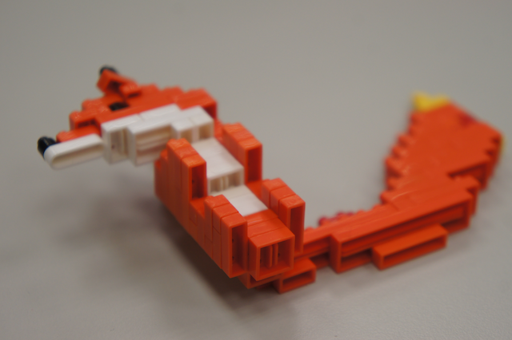](https://tech.mozilla.com.tw/wp-content/uploads/2013/12/nanoblock-firefox.12.butt_.png)

12. 最後再疊一個方塊當屁股，這樣一來火狐的身體基本上就完成囉！

[

13. 準備好火狐的雙手雙腳。

[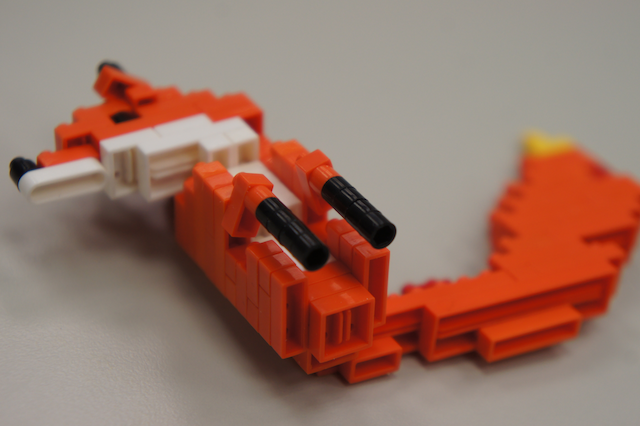](https://tech.mozilla.com.tw/wp-content/uploads/2013/12/nanoblock-firefox.14.front-legs.png)

14. 接上兩隻前腳，並轉成內八的角度。

[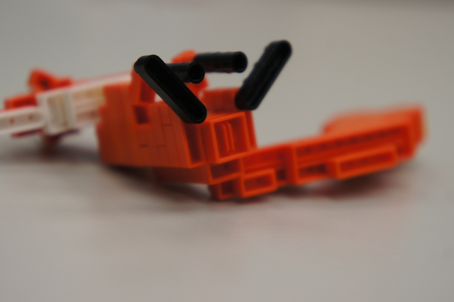](https://tech.mozilla.com.tw/wp-content/uploads/2013/12/nanoblock-firefox.15.back-legs.png)

15. 再用外八的角度裝上兩隻後腳。

[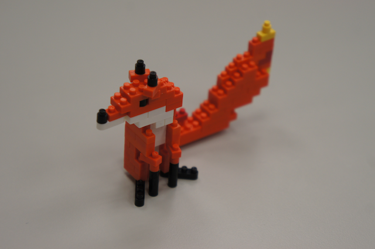](https://tech.mozilla.com.tw/wp-content/uploads/2013/12/nanoblock-firefox.16.complete.png)

登登登！大功告成啦！

和原圖比較看看，有沒有很像？

[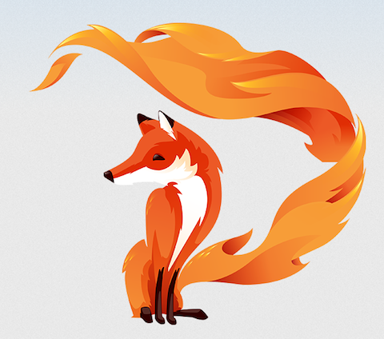](https://tech.mozilla.com.tw/wp-content/uploads/2013/12/firefox.png)

## 擴充成名片架

如果你是個實用派，希望小火狐也可以有一些實際的功能，

那麼底下將教你如何把小火狐擴充成名片架。

[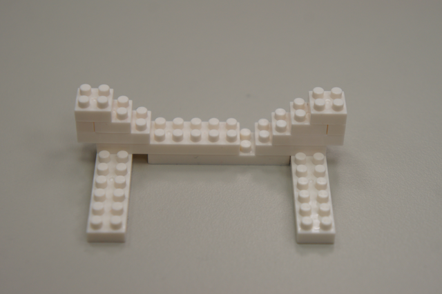](https://tech.mozilla.com.tw/wp-content/uploads/2013/12/nanoblock-firefox.17.card-holder.png)

名片架組合方式。

[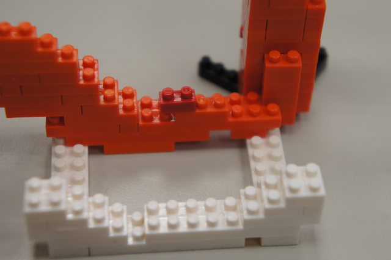](https://tech.mozilla.com.tw/wp-content/uploads/2013/12/nanoblock-firefox.18.card-holder.png)

將名片架和 Firefox 結合。

[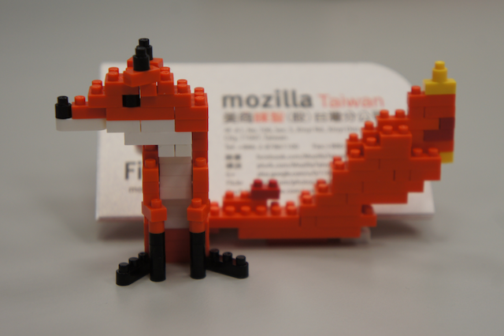](https://tech.mozilla.com.tw/wp-content/uploads/2013/12/nanoblock-firefox.19.card-holder.png)

完成！放上你的名片吧！

## 增添一些耶誕氣氛

積木有趣的地方就是可以自己依心情或節氣增加不同的裝飾，

耶誕節快到了，當然不免俗的要幫小火狐戴一頂耶誕帽囉！

因為火狐的頭很小 XD，所以他的帽子很好做：

[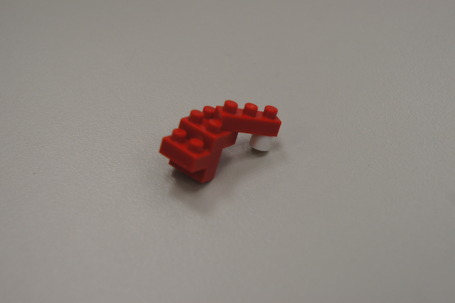](https://tech.mozilla.com.tw/wp-content/uploads/2013/12/nanoblock-firefox.20.xmas_.png)

小耶誔帽。

[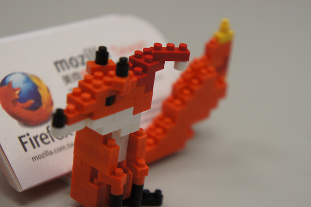](https://tech.mozilla.com.tw/wp-content/uploads/2013/12/nanoblock-firefox.21.xmas_.png)

戴在小火狐頭上。是不是很有耶誕節的 fu 呢？

為了捍衛網路的自由開放，你也來做一隻小火狐加入我們吧！
