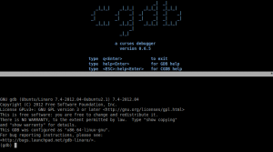
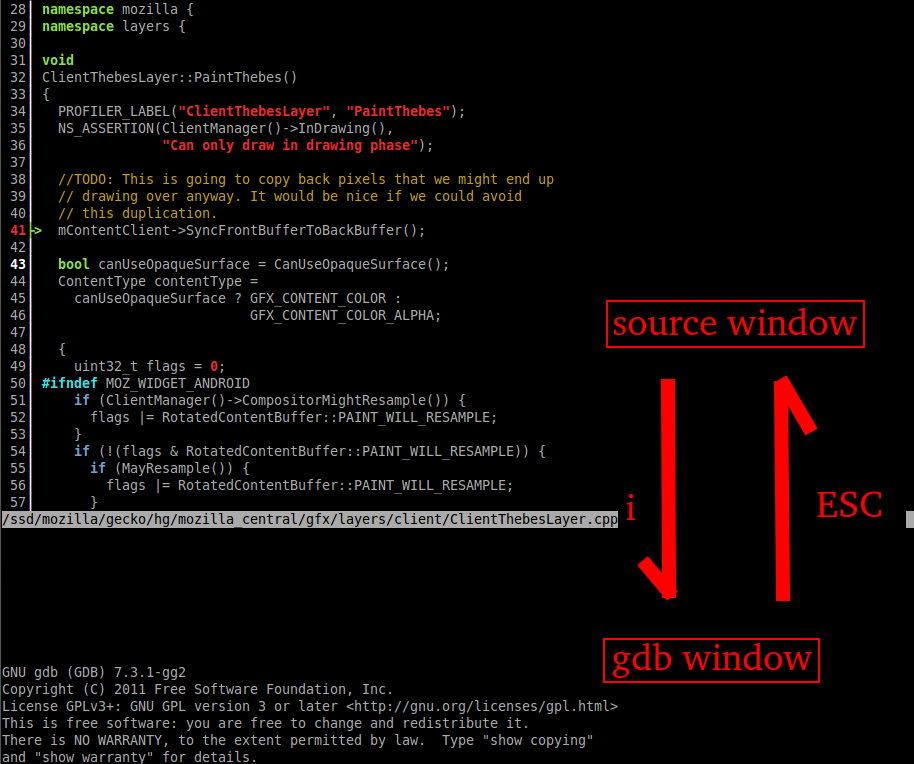
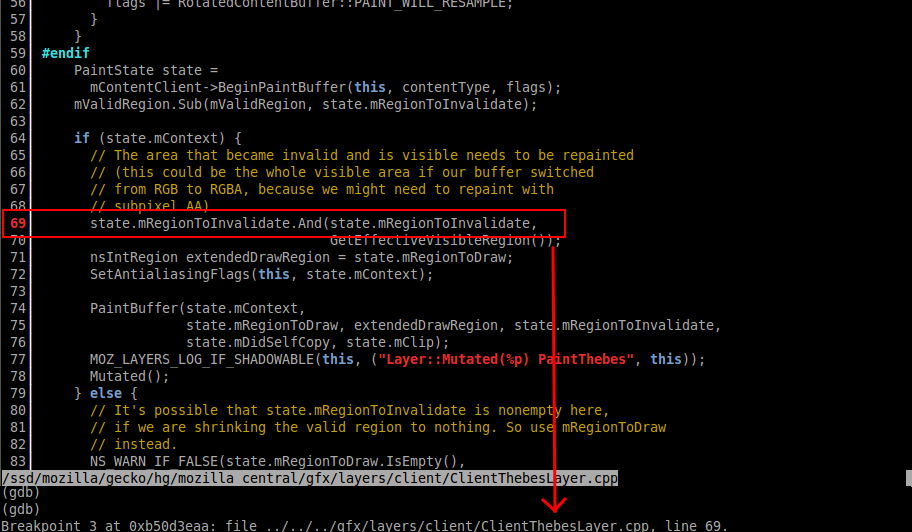
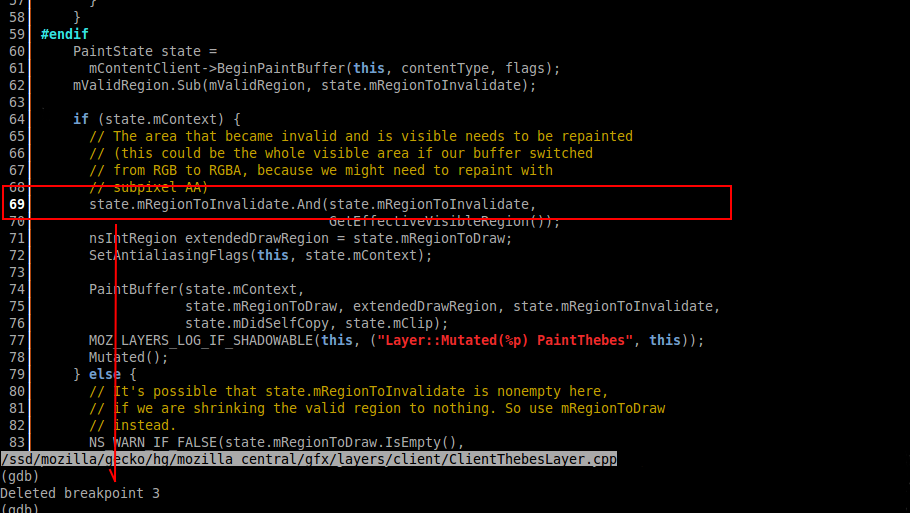

我們在開發過程中，常常會使用 GDB 來找 bug，但是它是純文字介面，使用上還是有些不便，幸好現在可以找到不少 open source project 來改進這些問題，今天所介紹的 CGDB[[1]](https://cgdb.github.io/) 工具，是我使用過覺得相當好用的工具，讓你在漫漫長夜的 debug 過程中，得到一點小小的慰藉。CGDB 其實沒有 DEBUG 的能力，它底層還是需要呼叫GDB的，它使用 GDB MI[[2]](https://sourceware.org/gdb/onlinedocs/gdb/GDB_002fMI.html) 的介面，重新包裝了 GDB ，讓你用更簡單的方式操作 GDB。

### CGDB 的特點

- 讓你人生變彩色的 syntax highlight source window，可以不用切到其他 editor 就可查看或搜尋程式碼。

- 簡單的 breakpoint 新增與刪除方式。

當然 CGDB 還有其他好用的功能，網路上有完整的文件[[3]](https://cgdb.github.io/docs/cgdb.html)可以參考。

### 安裝 CGDB

要在 ubuntu 上安裝 CGDB 相當簡單，如果不想自己 build ，直使用 apt-get 安裝就可以了。

		
		

apt-get install cgdb
			
				
					
				
					1
				
						apt-get install cgdb
					
				
			
		

安裝完成後，直接執行程式，看到 CGDB logo 就代表安裝成功囉。

		
		

cgdb
			
				
					
				
					1
				
						cgdb
					
				
			
		

若你用的是 cross compiler tool chain 也沒關係，加個參數 -d 就可以用了。

		
		

# if your debugger is arm-linux-androideabi-gdb
cgdb -d arm-linux-androideabi-gdb
			
				
					
				
					12
				
						# if your debugger is arm-linux-androideabi-gdbcgdb -d arm-linux-androideabi-gdb
					
				
			
		

### CGDB 101

要在 B2G GDB debug script 改用 CGDB 很簡單，只要修改 run-gdb.sh 內容，改用 CGDB 即可。

		
		

else
 echo $GDB -x $GDBINIT $PROG
 #$GDB -x $GDBINIT $PROG
 cgdb -d $GDB -- -x $GDBINIT $PROG #<---use cgdb here
fi
			
				
					
				
					12345
				
						else echo $GDB -x $GDBINIT $PROG #$GDB -x $GDBINIT $PROG cgdb -d $GDB -- -x $GDBINIT $PROG #<---use cgdb herefi
					
				
			
		

CGDB 頁面分成 source window 及 [casino online](https://www.nbso.ca/)  GDB command window 兩部分，你可以像使用原來 GDB 一樣，在 GDB command window 輸入 command 來 debug，也可以切到 source window 看你要 debug 的程式內容，兩個 window 切換方式和 VIM 相同，使用 Esc 及 i 鍵來切換。GDB command 的教學網路上可以找到不少文章，或是可以參考[[4]](https://www.yolinux.com/TUTORIALS/GDB-Commands.html)的教學內容。

新增及移除 break point 方法很簡單，只要切到 source window 後，使用 PageDown/PageUp 及方向鍵移到你想要新增/刪除的位置，按下空白鍵就可以輕鬆新增/刪除 break point。

CGDB 還有其他好用的功能，像是可以自定義 macros 或是用 regexp 去查找程式，值得大家花時間試用看看。

Reference:

[1] [http://cgdb.github.io/](https://cgdb.github.io/)

[2] [https://sourceware.org/gdb/onlinedocs/gdb/GDB_002fMI.html](https://sourceware.org/gdb/onlinedocs/gdb/GDB_002fMI.html)

[3] [http://cgdb.github.io/docs/cgdb.html](https://cgdb.github.io/docs/cgdb.html)

[4] [http://www.yolinux.com/TUTORIALS/GDB-Commands.html](https://www.yolinux.com/TUTORIALS/GDB-Commands.html)
