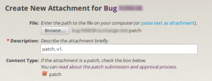
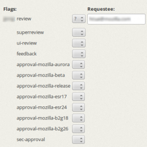
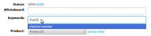

看了這麼[熱血的影片](https://www.youtube.com/watch?v=LuyBGkbzTjs)，想必你也迫不及待想成為個 mozillian 吧？！只要有心，人人都能成為 mozillian，如果坐在電腦前的你是個 developer 那就更適合不過了！

這篇就來告訴你如何貢獻到 mozilla 的 code base。

## Step 1：新增 Bugzilla 帳號

首先，你需要[新增一個 Bugzilla 帳號](https://bugzilla.mozilla.org/createaccount.cgi)。Bugzilla 是一套追蹤 bug 的系統，mozilla 幾乎所有的程式碼修改都記錄在 [Bugzilla@Mozilla](https://bugzilla.mozilla.org/) 上，上 code 時也需要在 Bugzilla 經過審核（review）才能真的進到 mozilla code base。因此這個 Bugzilla 帳號是不可或缺的！當然，若你發現任何問題，也可以在 Bugzilla 上回報。

## Step 2：抓 code

下一步就是抓 code 囉！這部分可以參考[先前的文章](https://tech.mozilla.com.tw/posts/2786/easy-3-steps-to-build-firefox-os)，不過實際上 code 到 mozilla 需要用到 mercurial（hg） 這套版本管理工具。如果你習慣使用 git，也可以用 git 準備好 patch 再 import 到 hg 或直接[轉換](https://github.com/jlebar/moz-git-tools/blob/master/git-patch-to-hg-patch)成 hg  格式。mercurial（hg）的使用方式這邊就不贅述，詳細請參考 [1]。

## Step 3：認養 + 解 bug

接下來就可以在 Bugzilla 上認養 bug 了！如果不知道從何下手，可以從 [Good first bugs](https://bugzil.la/sw:%5Bgood%20first%20bug%5D)（適合新手的 bugs）或是 [Mentored bugs](https://bugzilla.mozilla.org/buglist.cgi?quicksearch=mentor&list_id=9369471)（有指導員幫忙的 bugs）開始。mozilla 還貼心的準備了[有中文指導員的 bugs](https://bit.ly/mentor-lang-zh) 喔！如何解決問題就是你大展身手的時候了。當你找到解決 bug 的方法後，請回到 Bugzilla 的 bug 上選擇 「Add an attachment」把準備好的 patch 上傳到 bug 上。別忘了，patch 需要是 hg 的格式。

Create attachemnt (patch)

## Step 4：審核

上到 mozilla code base 的 patch 需經過 reviewer 給「 r+ 」才能夠 checkin。邀請 reviewer 審核請到上一步驟 attachment 的「 Details」頁面，在「 review」欄位選擇「？」並輸入 reviewer 的 email 或 Bugzilla id 。如果不知道請誰 review，可以到[這邊](https://wiki.mozilla.org/Modules/All)找相關的 owner 和 peers 幫忙。Reviewer 可能不會第一次就給「 r+ 」，這時不要灰心，這是必經之路，只要依照 reviewer 給的建議或是和 reviewer 討論後，修改 patch 再重複審核過程，「 r+ 」很快就會是你的。

如果 code 改動的幅度較大，像是修改了原有的架構、API、modules 間的互動方式 等，那麼除了 reviewer 以外還要邀請 [super-reviewer](https://www.mozilla.org/hacking/reviewers.html#the-super-reviewers) 來審核，保險起見 reviewer 和 super-reviewer 不能是同一個人。邀請 super-reviewer 的方法與邀請 reviewer 類似，只是改使用「 superreview」欄位。

Ask for review

## Step 5：跑自動測試

patches 上到 code base 前（或邀請 review 前）請務必先丟到 [mozilla try server](https://wiki.mozilla.org/ReleaseEngineering/TryServer) 跑過測試，確保你的 patch 不會造成新的問題。mozilla try server 是一套自動測試系統，讓你在不用 check-in patch 的情況下就能跑過所有的測試。

要丟到 try server 跑測試需要有 mozilla hg（level 1）的帳號。申請步驟稍微繁雜一點點，但主要的 actions 可分為三個：

- 在 Bugzilla 的「Repository Account Requests」component 下，新增一個 bug，主旨為「Commit Access (Level 1) for Xxxx Xxxx」，提供你要使用的 email address， 並在 bug 上附上你的 SSH public key（附檔名為「.pub」的檔案）。

- 詳讀並填妥 [Committer’s Agreement](https://www.mozilla.org/hacking/notification/) 後， 郵寄／傳真／email 給相關人士，並在 bug 上告知已將 Committer’s Agreement 寄出。

- 找 voucher（s）到 bug 上替你喊一聲做擔保。

剩下就交給 mozillla IT 了！申請進度都會在 bug 上更新。可參考 [Bug 706248](https://bugzilla.mozilla.org/show_bug.cgi?id=706248) 作為範例，詳細步驟請參考 [2]。

申請完就能將 patch（es）透過 hg 丟到 try server 跑測試了：

		
		

hg qref --message "try: -b do -p all -u all -t none"
hg push -f ssh://hg.mozilla.org/try/
			
				
					
				
					12
				
						hg qref --message "try: -b do -p all -u all -t none"hg push -f ssh://hg.mozilla.org/try/
					
				
			
		

以上指令會將你的 commit message 改成 [try syntax](https://wiki.mozilla.org/Build:TryChooser#Syntax_Builder)，記得跑完再用第一個指令將 commit message 改回來。

## Step 6：完成！

若你的 patch（es）跑完 try server 後沒有什麼問題，就可以在 bug 上的 keyword 選擇 checkin-needed，會有善心人士幫你的 bug merge 進 code base 裡。而當 patch 被 merge 進 main branch，bug 也會隨之被標為「resolved」。

Checkin-needed

恭喜你！這樣你的第一個 bug 就完成了。Happy Hacking！

註：B2G 非 gecko 的 projects 需使用到 github，步驟會有些不同。

[1] [Using Mercurial](https://developer.mozilla.org/en/docs/Mercurial_FAQ)

[2] [Becoming a Mozilla Committer](https://www.mozilla.org/hacking/committer/)

參考資料：

- [Contributing to the Mozilla codebase](https://developer.mozilla.org/en/docs/Introduction)

- [How to Submit a Patch](https://developer.mozilla.org/en/docs/Introduction)
