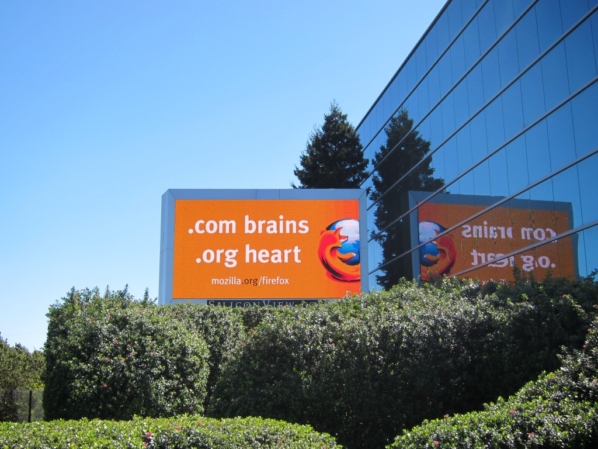
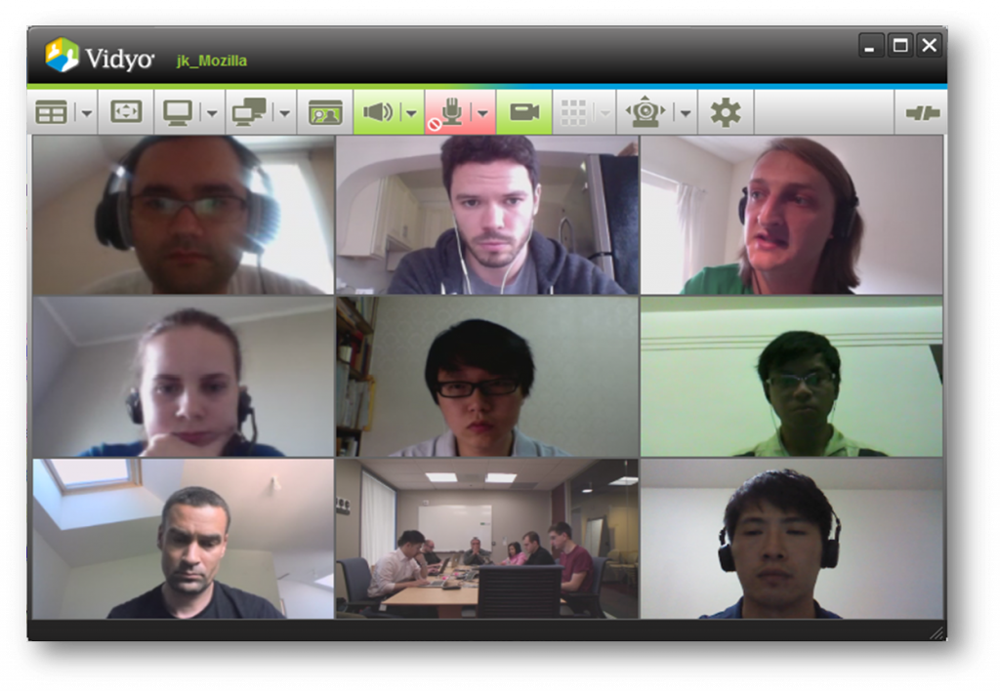

相信關心「謀智台客」的各位對於 Firefox OS (Boot to Gecko, B2G 專案) 都有基本的認識了（還有問題的可以趕快閱讀由 [timdream](https://blog.timc.idv.tw/) 哥發表過的「[關於 B2G 計畫，以及 Web 的誤解](https://tech.mozilla.com.tw/posts/351/%E9%97%9C%E6%96%BC-b2g-%E8%A8%88%E7%95%AB%EF%BC%8C%E4%BB%A5%E5%8F%8A-web-%E7%9A%84%E8%AA%A4%E8%A7%A3)」），但這麼龐大的專案會是兩三個小伙子躲在車庫就搞出來的嗎？

答案當然不是！其實主要是由大約80位 Mozilla 的 Geek 專業工程師和無數個志工所同心協力開發的，而且 B2G 可是一個跨國際的大型專案呢！

這些參與 B2G 專案的工程師來自於世界各地，除了大家所熟知座落在加州 Mountain View 的 Mozilla 總部，另外還有位於北京，倫敦，巴黎…等的分部也都有工程師參與，最重要的是，燒燙燙在去年 2011 年 10 月成立的台灣分公司，也在 B2G 專案中扮演最重要的角色之一。

要讓這麼大型的計畫順利的執行起來，除了每個 Mozillian 都擁有的熱情與拼勁之外，各個不同時區的合作模式也是非常重要的一環。就拿 Mountain View 與台灣分公司來說，兩邊的上下班時間剛好是完全相反的，所以 E-mail 的往來與視訊會議的互動是再平凡（頻繁）也不過了。但這樣透過書信溝通與視訊會議這樣效率好嗎？別擔心，在 .org 基金會的 Mozillians 個個都有著 .com 的辦事效率，往往在下班之後、回家閒暇之餘或者晚上睡到一半被前女友的電話吵醒睡不著時，都會利用時間與國外的工作夥伴討論進度與所遭遇到的問題。

.com brains .org heart

這些光聽起來就是件苦差事，下班了不只要動腦而且還要切換成英文模式。但其實辛苦的地方也就是有趣的地方，從小到大大家都說英文很重要很重要，終於在進到 Mozilla 的這一刻它完全派上用場了！這真的是養兵千日。不光只是寫作的部份，聽力與口說在視訊會議更是大量使用，怪不得自從進了 Mozilla 以後，頭腦就靈光了很多，每次考試都考一百分，明顯的高了，人也壯了，自信心都回到我身邊了，呀～～～

B2G/Gaia Meeting

在一個這麼國際化的公司工作，除了每天都有喝不完的鮮奶和跟聚寶盆一樣會一直自己複製出來的零食之外 *1，另外一個做夢也會笑的福利就是可以和神人級的大師一起工作！相信使用過 JavaScript 開發的朋友，應該都拜讀過由 [David Flanagan](https://twitter.com/__DavidFlanagan/) 撰寫的 JavaScript: The Definitive Guide: Activate Your Web Pages – Definitive Guides 經典本，而 David 目前也是 Mozilla 的一員，並且也在 B2G 的 UI 層 – [Gaia](https://wiki.mozilla.org/Gaia) 負責許多重要的工作，所以在每週的 Gaia meeting 以及程式碼當中，都可以見到他的身影，更不用說一般平常在 Gaia 上的合作。您說，這對一個程式設計師來講是不是真的很夢幻呢！

加入 Mozilla 並且參與 B2G 這個即將改變世界的計畫，真的是不可多得的機會，你可以得到的收穫遠比你想像中大的多。大家是否記得蜘蛛人他阿伯說過：「With great power comes great responsibility.」，如果你心懷大志而且視改變世界為己任的話，快加入 B2G 開發的行列吧！

*1 特別感謝 Mozilla Taiwan 首席助理 Kate 小姐
