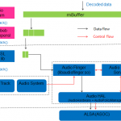

“聽  海哭的聲音  這片海未免也太多情   悲泣到天明"

是低，大家都知道是阿妹經典到不行的歌，但是如果阿妹聲音播不出來，那哭的人就換成是我而不是那片海了 Orz ！

請大家先從阿妹的歌聲裡 (或是我的哭聲?) 回到現實來，聽我來聊聊 Firefox OS 裡聲音的部分。基本上聲音系統裡可以簡單分成兩種，一種是 voice 另一種則是 audio，簡單的分法就是"講電話" (voice) 跟"玩手機" (audio)。玩手機又可以分成播放 (playback) 和錄音 (record) 兩種，本篇把焦點會放在 audio playback 的部分，換句話說就是手機播放聲音的功能！事實上，audio 牽扯很多相關的功能，像是 Modem、Bluetooth、FMRadio 等，而且有時候你叫 audio 播，他還真的給你裝作沒聲音；有時候你不想要 audio 播，他卻跑出聲音來！我只能學宮廷劇的華妃來一句 – audio 就是矯情！(尾音升高 =.=)

從 FxOS (Firefox OS 的縮寫，本篇台客文章之後均用此縮寫) 大架構來分，audio 可以分成 Gaia layer / Gecko layer / Gonk layer ; 從 FxOS 播放來講，Gaia app 可以使用 audio element 來對 audio 進行播放、暫停等操作。來來來，你來，是叫你來一起看大架構啦：

[Gaia layer]  以下舉例說明使用一個 audio element，至於如何使用 audio API，可以到 MDN 上查一查喔！

		
		

var player = new Audio();    // audio element
player.play()                // play function
player.pause()               // pause function
			
				
					
				
					123
				
						var player = new Audio();    // audio elementplayer.play()                // play functionplayer.pause()               // pause function
					
				
			
		

[Gecko layer] 接下來 audio 檔案會被 decode 成 PCM data，然後往 audio back-end 傳送。

鄉民說沒圖沒真相，為了讓大家了解 FxOS 發出聲音的真相，放上兩張野生的 Gecko 的 audio 架構圖。

 

從這兩張圖來看 audio 的 data 流動，左半邊的圖，我們看到在 MediaDecoderStateMachine 會產生一個 audio thread 負責把 decode 完的 PCM data 往 AudioStream 塞；右半邊的圖，我們看到會產生一個 AudioStream 的 instance，且在 AudioStream::Init() 的階段，會將 stream type、channel number、sample rate 等資訊帶到 audio back-end 去。以下對幾個 component 稍加說明。

a) HTMLMediaElement: 是HTMLAudioElement 的 parent class，會提供 audio element 的基本操作像是 audio.play() 或是 audio.pause() 的具體實作。

b) MediaDecoder/MediaDecoderStateMachine: MediaDecoder 中有個 MediaReader 負責 decode 不同類型的 audio 檔案成 PCM data，而在  MediaDecoderStateMachine 會處理不同的 decode 狀態，然後使用 AudioLoop 叫 AudioStream 去存取 decode 完成的資料。

c) AudioStream: 維護一個 buffer，使用 SetCapacity() 設定存放 n 秒的 buffer 大小，利用 PopElements()  & AppendElements() 兩個 function 來操作這一個 circular buffer 的讀取和寫入。

d) Lib Cubeb: 提供一組 file operation 讓 audio stream object 可以和不同的 audio back-end 溝通。(FxOS 目前是使用 Android 的 OpenSL NDK lib 當成 back-end )

[Gonk layer] 使用 Android AudioTrack/AudioFlinger 和 ASOC audio driver 將 digital PCM轉成 analog 訊號往正確的 output device 傳送。

a) OpenSL ndk: Android 提供的一個實作 OpenSL 的 API 的 library，FxOS 使用 OpenSL ndk 而不直接使用 AudioTrack 的原因 – 這樣就不會因為 Android 版本的改動而需要修改 Gecko 相關的 code。

b) AudioTrack & AudioFlinger: Android Audio back-end！ 維護一個 circular shared memory buffer，在 plackback 部分，AudioTrack 主要負責"寫" PCM data 到 buffer 裡；而 AudioFlinger 主要負責從 buffer 裡"讀" PCM data，然後把 PCM data 送給 Android HAL 的 AudioHardware 。

c) Android HAL: Android 提出的一組硬體抽象層，透過 ALSA API (或是 Tiny ALSA API)  來對 ASOC audio driver 提供的 File Operation 來進行操作。然後將 digital 訊號轉成 analog 訊號，往 output device 硬體輸出。

## [後記]

除了上面提到的 audio playback 的部分外，像是跟 connection device (像是 Bluetooth headset – A2DP / SCO 或是有線耳機) 和 phone state 相關的 AudioManager 也是一個有趣的 topic (但是不是在本篇聊 ^.^)。另外 audio competing policy 的 audio channel service / agent 、audio policy service + audio policy manager (決定 routing path) 也都是可以好好聊聊的 topics。最後，如果對這些 audio 的 component 的熟悉度有提升的話，我想 audio 就沒辦法矯情了， 也可以快速地找到 bug 的 root cause了 🙂

[1] cubeb.c 負責接不同的 audio back-end ([http://dxr.mozilla.org/mozilla-central/source/media/libcubeb/src/cubeb.c?from=cubeb.c&case=true#51](https://dxr.mozilla.org/mozilla-central/source/media/libcubeb/src/cubeb.c?from=cubeb.c&case=true#51))
