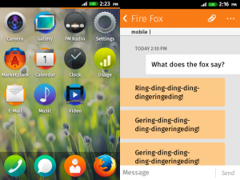

在人手一支智慧型手機的時代加上 3G ／4G 行動通訊快速的發展，已出現越來越多樣性的即時通訊軟體，例如：Line、WhatsApp 等等。但提到手機內建最老字號的通訊服務，當然是從 2G／2.5 G 時代就已經存在至今的 SMS（簡訊服務）與 MMS（多媒體訊息服務）。只需要對方電話號碼，不論您與對方身處國內外，都能提供使用者即時且圖文並茂的訊息服務。今天的主題要帶著大家一起來了解這兩項服務在 Firefox OS 上是如何實現。

Firefox OS 提供了 Web App 哪些 Moible Message 相關的 DOM API [[1]](https://hg.mozilla.org/releases/mozilla-b2g28_v1_3/file/0fd9f6fe8832/dom/mobilemessage/interfaces/nsIDOMMobileMessageManager.idl)，在此我們列出與收／送相關之介面如下：

- send (number, message, [optional] sendParameter) 發送簡訊 ：只需帶入電話號碼、文字內容，就能將簡訊發送到指定的電話號碼。

- sendMMS (parameter, [optional] sendParameter) 發送多媒體訊息 ：帶入 [[2]](https://hg.mozilla.org/releases/mozilla-b2g28_v1_3/file/0fd9f6fe8832/dom/webidl/MobileMessageManager.webidl) 所規範之參數格式包括收件者位址、主旨、文字內容與影音圖片等附件，即可將此多媒體訊息寄送到收件者位址。

- onsending 、 onsent 、 onfailed ：訊息發送中的狀態與最終發送結果。

- onreceived ：當手機收到新訊息時，主動回報的介面。

Mobile Message 架構圖：

- [MobileMessageManager](https://hg.mozilla.org/releases/mozilla-b2g28_v1_3/file/0fd9f6fe8832/dom/mobilemessage/src/MobileMessageManager.cpp)：提供了上個章節所提到 DOM API 實作的進入點。

- [SMSIPCService](https://hg.mozilla.org/releases/mozilla-b2g28_v1_3/file/0fd9f6fe8832/dom/mobilemessage/src/ipc/SmsIPCService.cpp)：提供 Gaia 與 Gecko 間跨 process 的溝通管道。詳細內容已由 巧克力分享的“ [快來幫忙找，IPDL 在哪裡？](https://tech.mozilla.com.tw/posts/2296/%E5%BF%AB%E4%BE%86%E5%B9%AB%E5%BF%99%E6%89%BE%EF%BC%8Cipdl%E5%9C%A8%E5%93%AA%E8%A3%A1%EF%BC%9F)”一文有更深入的說明。

- [SmsService](https://hg.mozilla.org/releases/mozilla-b2g28_v1_3/file/0fd9f6fe8832/dom/mobilemessage/src/gonk/SmsService.cpp)：負責從 RadioInterfaceLayer 選擇指定的 RadioInterface 發送簡訊。（由於目前 Firefox OS 已支援一機多卡的架構，所以有多個 RadioInterface 可供選擇。）

- [RadioInterfaceLayer](https://hg.mozilla.org/releases/mozilla-b2g28_v1_3/file/0fd9f6fe8832/dom/system/gonk/RadioInterfaceLayer.js)：負責與手機中的數據機模組作資訊的交換，其中包括：接/打電話、收/送簡訊、、行動上網、 SIM 卡管理等服務。

- [MmsService](https://hg.mozilla.org/releases/mozilla-b2g28_v1_3/file/0fd9f6fe8832/dom/mobilemessage/src/gonk/MmsService.js)：為 MMS 實作的核心，包含要求 RadioInterfaceLayer 建立 MMS 網路連線、編/解碼 MMS 封包、透過 XMLHTTPRequest 收／送 MMS 封包。

- [MobileMessageDatabaseService](https://hg.mozilla.org/releases/mozilla-b2g28_v1_3/file/0fd9f6fe8832/dom/mobilemessage/src/gonk/MobileMessageDatabaseService.js)：顧名思義，利用 IndexedDB ，將收／送的訊息保存在資料庫中，供 Web App 隨時存取所有的訊息記錄。

- [MobileMessageService](https://hg.mozilla.org/releases/mozilla-b2g28_v1_3/file/0fd9f6fe8832/dom/mobilemessage/src/MobileMessageService.cpp)：負責產生一則 SMS／MMS 訊息對應的 DOM Object 供 Web App 做 UI 上的呈現。

介由以上的簡介希望能拋磚引玉，讓更多人了解 Firefox OS 的相關的實作，若有興趣參與，也可以參考由小圭分享的文章“[我也想成為-mozillian！教你如何貢獻到-mozilla-code-base](https://tech.mozilla.com.tw/posts/4116/%E6%88%91%E4%B9%9F%E6%83%B3%E6%88%90%E7%82%BA-mozillian%EF%BC%81%E6%95%99%E4%BD%A0%E5%A6%82%E4%BD%95%E8%B2%A2%E7%8D%BB%E5%88%B0-mozilla-code-base)”，實際參與各項功能的開發喔！

[1] [Interface Definition of MobileMessageManager](https://hg.mozilla.org/releases/mozilla-b2g28_v1_3/file/0fd9f6fe8832/dom/mobilemessage/interfaces/nsIDOMMobileMessageManager.idl)

[2] [Definition of SMS/MMS Sending Parameters](https://hg.mozilla.org/releases/mozilla-b2g28_v1_3/file/0fd9f6fe8832/dom/webidl/MobileMessageManager.webidl)
