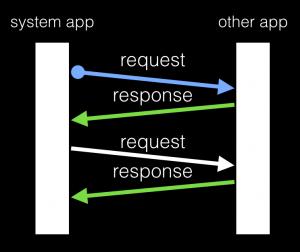

先前 [EragonJ 跟大家介紹過 Inter App Communication 的使用情境以及使用範例程式碼](https://tech.mozilla.com.tw/posts/3560/inter-app-communication-app-%E7%9A%84%E6%BA%9D%E9%80%9A%E6%A9%8B%E6%A8%91)，本篇將繼續討論 Inter-App Communcation（文章後面將縮寫為 IAC ）其他較少為人知的面向。

## 雙向通訊連線

使用 IAC 建立連線的程式碼通常如下：

		
		

navigator.mozApps.getSelf().onsuccess = function(evt) {
  var app = evt.target.result;
  app.connect('some-iac-keyword').then(function onConnAccepted(ports) {
    // send messages
  }, function onConnRejected(reason) {
    // error handling
  });
}
			
				
					
				
					12345678
				
						navigator.mozApps.getSelf().onsuccess = function(evt) {  var app = evt.target.result;  app.connect('some-iac-keyword').then(function onConnAccepted(ports) {    // send messages  }, function onConnRejected(reason) {    // error handling  });}
					
				
			
		

但其實 IAC 建立出來的連線是雙向連線，連線兩端的 app 只要拿得到 port 就可以傳送訊息給另一端 app 。因此在某些情況下， app 可以借助 [IACHandler](https://github.com/mozilla-b2g/gaia/blob/master/shared/js/iac_handler.js) 的幫助，不需要事先透過 [mozApps API](https://developer.mozilla.org/en-US/docs/Web/API/Apps) 建立連線而直接使用下方的程式碼與其他 app 以 IAC 進行溝通。

		
		

var port;
try {
  port = IACHandler.getPort('some-iac-keyword');
  port.postMessage(message);
} catch (e) {
  // report error
}
			
				
					
				
					1234567
				
						var port;try {  port = IACHandler.getPort('some-iac-keyword');  port.postMessage(message);} catch (e) {  // report error}
					
				
			
		

這樣做的假設前提是：另一端的 app 一定會先建立連線，因此這時透過 keyword 一定可以取得 port 。

什麼情況適用呢？訊息傳遞如果是 request 和 response 成對一來一回進行的（如下圖），就非常適用這種寫法，這個情境是由 system app 先主動對其他 app 建立連線（藍色箭頭），則其他 app 在回應訊息時，就可以利用上述方式回傳訊息，而不必自行建立連線。

## 限制訊息傳送來源或訊息接收對象

在 manifest.webapp 定義 IAC 連線的 connection 時，可以使用 rules 這個參數定義我們只接受哪些條件的訊息傳入。如果我們撰寫的 app ，只接受 system app 送來的訊息，不希望聽到來路不明的 app 所送來的訊息，可以在宣告 manifest.webapp 時加上 rules 的設置如下：

		
		

"some-iac-keyword": {
  "description": "Some Inter-app Communication description",
  "rules": {
    "manifestURLs": ["app://system.gaiamobile.org"],
  }
}
			
				
					
				
					123456
				
						"some-iac-keyword": {  "description": "Some Inter-app Communication description",  "rules": {    "manifestURLs": ["app://system.gaiamobile.org"],  }}
					
				
			
		

同理，如果我們透過 IAC 傳送訊息給特定 app 時，如果不希望來路不明的 app 偷聽我們所傳送的內容，在建立連線時也可以加以限制如下：

		
		

var port = (location.port) ? ':' + location.port : '';
var systemManifestURLs = [];
// we don't want any app receive our message except system app
systemManifestURLs.push(location.protocol +
  '//system.gaiamobile.org' + port + '/manifest.webapp');

navigator.mozApps.getSelf().onsuccess = function(evt) {
  var app = evt.target.result;
  app.connect('some-iac-keyword', { 
    manifestURLs: systemManifestURLs
  }).then(function onConnAccepted(ports) {
    // send messages
  }, function onConnRejected(reason) {
    // error handling
  });
}
			
				
					
				
					12345678910111213141516
				
						var port = (location.port) ? ':' + location.port : '';var systemManifestURLs = [];// we don't want any app receive our message except system appsystemManifestURLs.push(location.protocol +  '//system.gaiamobile.org' + port + '/manifest.webapp'); navigator.mozApps.getSelf().onsuccess = function(evt) {  var app = evt.target.result;  app.connect('some-iac-keyword', {     manifestURLs: systemManifestURLs  }).then(function onConnAccepted(ports) {    // send messages  }, function onConnRejected(reason) {    // error handling  });}
					
				
			
		

詳細使用方式可以參考 IAC wiki 的 [Publisher](https://wiki.mozilla.org/WebAPI/Inter_App_Communication_Alt_proposal#Publisher) 和 [Subscriber](https://wiki.mozilla.org/WebAPI/Inter_App_Communication_Alt_proposal#Subscriber) 章節。

## App 物件快取

常見的 IAC 建立連線以及傳送訊息的方式如下：

		
		

navigator.mozApps.getSelf().onsuccess = function(evt) {
  var app = evt.target.result;
  app.connect('some-iac-keyword').then(function onConnAccepted(ports) {
    ports.forEach(function(port) {
      port.postMessage(message);
    });      
    // send messages
  }, function onConnRejected(reason) {
    // error handling
  });
}
			
				
					
				
					1234567891011
				
						navigator.mozApps.getSelf().onsuccess = function(evt) {  var app = evt.target.result;  app.connect('some-iac-keyword').then(function onConnAccepted(ports) {    ports.forEach(function(port) {      port.postMessage(message);    });          // send messages  }, function onConnRejected(reason) {    // error handling  });}
					
				
			
		

但這樣寫有一個效能上的缺點，就是每次傳送訊息都必須要透過 mozApps API 的 geSelf() 取得自身的 app 物件，然而 getSelf() 是非同步的 DOMRequest ，事實上在同一個 app 內部每次呼叫 getSelf() 取得的 app 物件都是同一個，我們何不直接把它 cache 起來以避免不必要的 DOMRequest 呢？

		
		

var SomeClass = {
  ...

  _realConnect: function realConnect() {
    var port = (location.port) ? ':' + location.port : '';

    this.app.connect('some-iac-keyword').then(function onConnAccepted(ports) {
      // do something when connected
    }, function onConnRejected(reason) {
      // report error
    });
  },
  connect: function connect() {
    var that = this;
    if (this.app) {
      // if we have app object already, then we do things directly 
      // without firing getSelf() DOMRequest again
      this._realConnect.apply(this);
      return;
    }
    navigator.mozApps.getSelf().onsuccess = function(evt) {
      // cache app object
      that.app = evt.target.result;
      that._realConnect.apply(that);
    };

    ...
  },

  ...
};
			
				
					
				
					12345678910111213141516171819202122232425262728293031
				
						var SomeClass = {  ...   _realConnect: function realConnect() {    var port = (location.port) ? ':' + location.port : '';     this.app.connect('some-iac-keyword').then(function onConnAccepted(ports) {      // do something when connected    }, function onConnRejected(reason) {      // report error    });  },  connect: function connect() {    var that = this;    if (this.app) {      // if we have app object already, then we do things directly       // without firing getSelf() DOMRequest again      this._realConnect.apply(this);      return;    }    navigator.mozApps.getSelf().onsuccess = function(evt) {      // cache app object      that.app = evt.target.result;      that._realConnect.apply(that);    };     ...  },   ...};
					
				
			
		

如上，我們在 SomeClass 內部有一個 _realConnect() 負責真正建立 IAC 連線， connect() 則是提供外部元件呼叫的函式。當外部元件第一次呼叫 connect() 時， this.app 不存在，因此我們透過 mozApps.getSelf() 取得 app 物件，並把它存在 that.app ，之後當外部元件再次呼叫 connect() 時，就不必再多花一次 DOMRequest 的成本，可以直接呼叫 _realConnect() 建立 IAC 連線。

希望以上三項資訊可以幫助開發者朋友們更加深入了解 IAC ，並更加妥善地利用 IAC 寫出更好用的 web app 。
