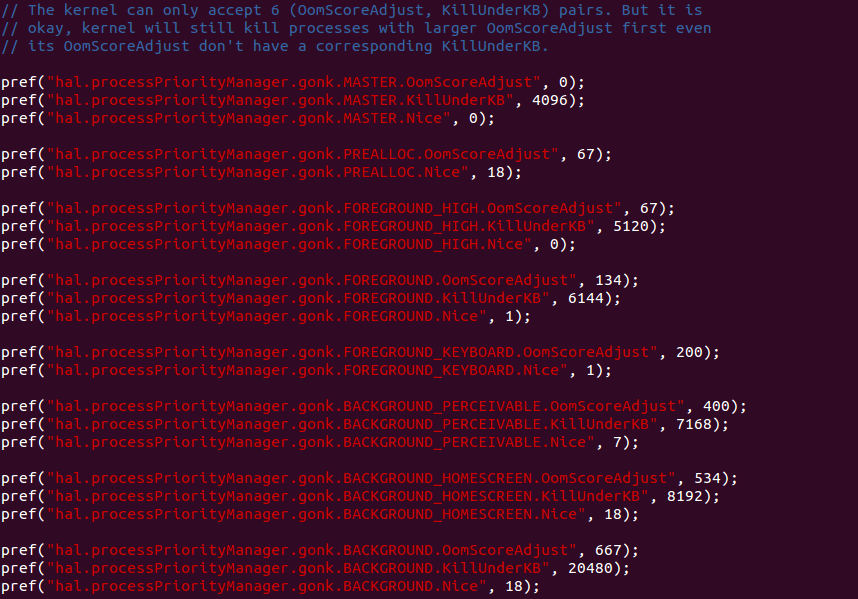
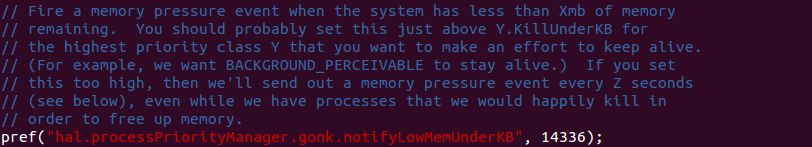
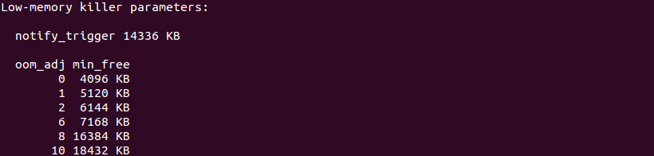

先前 Alan 跟大家介紹過“[凡走過必留下痕跡 – 如何獲得 memory allocation 的 footprint](https://tech.mozilla.com.tw/posts/1826/%E5%87%A1%E8%B5%B0%E9%81%8E%E5%BF%85%E7%95%99%E4%B8%8B%E7%97%95%E8%B7%A1-%E5%A6%82%E4%BD%95%E7%8D%B2%E5%BE%97-memory-allocation-%E7%9A%84-footprint)”，教大家如何生成 memory footpoint 來找出 memory leak 和減少記憶體使用量。今天，我要介紹的是 Firefox OS 如何在有限的記憶體下管理記憶體資源，並針對其進行優化。

## 在 Firefox OS 上，如何獲得更多的記憶體資源？

在 Firefox OS 上，有三種事件可以讓系統在記憶體不足的狀況下獲得更多的的資源。它們分別是：

1. Low memory killer（LMK）

2. Memory pressure event

3. Out of memory killer（OOM)

LMK 是 Android 原本就有的機制，我們把它整合進 Firefox OS。當快取或可用記憶體低於某個臨界值時，LMK 會嘗試去殺 oom_adj >= 0 的行程來獲得更多的記憶體資源。各類行程的臨界值會在 b2g/app/b2g.js 做設定，以下表為例，快取及可用記憶體都小於 20MB 的時候，oom_adj為10（BACKGROUND）的行程會被LMK所殺掉；快取及可用記憶體都小於 8MB 的時候，oom_adj為8（BACKGROUND_HOMESCREEN）的行程會被殺掉；如果快取及可用記憶體都小於 4MB，oom_adj為0（MASTER）的行程，也就是 b2g，將會被 LMK 殺掉。順帶一提，LMK 殺行程是漸近式的，如果連 b2g 都被殺掉了，通常這種狀況一定是有 memory leak。

當 memory pressure event 被觸發，註冊觀察 memory pressure event 的 service 就會執行相對應的動作，例如，清除或最小化快取（b2g 的暫存資料）。觸發 memory pressure event 的設定值在 b2g/app/b2g.js ，目前的預設值（notifyLowMemUnderKB）為 14MB。

當可用記憶體低於一個臨界值，Linux kernel 提供的 OOM 就會根據行程的記憶體用量及 oom_score_adj 計算出來的分數，殺掉一個合適的行程，以獲取更多的記憶體來滿足系統的需求。觸發 OOM 的可用記憶體臨界值（min_free_kbytes）預設為 1352KB。

## 如何讓這三種事件可以在 Firefox OS 上完美運作，達到效能的優化？

先說問題好了，如果這三個事件沒有配合好，會發生什麼問題？

1. 假如 LMK 各類行程的臨界值設太低，系統反應會很慢。在記憶體不夠的狀況下，無法殺掉不需要的行程以獲得更多記憶體，進而造成效能不佳；若臨界值設太高，行程會很容易被 LMK 殺掉，使用者在使用上會覺得不便。

2. Memory pressure event 設定值設的太高，系統會提早進行清除或最小化快取。這在記憶體充足的狀況下是沒有必要的，會造成 CPU 資源被搶走，使用者覺得系統效能不佳；設的太低，無法及時釋放出記憶體資源。

3. 由於 OOM 與 LMK 演算法的不同，假如 OOM 比 LMK 更早被觸發，有可能會造成前台或後台的行程還存在的狀況下，b2g 或是其它 system application 提早被殺掉。這會造成嚴重的穩定性問題。

所以我們需要找出一組參數，來解決以上的問題：

1. 使用者在操作手機的時候，不會感覺到效能不佳。換句話說，前台行程在執行的時候，後台行程是允許被殺掉的，以釋放更多的記憶體。為了達到此一目的，BACKGROUND_HOMESCREEN.KillUnderKB 及 BACKGROUND.KillUnderKB 是可以稍微調大一點。

2. 在可感知的行程被殺掉之前先觸發 memory pressure event 。也就是說 notifyLowMemUnderKB 最好是介於 BACKGROUND_HOMESCREEN.KillUnderKB 和 BACKGROUND_PERCEIVABLE.KillUnderKB 這兩個值之間。

3. 必須要讓 LMK 在 OOM 之前運作。所以 min_free_kbytes 必須比 MASTER.KillUnderKB 來的小。

以 Tarako（sc6821，128MB memory device）為例，根據 adb shell b2g-info dump 出來的記憶體相關設定如下：

## 如何快速的針對平台做校調？

除了直接修改 b2g/app/b2g.js 的參數以外，Firefox OS 提供一個更方便的方式讓大家可以快速的驗証自己的參數。開發者可以借由修改手機內部的 /system/b2g/defaults/pref/dev-pref.js 來增加想要調整的參數。這個檔案內的參數會覆蓋掉 b2g/app/b2g.js 的預設值。

當然，我們對超低價手機的記憶體優化絕對不止這些，更多的技術探討都在 [bugzilla](https://bugzilla.mozilla.org/show_bug.cgi?id=929945)上，趕快加入火狐的行列，一起改變世界吧。
