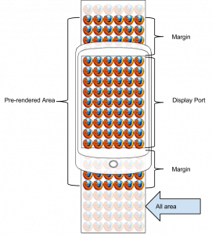
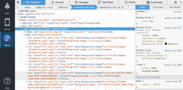

隨著超低價的市場崛起，我們對各項資源也開始斤斤計較。不論是 CPU、RAM、及 Flash，每一個項目都是我們努力減少的目標。先前丹尼兄及艾倫兄已分別為大家介紹過 gecko 在處理記憶體管理上的文章[[1](https://tech.mozilla.com.tw/posts/4667/%E5%B9%B3%E5%83%B9%E6%99%BA%E6%85%A7%E6%89%8B%E6%A9%9F%E5%A4%A7%E8%A7%A3%E5%AF%86%EF%BC%8Dfirefox-os-%E8%A8%98%E6%86%B6%E9%AB%94%E7%AE%A1%E7%90%86%E8%88%87%E5%84%AA%E5%8C%96)][[2](https://tech.mozilla.com.tw/posts/1826/%E5%87%A1%E8%B5%B0%E9%81%8E%E5%BF%85%E7%95%99%E4%B8%8B%E7%97%95%E8%B7%A1-%E5%A6%82%E4%BD%95%E7%8D%B2%E5%BE%97-memory-allocation-%E7%9A%84-footprint)]。這些都是著墨在記憶體管理上，今天醬糊小弟將向各位介紹一個在 gaia 存在已久的可視範圍監視器（[Visibility Monitor](https://github.com/mozilla-b2g/gaia/blob/eb04b0228011a34b8c45d1fc675a6b9b7965b79d/shared/js/tag_visibility_monitor.js)）。

## 起源

Visibility Monitor 是源自於 Gaia 的 Gallery app，它第一次出現於 [Bug 809782 （ [Gallery] gallery crashes if too many images are available on sdcard ）](https://bugzilla.mozilla.org/show_bug.cgi?id=809782)。它的出現解救了 Gallery app 會因為圖片太多，導致出現記憶體不足的問題。一段時間過後，除了原本的 visibility monitor 外，它的另外一個兄弟：[Tag Visibility Monitor](https://github.com/mozilla-b2g/gaia/blob/master/shared/js/tag_visibility_monitor.js)也出現了。這兩個 visibility monitor 的功能幾乎完全一樣，唯一的差別是 tag visibility monitor 它會依照指定的 tag name 來過濾那些 elements 要進行監控。所以，接下來的介紹，將以 tag visibility monitor 為範例，對 visibility monitor 也適用。

另一個題外話是，visibility monitor 是由 JavaScript 大師 David Flanagan 親手完成，他是 [JavaScript: The Definitive Guide](https://shop.oreilly.com/product/9780596805531.do) 的作者，目前也是 mozilla 的員工之一。

## 運作原理

Visibility Monitor 的運作原理是將畫面外的圖片從 DOM tree 上拿掉，如此一來就能讓 gecko 有機會去釋放 image loader/decoder 所暫存的圖片記憶體。

大家可能會認為這件事在 gecko 做就好了，為什麼要在 gaia 做？跟據[簡超強](https://tech.mozilla.com.tw/posts/author/schienmozilla-com)的介紹， gecko 的 visibility monitor 僅會對 image decoder 所解壓後的圖片進行清除，然而，原始的圖片還是會被暫存在記憶體中。這些圖片是 image loader 透過網路或是本機檔案系統所得到的圖片。Gaia 的版本不一樣之處在於，它會將圖片完全從 DOM tree 上拿掉。所以，連 image loader 所暫存的原圖都還是會被清掉。這件事，在記憶體只有 128MB 的 tarako (註: Firefox OS 低規手機專案代號) 上就顯得非常重要。

 

 我們以[上圖](../assets/4825/wp-content/uploads/2014/07/visibility-monitor2.png)做例子，可以把全部的區域分成 display port、pre-rendered area、margin 及全部的區域。Visibility monitor 的功能就是當 display port 上下移動的時候，會動態載入 pre-rendered area 的圖片，那沒有落在 pre-rendered area 的圖片將不會被載入及解碼。圖中的 margin 就是 visibility monitor 可以動態調整的參數。當 margin 越大，gecko 預先畫上的圖片就越多，所耗費的記憶體就越大、捲動的流暢度就越好（即 FPS 就越高）；當 margin 越小，gecko 預先畫上的圖片就越少，所耗費的記憶體就越小、捲動的流暢度就越差（即 FPS 就越低）。正因為它的運作原理是這樣，所以加入它之後，我們就能照著需求調整所需要的參數及品質。

## 使用前提

大家常說：『又要馬兒好、又要馬兒不吃草』這件事是不可能的。當然，『又要使用 visibility monitor、又不被受影響』這也是件不可能的事。使用 visibility monitor 的前題必須滿足下列條件[[3](https://github.com/mozilla-b2g/gaia/blob/0a0f549c6b341b8b14c4188390abbefe52847cb4/shared/js/tag_visibility_monitor.js#L46-L51)]：

- 所有被 monitor 到的 HTML DOM Element 都是由上到下排列

由於更多 CSS 選項的支援，例如：flex-flow，讓我們有機會改變由上到下的排列或由右到左的排列。當我們使用這些設定後，將會導致 visibility monitor 的實作會變的更複雜，帶來的缺點就是 FPS 降的更低。這不是我們所樂見的結果，所以這種的排列方式是不被 visibility monitor 接受的。當有人用了這類的排列方式，visibility monitor 所產生出來的效果就是在該顯示的地方，顯示不出圖片，進而會發出錯誤訊息。

- 所有被 monitor 到的 HTML DOM Element 都不能使用絕對位置定位

由於 visibility monitor 需要計算每個 HTML DOM Element 的高度，用來決定要不要顯示，所以如果它是固定在某個位置的時候，在計算上就會變的更複雜。所以，這也是不被接受的設定。當有人用了這類的排列方式，visibility monitor 所產生出來的效果就是在該顯示的地方，顯示不出圖片，進而會發出錯誤訊息。

- 所有被 monitor 到的 HTML DOM Element 都不能透過 JavaScript 去動態改變它的位置

動態改變 HTML DOM Element 的行為跟使用絕對位置類似，它會讓計算的公式變的比原本的複雜許多，所以它也是不被接受的設定。當有人用了這類的排列方式，visibility monitor 所產生出來的效果就是在該顯示的地方，顯示不出圖片，進而會發出錯誤訊息。

- 所有被 monitor 到的 HTML DOM Element 都不能改變大小或是隱藏，但它們的大小可以不一樣

不能改變大小或隱藏的原因是因為 visibility monitor 是使用 [MutationObserver](https://developer.mozilla.org/en-US/docs/Web/API/MutationObserver) 來監控一個 HTML DOM Element 的新增與移除，但它卻沒有辨法監控一個 HTML DOM Element 的出現或消失，或是大小上的改變。當有人用了這類的排列方式，visibility monitor 所產生出來的效果就是在該顯示的地方，顯示不出圖片，進而會發出錯誤訊息。

- 進行監控的 container 不能使用 position: static 的方式

由於 visibility monitor 是透過 offsetTop 來計算 display port 的位置，所以無法使用 position: static。建議可以使用 position: relative。

- 進行監控的 container 只能透過 window resize 的方式來調整大小

visibility monitor 是透過 window.onresize 的事件來決定是否要重新計算 pre-rendered area，所以每個大小的改變，都要送出 resize 事件。

## Tag Visibility Monitor API

[visibility monitor](https://github.com/mozilla-b2g/gaia/blob/master/shared/js/tag_visibility_monitor.js) 的 API 非常簡單，只有一個 function 而已：

function monitorTagVisibility(
 container,
 tag,
 scrollMargin,
 scrollDelta,
 onscreenCallback,
 offscreenCallback
)

					12345678

						function monitorTagVisibility( container, tag, scrollMargin, scrollDelta, onscreenCallback, offscreenCallback)

它所帶入的參數定義如下：

- container：這個 container 是使用者真正捲動的 HTML DOM Element，它不一定要是被監控的 element 的上一層，但它一定要是它們的祖先。

- tag：它是一個字串，用來代表要監控的 element name。

- scrollMargin：它是一個數字，用來指定 display port 外的 margin 大小。

- scrollDelta：它是一個數字，用來指定每捲動多少像素要進行一次計算，並產生新的 pre-rendered area。

- onscreenCallback：它是一個 callback function，當有一個 HTML DOM Element 移入在 pre-rendered area 時會呼叫的 function。

- offscreenCallback：它是一個 callback function，當有一個 HTML DOM Element 移出在 pre-rendered area 時會呼叫的 [online casino](https://www.nbso.ca/) function

請注意，這邊的「移入」與「移出」的定義是指，只要有一個 pixel 還在 pre-rendered area 上，就算是移入或是還在畫面上；只要沒有任何一個 pixel 在 pre-rendered area 上，就算移除或不在畫面上。

## 以 1.3T 版的 Music app 為例加入 Visibility Monitor

幫 1.3T 版的 Music app 加入 visibility monitor 是醬糊小弟負責的一個 bug。在加入的過程中，醬糊小弟並不了解 Music app 的結構，所以就借助多明尼哥的幫助，找到需要加入的位置。全部的位置有三處：TilesView、ListView、SearchView，這裡僅以 TilesView 做介紹，將加入的方法展示出來。

首先，我們可以透過 App Manager 來找出 TilesView 中真正在捲動的 HTML DOM Element：

透過 App Manager 我們可以發現 TilesView 中有 views-tile、views-tiles-search、views-tiles-anchor 及其下的 li.tile。經過測試，我們發現 scroll bar 出現的位置是在 views-tile，而 views-tiles-search 會被自動捲到看不見的位置，接著每個 tile 則是以 li.tile 的方式存在。所以，container 要設定在 views-tiles 的位置，tag 要設定成 li，我們可以使用下面的程式碼來建立 visibility monitor：

monitorTagVisibility(document.getElementById("views-tile"), "li",
 visibilityMargin, // extra space top and bottom
 minimumScrollDelta, // min scroll before we do work
 thumbnailOnscreen, // set background image
 thumbnailOffscreen); // remove background image

					12345

						monitorTagVisibility(document.getElementById("views-tile"), "li", visibilityMargin, // extra space top and bottom minimumScrollDelta, // min scroll before we do work thumbnailOnscreen, // set background image thumbnailOffscreen); // remove background image

這段程式碼所用的 visibilityMargin 是設定成 360 即 3/4 個畫面、minimumScrollDelta 是 1 即每個 pixel 都重新計算一次。至於 thumbnailOnScreen 及 thumbnailOffscreen 則是把 thumbnail 的 background image 給設定上去或清空。

## Visibility Monitor 的效果

我們以 tarako 裝置進行實機測試，開啟 Music app 讓其載入近 200 首具封面的 mp3 檔，共 900MB 。不使用 visibility monitor 的情況下，Music app 於 image 的記憶體使用量如下：

├──23.48 MB (41.04%) -- images
│ ├──23.48 MB (41.04%) -- content
│ │ ├──23.48 MB (41.04%) -- used
│ │ │ ├──17.27 MB (30.18%) ── uncompressed-nonheap
│ │ │ ├───6.10 MB (10.66%) ── raw
│ │ │ └───0.12 MB (00.20%) ── uncompressed-heap
│ │ └───0.00 MB (00.00%) unused
│ └───0.00 MB (00.00%) chrome

					12345678

						├──23.48 MB (41.04%) -- images│ ├──23.48 MB (41.04%) -- content│ │ ├──23.48 MB (41.04%) -- used│ │ │ ├──17.27 MB (30.18%) ── uncompressed-nonheap│ │ │ ├───6.10 MB (10.66%) ── raw│ │ │ └───0.12 MB (00.20%) ── uncompressed-heap│ │ └───0.00 MB (00.00%) unused│ └───0.00 MB (00.00%) chrome

使用 visibility monitor 後，Music app 於 image 的記憶體使用量如下：

├───6.75 MB (16.60%) -- images
│ ├──6.75 MB (16.60%) -- content
│ │ ├──5.77 MB (14.19%) -- used
│ │ │ ├──3.77 MB (09.26%) ── uncompressed-nonheap
│ │ │ ├──1.87 MB (04.59%) ── raw
│ │ │ └──0.14 MB (00.34%) ── uncompressed-heap
│ │ └──0.98 MB (02.41%) unused
│ └──0.00 MB (00.00%) chrome

					12345678

						├───6.75 MB (16.60%) -- images│ ├──6.75 MB (16.60%) -- content│ │ ├──5.77 MB (14.19%) -- used│ │ │ ├──3.77 MB (09.26%) ── uncompressed-nonheap│ │ │ ├──1.87 MB (04.59%) ── raw│ │ │ └──0.14 MB (00.34%) ── uncompressed-heap│ │ └──0.98 MB (02.41%) unused│ └──0.00 MB (00.00%) chrome

兩者的比較如下：

├──-16.73 MB (101.12%) -- images/content
│ ├──-17.71 MB (107.05%) -- used
│ │ ├──-13.50 MB (81.60%) ── uncompressed-nonheap
│ │ ├───-4.23 MB (25.58%) ── raw
│ │ └────0.02 MB (-0.13%) ── uncompressed-heap
│ └────0.98 MB (-5.93%) ── unused/raw

					123456

						├──-16.73 MB (101.12%) -- images/content│ ├──-17.71 MB (107.05%) -- used│ │ ├──-13.50 MB (81.60%) ── uncompressed-nonheap│ │ ├───-4.23 MB (25.58%) ── raw│ │ └────0.02 MB (-0.13%) ── uncompressed-heap│ └────0.98 MB (-5.93%) ── unused/raw

為了確定 visibility monitor 有正常的運作，我們也使用了更多的 MP3 檔，總數是近 400 首，它的記憶體使用量也維持在 7MB 左右，如此一來，我們就向 128MB 前進一大步了。

## 結語

最後，當圖片的使用量不大的情況下，我們其實不需要用到 visibility monitor。因為用了它後，FPS 一定會下降。這類的情況只需要交給 gecko 來處理就可以了。當需要做制大量使用圖片的 app 時，我們就可以透過 visibility monitor 來控制記憶體的使用總量，而且它不會隨著圖片的數量而增加。

Visibility monitor 的 margin 參數與 delta 參數會影響記憶體使用量與 FPS，其關係如下：

- margin 越大 => 記憶體使用量越多、FPS 越接近 gecko 原生的捲動

- margin 越小 => 記憶體使用量越少、FPS 越小

- delta 越大 => 記憶體使用量會小幅增加、FPS 會提昇、出現尚未載入的圖片機率越高

- delta 越小 => 記憶體使用量會小幅減少、FPS 會下降、出現尚未載入的圖片機率越低
