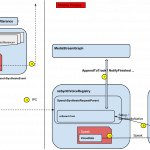

相信大家多多少少玩過 iOS 手機上的 Siri 或是 Android 手機上的 Google Now！ 等語音辨識功能。  也或許有經驗因為長時間低頭滑手機太累而利用系統中的朗讀功能來"聽"文章。  而這兩種功能 1. Automated Speech Recognition. （ASR） 2. Text to Speech （TTS）/ Speech Synthesis ～目前究竟隱藏在 Firefox OS 的什麼地方， 以及如何達成功能的呢？ 就讓我們繼續看下去 ～

簡單來說，ASR 就是利用 Microphone 或其他 Capture device 將輸入的聲音，透過語音語意辨識引擎轉換成文字或預先設定好的指令集，再往更上層的介面傳遞。 而 TTS 則將一段被選取的文字當作輸入，透過語音合成引擎包裝成 Audio Segment 再交由媒體系統去播放。

好的！

目前 ASR 與 TTS 的程式碼放置在 [mozilla-central/dom/media/webspeech/](https://dxr.mozilla.org/mozilla-central/source/dom/media/webspeech/)，然而由於缺乏開放且強大的語音語意辨識引擎，目前 ASR 在 Firefox OS 中只實作了 Speech API [1] 接口部分以及一個主要流程控制的狀態機 [2]，所以我們在這暫且不對 ASR 做深入介紹。  讓我們把聚光燈投向另一個主角 TTS ！！

## Speech Synthesis 相關介面

先來看一眼 Speech Synthesis 的 Interface [3] 吧 ！

首先你可以透過 SpeechSyntheis 所提供的幾個 method 做操作

		
		

interface SpeechSynthesis {
      readonly attribute boolean pending;
      readonly attribute boolean speaking;
      readonly attribute boolean paused;
      void speak(SpeechSynthesisUtterance utterance);
      void cancel();
      void pause();
      void resume();
      SpeechSynthesisVoiceList getVoices();
};
			
				
					
				
					12345678910
				
						interface SpeechSynthesis {      readonly attribute boolean pending;      readonly attribute boolean speaking;      readonly attribute boolean paused;      void speak(SpeechSynthesisUtterance utterance);      void cancel();      void pause();      void resume();      SpeechSynthesisVoiceList getVoices();};
					
				
			
		

你發現 speak() / cancel() / pause() / resume() 似乎跟播放狀態有著密切關係，但⋯⋯我們這個是 Text to speech 的功能啊！最重要的 Text 在哪兒呢 ？ 眼尖的讀者應該有注意到另一個 interface

		
		

interface SpeechSynthesisUtterance : EventTarget {
      attribute DOMString text;
      attribute DOMString lang;
      attribute DOMString voiceURI;
      attribute float volume;
      attribute float rate;
      attribute float pitch;
      attribute EventHandler onstart;
      attribute EventHandler onend;
      attribute EventHandler onerror;
      attribute EventHandler onpause;
      attribute EventHandler onresume;
      attribute EventHandler onmark;
      attribute EventHandler onboundary;
    };
			
				
					
				
					123456789101112131415
				
						interface SpeechSynthesisUtterance : EventTarget {      attribute DOMString text;      attribute DOMString lang;      attribute DOMString voiceURI;      attribute float volume;      attribute float rate;      attribute float pitch;      attribute EventHandler onstart;      attribute EventHandler onend;      attribute EventHandler onerror;      attribute EventHandler onpause;      attribute EventHandler onresume;      attribute EventHandler onmark;      attribute EventHandler onboundary;    };
					
				
			
		

沒錯！ 我們可以透過將所想要朗讀的文字塞入這個 interface 中的 DOMString text，並且指定對應的 language、voiceURI 等 attributes， 這樣便把所有想要語音合成的資訊都準備妥當了！

咦！？ 慢著，我怎麼知道目前 Firefox OS 支援哪些語系以及語調（男聲/女聲）？

喔喔，我們似乎漏看了這段程式碼以及以下兩個 Interfaces

		
		

SpeechSynthesisVoiceList getVoices();
			
				
					
				
					1
				
						SpeechSynthesisVoiceList getVoices();
					
				
			
		

		
		

interface SpeechSynthesisVoice {
      readonly attribute DOMString voiceURI;
      readonly attribute DOMString name;
      readonly attribute DOMString lang;
      readonly attribute boolean localService;
      readonly attribute boolean default;
};
interface SpeechSynthesisVoiceList {
      readonly attribute unsigned long length;
      getter SpeechSynthesisVoice item(in unsigned long index);
}
			
				
					
				
					1234567891011
				
						interface SpeechSynthesisVoice {      readonly attribute DOMString voiceURI;      readonly attribute DOMString name;      readonly attribute DOMString lang;      readonly attribute boolean localService;      readonly attribute boolean default;};interface SpeechSynthesisVoiceList {      readonly attribute unsigned long length;      getter SpeechSynthesisVoice item(in unsigned long index);}
					
				
			
		

原來 Speech API [4] 裏早就定義好相關的介面與結構，所以 Firefox OS 在實作 SpeechSynthesis 時也設計了一個對應的 [XPCOM – nsISynthVoiceRegistry.idl](https://dxr.mozilla.org/mozilla-central/source/dom/media/webspeech/synth/nsISynthVoiceRegistry.idl) 元件讓系統註冊語音合成引擎，於是 Firefox OS 在起動時便能將搭載的語音合成引擎 Pico [4] 註冊起來，接著上層 UI 便能透過 API 取得目前 Pico 引擎內支援的語系，以及聲調來當作朗讀的參數傳入引擎！

## Speech Synthesis 流程架構

接著來介紹簡單的流程架構圖吧～（以下為在 Firefox OS 中多程序架構流程）

[](https://tech.mozilla.com.tw/wp-content/uploads/2014/10/TTS_Architecture.png)

1) 使用者在網頁上選取了一段文字，在 javascript 中 建立一個 SpeechSynthesisUtterance Object 並從 SpeechSynthesis interface 的 Speak() 傳入。   而被傳入的 SpeechSynthesisUtterance 會先被加入一個 Queue 中，之後一個一個被處理。

2) 被處理的 SpeechSynthesisUtterance 透過 nsSynthVoiceRegistry 的 SpeakUtterance() 將自己傳入 nsSynthVoiceRegistry 中。

3) 這階段分為兩種可能的方式，第一種是在 Firefox OS 下的情況，每一個 Utterance object 建立一個對應的 IPC request child-parent channel，讓要準備合成的文字透過 channel 被傳送到 chrome process。（對 IPC 不熟 ？ 快來[參考這篇](https://tech.mozilla.com.tw/posts/2296/%E5%BF%AB%E4%BE%86%E5%B9%AB%E5%BF%99%E6%89%BE%EF%BC%8Cipdl%E5%9C%A8%E5%93%AA%E8%A3%A1%EF%BC%9F)。）  第二種則是在尚未開啟 [Firefox e10s](https://wiki.mozilla.org/Electrolysis) 功能前的單執行程序應用情境，Utterance object 並不需要建立 IPC channel 便能直接將自己傳入 nsSynthVoiceRegistry 內。

4) 在 chrome process 裏的 nsSynthVoiceRegistry 透過自己的 Speak() 將資訊準備成 Voice data 隨後交給 nsPicoService。

5) nsPicoService 會產生 PicoCallbackRunnable task 來 asynchronously 執行與更底層 Pico Module （實際上真正將 Text 轉換成 Synthesized buffer block 的地方） 的互動。

6) 隨後再將合成好的資料利用 PicoSynthDataRunnable 所持有在 step 3 建立的 nsSpeechTask 的 Setup() 與 SendAudioNative() 與 MediaStreamGraph 建立 Notifier-Listener 關係，且將 Synthesized data 包裝成 Audio segment 交給 MediaStreamGraph 進行播放功能。

7) Audio segment 被傳入 MediaStreamGraph 的 Track 裏進行消化，而 MediaStreamGraph 會依據進行的程度作通知，例如：NotifyFinished 、NotifyBlockingChanged⋯⋯etc，而這些通知隨後便會透過 ipc 傳送狀態回 content process。

8) 當 audio 的 playback status 透過 ipc 傳回 content process 後，SpeechTaskChild 會利用持有的 utterance object 的 DispatchSpeechSynthsisEvent() 將狀態發送出去。

9) 傳送 state event 給上層的 DOM listener。

這就是簡單的 Speech Synthesis 流程架構。  至於遺珠之憾 ASR 呢，我們下回再做更深入的介紹～

## 參考資料

[1] [https://dvcs.w3.org/hg/speech-api/raw-file/tip/speechapi.html#speechreco-section](https://dvcs.w3.org/hg/speech-api/raw-file/tip/speechapi.html#speechreco-section)

[2] [http://dxr.mozilla.org/mozilla-central/source/dom/media/webspeech/recognition/SpeechRecognition.cpp#179](https://dxr.mozilla.org/mozilla-central/source/dom/media/webspeech/recognition/SpeechRecognition.cpp#179)

[3] [https://dvcs.w3.org/hg/speech-api/raw-file/tip/speechapi.html#tts-section](https://dvcs.w3.org/hg/speech-api/raw-file/tip/speechapi.html#tts-section)

[4] [http://dxr.mozilla.org/mozilla-central/source/dom/media/webspeech/synth/pico](https://dxr.mozilla.org/mozilla-central/source/dom/media/webspeech/synth/pico)
