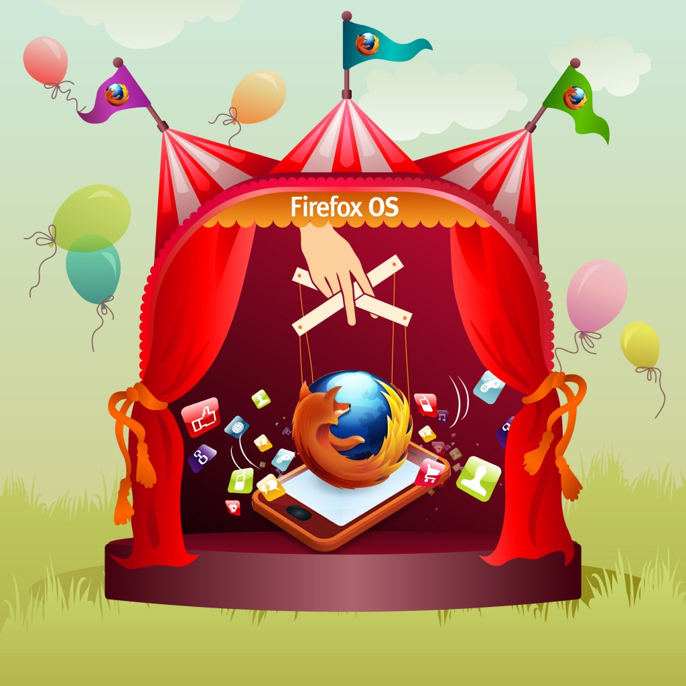

謀智台客曾在五月份時為各位介紹 Firefox OS (原 Boot To Gecko, 簡稱 B2G) 的模擬器 — [B2G on Emulator](https://tech.mozilla.com.tw/posts/127/b2g-on-emulator-2)。今天則要就模擬器進行進一步的說明，與各位分享如何基於模擬器和 Marionette automation driver 進行 Boot To Gecko 的開發測試。

[Marionette](https://developer.mozilla.org/en/Marionette) 是一套自動測試框架，它可以用來測試 UI 或是 Gecko 內部的 JS/XPCOM 元件與 API。Marionette 的使用也非常地簡單，我們可以將它視為一遠端伺服器，開發者只需要連上它，便能輕易地執行撰寫好的 test script。當然，在使用 Mationette 測試 Boot To Gecko 之前，我們得要確定已經建立好 Boot To Gecko emulator 的開發環境，其建立步驟可以參考 “[Preparing your first B2G build](https://developer.mozilla.org/en/Mozilla/Boot_to_Gecko/Preparing_for_your_first_B2G_build)“。若是開發環境已建置完成，那麼只要底下的這行指令，我們就能進行 Marionette 測試了。

		
		

./test.sh
			
				
					
				
					1
				
						./test.sh
					
				
			
		

如果不想要執行 B2G 目錄下的所有測試檔，我們也可以指定測試檔路徑，只執行我們感興趣的測試檔案。

		
		

./test.sh patch_to_tests
			
				
					
				
					1
				
						./test.sh patch_to_tests
					
				
			
		

執行完後，會看見類似的結果，底下的 “OK" 表示測試成功，"FAILED" 當然就是測試失敗啦!

		
		

TEST-START test_incoming_answer_hangup.js
/mozilla/B2G-emu/gecko/dom/telephony/test/marionette/test_incoming_answer_hangup.js, runTest (marionette_test.MarionetteJSTestCase) ... ok

START LOG:
INFO Verifying initial state. Mon Jul 02 2012 13:26:31 GMT+0000 (GMT)
INFO Initial call list: OK Mon Jul 02 2012 13:26:31 GMT+0000 (GMT)
INFO Simulating an incoming call. Mon Jul 02 2012 13:26:31 GMT+0000 (GMT)
INFO Received 'incoming' call event. Mon Jul 02 2012 13:26:31 GMT+0000 (GMT)
INFO Call list is now: inbound from 5555552368 : incoming,OK Mon Jul 02 2012 13:26:31 GMT+0000 (GMT)
INFO Answering the incoming call. Mon Jul 02 2012 13:26:31 GMT+0000 (GMT)
INFO Received 'connecting' call event. Mon Jul 02 2012 13:26:31 GMT+0000 (GMT)
INFO Received 'connected' call event. Mon Jul 02 2012 13:26:32 GMT+0000 (GMT)
INFO Call list is now: inbound from 5555552368 : active,OK Mon Jul 02 2012 13:26:32 GMT+0000 (GMT)
INFO Hanging up the incoming call. Mon Jul 02 2012 13:26:32 GMT+0000 (GMT)
INFO Received 'disconnecting' call event. Mon Jul 02 2012 13:26:32 GMT+0000 (GMT)
END LOG:
----------------------------------------------------------------------
Ran 1 test in 6.733s

OK
			
				
					
				
					1234567891011121314151617181920
				
						TEST-START test_incoming_answer_hangup.js/mozilla/B2G-emu/gecko/dom/telephony/test/marionette/test_incoming_answer_hangup.js, runTest (marionette_test.MarionetteJSTestCase) ... ok START LOG:INFO Verifying initial state. Mon Jul 02 2012 13:26:31 GMT+0000 (GMT)INFO Initial call list: OK Mon Jul 02 2012 13:26:31 GMT+0000 (GMT)INFO Simulating an incoming call. Mon Jul 02 2012 13:26:31 GMT+0000 (GMT)INFO Received 'incoming' call event. Mon Jul 02 2012 13:26:31 GMT+0000 (GMT)INFO Call list is now: inbound from 5555552368 : incoming,OK Mon Jul 02 2012 13:26:31 GMT+0000 (GMT)INFO Answering the incoming call. Mon Jul 02 2012 13:26:31 GMT+0000 (GMT)INFO Received 'connecting' call event. Mon Jul 02 2012 13:26:31 GMT+0000 (GMT)INFO Received 'connected' call event. Mon Jul 02 2012 13:26:32 GMT+0000 (GMT)INFO Call list is now: inbound from 5555552368 : active,OK Mon Jul 02 2012 13:26:32 GMT+0000 (GMT)INFO Hanging up the incoming call. Mon Jul 02 2012 13:26:32 GMT+0000 (GMT)INFO Received 'disconnecting' call event. Mon Jul 02 2012 13:26:32 GMT+0000 (GMT)END LOG:----------------------------------------------------------------------Ran 1 test in 6.733s OK
					
				
			
		

		
		

TEST-START test_incoming_reject.js
/mozilla/B2G-emu/gecko/dom/telephony/test/marionette/test_incoming_reject.js, runTest (marionette_test.MarionetteJSTestCase) ... ERROR

======================================================================
ERROR: /orkSpace/mozilla/B2G-emu/gecko/dom/telephony/test/marionette/test_incoming_reject.js, runTest (marionette_test.MarionetteJSTestCase)
----------------------------------------------------------------------
Traceback (most recent call last):
  File "/mozilla/B2G-emu/gecko/testing/marionette/client/marionette/marionette_test.py", line 176, in runTest
    results = self.marionette.execute_js_script(js, args)
  File "/mozilla/B2G-emu/gecko/testing/marionette/client/marionette/marionette.py", line 334, in execute_js_script
    newSandbox=new_sandbox)
  File "/mozilla/B2G-emu/gecko/testing/marionette/client/marionette/marionette.py", line 150, in _send_message
    self._handle_error(response)
  File "/mozilla/B2G-emu/gecko/testing/marionette/client/marionette/marionette.py", line 199, in _handle_error
    raise ScriptTimeoutException(message=message, status=status, stacktrace=stacktrace)
ScriptTimeoutException: timed out

START LOG:
INFO Verifying initial state. Mon Jul 02 2012 13:26:32 GMT+0000 (GMT)
INFO Initial call list: OK Mon Jul 02 2012 13:26:32 GMT+0000 (GMT)
INFO Simulating an incoming call. Mon Jul 02 2012 13:26:32 GMT+0000 (GMT)
INFO Received 'incoming' call event. Mon Jul 02 2012 13:26:32 GMT+0000 (GMT)
INFO Call list is now: inbound from 5555552368 : incoming,OK Mon Jul 02 2012 13:26:32 GMT+0000 (GMT)
INFO Reject the incoming call. Mon Jul 02 2012 13:26:32 GMT+0000 (GMT)
INFO Received 'disconnecting' call event. Mon Jul 02 2012 13:26:32 GMT+0000 (GMT)
END LOG:
----------------------------------------------------------------------
Ran 1 test in 10.632s

FAILED (errors=1)
			
				
					
				
					123456789101112131415161718192021222324252627282930
				
						TEST-START test_incoming_reject.js/mozilla/B2G-emu/gecko/dom/telephony/test/marionette/test_incoming_reject.js, runTest (marionette_test.MarionetteJSTestCase) ... ERROR ======================================================================ERROR: /orkSpace/mozilla/B2G-emu/gecko/dom/telephony/test/marionette/test_incoming_reject.js, runTest (marionette_test.MarionetteJSTestCase)----------------------------------------------------------------------Traceback (most recent call last):  File "/mozilla/B2G-emu/gecko/testing/marionette/client/marionette/marionette_test.py", line 176, in runTest    results = self.marionette.execute_js_script(js, args)  File "/mozilla/B2G-emu/gecko/testing/marionette/client/marionette/marionette.py", line 334, in execute_js_script    newSandbox=new_sandbox)  File "/mozilla/B2G-emu/gecko/testing/marionette/client/marionette/marionette.py", line 150, in _send_message    self._handle_error(response)  File "/mozilla/B2G-emu/gecko/testing/marionette/client/marionette/marionette.py", line 199, in _handle_error    raise ScriptTimeoutException(message=message, status=status, stacktrace=stacktrace)ScriptTimeoutException: timed out START LOG:INFO Verifying initial state. Mon Jul 02 2012 13:26:32 GMT+0000 (GMT)INFO Initial call list: OK Mon Jul 02 2012 13:26:32 GMT+0000 (GMT)INFO Simulating an incoming call. Mon Jul 02 2012 13:26:32 GMT+0000 (GMT)INFO Received 'incoming' call event. Mon Jul 02 2012 13:26:32 GMT+0000 (GMT)INFO Call list is now: inbound from 5555552368 : incoming,OK Mon Jul 02 2012 13:26:32 GMT+0000 (GMT)INFO Reject the incoming call. Mon Jul 02 2012 13:26:32 GMT+0000 (GMT)INFO Received 'disconnecting' call event. Mon Jul 02 2012 13:26:32 GMT+0000 (GMT)END LOG:----------------------------------------------------------------------Ran 1 test in 10.632s FAILED (errors=1)
					
				
			
		

寫到這裡，我們已經對 Marionette 的使用有個粗略的介紹，想必各位讀者已經迫不及待地想多了解一些，好為 B2G 不同的 API 和 features 撰寫 tests 了吧! Marionette 支援以 JavaScript 撰寫的 tests，這些 tests 的檔名必須依循 “test_*.js" 或是 “browser_*.js" 的命名規則。此外，所有的 Marionette JavaScript tests 在結束之前都必須呼叫 finish()，當 finish() 被呼叫後，Marionette 便會收集 tests 裡的 assertions 並回報測試結果。

		
		

function test() {
  /* 測試程式 */
  finish();
}
			
				
					
				
					1234
				
						function test() {  /* 測試程式 */  finish();}
					
				
			
		

Marionette 提供三種常用的 assertion functions，分別為

		
		

is(value1, value2, message);
			
				
					
				
					1
				
						is(value1, value2, message);
					
				
			
		

用以判斷 value1 與 value2 是否相同。判斷失敗會使得最後的測試失敗。開發者可以指定 message 為錯誤訊息。

		
		

isnot(value1, value2, message);
			
				
					
				
					1
				
						isnot(value1, value2, message);
					
				
			
		

用來判斷兩個變數是否相同的function。

		
		

ok(value, message);
			
				
					
				
					1
				
						ok(value, message);
					
				
			
		

則可判斷 value 是否為真。

除了這三個 assertion functions 之外，另一個好用的 function 則非 runEmulatorCmd(cmd, callBack); 莫屬了。在開發測試時，有時候我們會需要傳送特定指令到 emulator 的通訊埠，像是手機撥號或接聽的指令，此時我們便可能透過 runEmulatorCmd() 簡易地進行測試。callBack 是optional parameter，當它被呼叫時，我們能得到一個存有 ‘cmd’ 執行結果的 array。再搭配前面提及的 assertion functions, 我們就能進一步判斷 cmd 的結果是否如我們預期囉。

最後，我們以「手機通話」相關功能測試為例，總結上述介紹。首先，用 ‘gsm call’ 撥號；接著用 ‘gsm list’ 取得電話列表，並以callBack 取得 result array, 以判斷來電號碼是否為 phoneNumber，並且電話狀態是否是 incoming。

		
		

function test () {

... ...

runEmulatorCmd("gsm call " + phoneNumber);

... ...

runEmulatorCmd("gsm list", function(result) {

is(result[0], "inbound from " + phoneNumber + " : incoming");

is(result[1], "OK");

});

... ...

finish();

}
			
				
					
				
					123456789101112131415161718192021
				
						function test () { ... ... runEmulatorCmd("gsm call " + phoneNumber); ... ... runEmulatorCmd("gsm list", function(result) { is(result[0], "inbound from " + phoneNumber + " : incoming"); is(result[1], "OK"); }); ... ... finish(); }
					
				
			
		

除了上述提及的 “gsm call" 和 “gsm list" 指令之外，讀者可以到 [http://developer.android.com/tools/devices/emulator.html](https://developer.android.com/tools/devices/emulator.html) 得到完整的指令列表，撰寫更多項功能的測試。

怎麼樣? 是不是開始躍躍欲試了呢? 歡迎加入我們，一起 Happy Hacking! 😀
