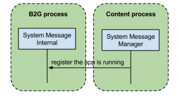
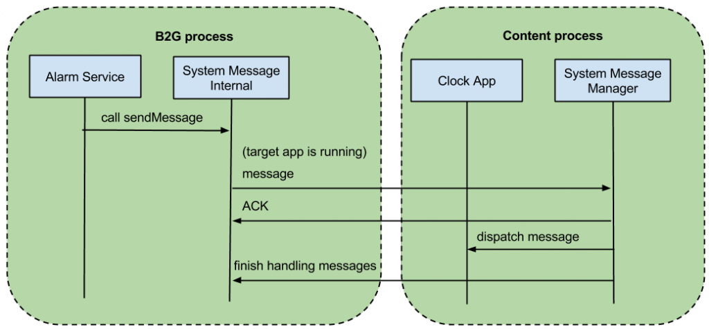
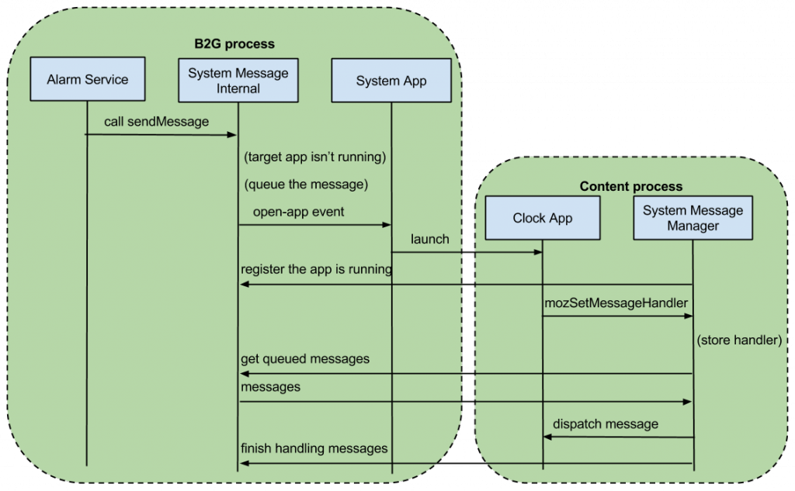

相信各位使用手機或多或少都有收過 SMS 簡訊或是定時鬧鈴等種種來自系統本身的通知，而在 Firefox OS 中，這些功能都可透過所謂的 system message 機制來達成，即便是在相關 app 尚未開啟的情況下。

簡而言之，system message 是為了處理一些必須要由 Gecko 來掌控並提供給相關 Gaia app 的訊息而衍伸出來的機制。在某些情況下，相關的 app 可能尚未開啟（例如一通電話打進來可是 Phone App 卻尚未開啟），因此 system message 同時也肩負著喚醒該 app 的任務。

## System Message 架構

首先，system message 主要可分為兩部分：

- SystemMessageInternal : 在 B2G process 上執行，主要負責管理所有 message，以及記錄是否有已經開啟可接收特定 message 的 App 。

- SystemMessageManager : 在各個 content process 執行，可以想像成每個 App 都有一個專職的原件，幫忙接收從 B2G process 上 SystemMessageInternal 送過來的 message。

而 SystemMessageInternal 和 SystemMessageManager 之間 （B2G process 和 content process 間）主要是透過 IPC （Inter Process Communication） 溝通。

值得一提的是， Gecko 也會保有一份事先制訂好的 SystemMessagePermissionsTable ，每個 message 都可以綁定特定的權限，再由綁定的權限決定該 message 可不可以被特定的 app 使用。例如 “alarm” message 就會綁定 “alarms” 權限，”sms-received” message 就會需要 “sms” 權限。

另外，每個想要接收 system message 的 app，都需要先在自己的 manifest.webapp 中宣告一個 “messages” 的欄位，來指定想接收的 message type 和對應處理的 URL。例如，在 Clock App 裡我們會看到關於處理 “alarm” message 的一些內容

		
		

"messages": [
   { "alarm": "/index.html" }
]
			
				
					
				
					123
				
						"messages": [   { "alarm": "/index.html" }]
					
				
			
		

同時因為 “alarm” message 需要 “alarms” 權限，所以我們也會看到關於權限宣告的內容

		
		

"permissions": {
  "alarms":{},
},
			
				
					
				
					123
				
						"permissions": {  "alarms":{},},
					
				
			
		

除此之外，每個 App 還需再透過 navigator.mozSetMessageHandler 來對指定的 message type 註冊 callback handler。同樣以 Clock App 為例，會發現有以下的 code

		
		

navigator.mozSetMessageHandler('alarm', this.onMozAlarm.bind(this));
			
				
					
				
					1
				
						navigator.mozSetMessageHandler('alarm', this.onMozAlarm.bind(this));
					
				
			
		

下列這個頁面則有詳細列出所有的 system message 以及其 handler signature：

[https://developer.mozilla.org/en-US/docs/Web/API/Navigator.mozSetMessageHandler](https://developer.mozilla.org/en-US/docs/Web/API/Navigator.mozSetMessageHandler)

以上大致是幾個跟 system message 相關的元件，接下來要來討論一些比較細部的流程。

## Process Launch

這邊主要是分別對 SystemMessageInternal （B2G process）和 SystemMessageManager（content process）在 launch 時的不同行為進行描述。

- 當 B2G process launch 之後，Gecko 會檢查 app manifest 並透過 SystemMessageInternal 記錄 “哪些 app 該處理哪幾種 system message”。

- 當每個 content process launch 後，SystemMessageManager 也會隨之跟著啟動，並透過 IPC 跟 SystemMessageInternal 註冊這個 content process 所代表的頁面（如下圖）。而 SystemMessageInternal 則可藉此判斷 “相關的 app 是否已經開啟”。相對的，當 SystemMessageManager 結束時，也會通知 SystemMessageInternal 以確保資料正確。

緊接著，就要開始來介紹當需要發出 system message 時，各個元件彼此之間的運作模式。

## App 已開 — 單純傳遞 System Message

首先是個比較單純的案例（以 alarm 為例），因為 app 已經開啟，故已透過 IPC 跟 SystemMessageInternal 註冊（並也已透過 mozSetMessageHandler 註冊 callback handler），所以 SystemMessageInternal 只需單純地把 system message 傳給對應的 SystemMessageManager 即可，SystemMessageManager 再透過 callback handler 傳遞給 Clock App（如下圖）。

## App 未開 — 先開 App 再傳 System Message

萬一不幸地沒有先開好 app ， SystemMessageInternal 必須先 queue 住相關的 message ，並且透過 open-app event 通知 System App 來開啟相關的 app ，而該 app 同個 content process 上的 SystemMessageManager 也會跟著啟動，當 Clock App 註冊 callback handler 後 SystemMessageManager 會跟 SystemMessageInternal 索取先前 queue 住的 message （如果有的話），緊接著再透過 callback handler 傳遞給 Clock App（如下圖）。

以上大致是關於 system message 運作模式的介紹，省略了部分實作細節並且盡量以簡單的例子闡述其工作流程。順帶一提，system message 除了可透過例子中可指定 manifest URL 跟 page URL 的 sendMessage 方式外，也可以利用 broadcastMessage 的方式發送 system message 給所有會接收該 message 的 app。另外，當有 app 新增或移除時， SystemMessageInternal 也會自動更新相關資料。至於其他更多有趣的內容，就留給各位有興趣去探索了。

[1] [http://dxr.mozilla.org/mozilla-central/source/dom/messages](https://dxr.mozilla.org/mozilla-central/source/dom/messages)

[2] [https://github.com/mozilla-b2g/gaia/tree/master/apps/clock](https://github.com/mozilla-b2g/gaia/tree/master/apps/clock)

[3] [https://developer.mozilla.org/en-US/docs/Web/API/Navigator.mozSetMessageHandler](https://developer.mozilla.org/en-US/docs/Web/API/Navigator.mozSetMessageHandler)
