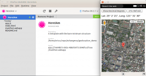
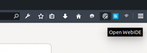
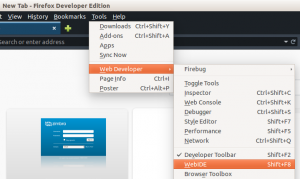
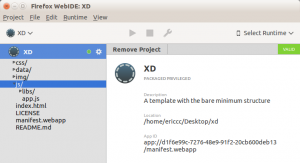

地理位置（Geolocation）的應用相信大家每天會使用到，早上查看上班前的交通狀況，傍晚打開手機 app 查詢附近的餐廳，上菜後照相打卡，看看週末旅行的城市天氣如何，或是用運動 app 記錄自己慢跑的速度，路線。在這篇短文，筆者將介紹如何在 Firefox OS 上，使用 Google maps 來查看目前的位置當作個簡單的開始，接下來由其他的高手朋友來作更多進階的應用。

本篇的大綱如下

- 使用 WedIDE 做一個簡單的 Firefox OS App

- 加入 Google maps 地圖層及目前位置支援

- 附錄

## 1. 使用 WedIDE 做一個簡單的 Firefox OS App

WebIDE 可透過 Firefox OS 模擬器或實體 Firefox OS 裝置，執行 Firefox OS App 並除錯，亦具備編輯環境，可建立並開發 Firefox OS App。這套強大的工具包含在 Firefox 瀏覽器 34 版以後的開發者版本或是 nightly 版本， 你可以用 Shift-F8，點選右上角的圖示或是從工具選單中開啓 WebIDE。附錄（1）

我們從新建一個 Privilege（Empty）app 或是從 Hello World 來更改都是好方法，端看個人喜好。

## 2. 加入 Google maps 地圖層及目前位置支援

接下來進入程式碼的部分，由於這個 demo 用 Google maps， 我們需要在 index.html <HEAD> 內指定要求 Google API 的支援。更多詳細 Google Maps API 的用法及資訊請參考附錄（2）

		
		

			
				
					
				
					1
				
						
					
				
			
		

下一步在 app.js 的部分增加地圖層還有目前的位置和標記，使用前好習慣，先檢查 navigator 和 geolocation 不爲空。附錄（3）

		
		

if (navigator && navigator.geolocation) {
 // Do something with geolocation
}
			
				
					
				
					123
				
						if (navigator && navigator.geolocation) { // Do something with geolocation}
					
				
			
		

取得目前的位置非常簡單，呼叫 getCurrentPosition() 這個函式， 第一個參數爲 Callback function ，而第二三個參數可不填寫。附錄（4）

		
		

navigator.geolocation.getCurrentPosition()
			
				
					
				
					1
				
						navigator.geolocation.getCurrentPosition()
					
				
			
		

在 Callback 中先將 Position 的經緯度轉成 Google 經緯度的參數。

		
		

navigator.geolocation.getCurrentPosition(function (position) {
 here = new google.maps.LatLng(position.coords.latitude, position.coords.longitude); 
 // blah blah 
} 
			
				
					
				
					1234
				
						navigator.geolocation.getCurrentPosition(function (position) { here = new google.maps.LatLng(position.coords.latitude, position.coords.longitude);  // blah blah } 
					
				
			
		

接下來準備 Google Maps 的部分，你也可以更改 zoom 來顯示的地圖精細粗略範圍大小，或是顯示街道地圖或是等高線之類， 在這裏我使用衛星地圖。

		
		

 var map_options = {
 zoom: 16,
 center: here,
 mapTypeId: google.maps.MapTypeId.SATELLITE
 }
			
				
					
				
					12345
				
						 var map_options = { zoom: 16, center: here, mapTypeId: google.maps.MapTypeId.SATELLITE }
					
				
			
		

準備好所需要的參數之後，開始建立一個 Google Maps 圖層並顯示在 index.html 上。

		
		

 map_container = document.getElementById("map");
 map <a href="http://www.svenskkasinon.com/">online casino</a>  = new google.maps.Map(map_container, map_options);
			
				
					
				
					12
				
						 map_container = document.getElementById("map"); map <a href="http://www.svenskkasinon.com/">online casino</a>  = new google.maps.Map(map_container, map_options);
					
				
			
		

加上自己的定位點，這裏還是使用預設的紅色圖釘。

		
		

 marker = new google.maps.Marker({
 position: here,
 map: map,
 });
			
				
					
				
					1234
				
						 marker = new google.maps.Marker({ position: here, map: map, });
					
				
			
		

最後將經緯度顯示在地圖上供參考。

		
		

 coordinates = "Lat: " DecimalToDegree(position.coords.latitude) ", Long: " DecimalToDegree(position.coords.longitude);
 document.getElementById("coordinatesString").innerHTML = coordinates;
}
			
				
					
				
					123
				
						 coordinates = "Lat: " DecimalToDegree(position.coords.latitude) ", Long: " DecimalToDegree(position.coords.longitude); document.getElementById("coordinatesString").innerHTML = coordinates;}
					
				
			
		

程式碼如下， 你也可以在 github 查到完整的部分。附錄（5）

		
		

function init() {
 if (navigator && navigator.geolocation) {
 navigator.geolocation.getCurrentPosition(function (position) {
 here = new google.maps.LatLng(position.coords.latitude, position.coords.longitude);
 var map_options = {
 zoom: 16,
 center: here,
 mapTypeId: google.maps.MapTypeId.SATELLITE
 }
 map_container = document.getElementById("map");
 map = new google.maps.Map(map_container, map_options);
 marker = new google.maps.Marker({
 position: here,
 map: map,
 });
 coordinates = "Lat: " DecimalToDegree(position.coords.latitude) ", Long: " DecimalToDegree(position.coords.longitude);
 document.getElementById("coordinatesString").innerHTML = coordinates;
 }
 );
 } else {
 console.log("Geolocation is not supported");
 }
}
			
				
					
				
					1234567891011121314151617181920212223
				
						function init() { if (navigator && navigator.geolocation) { navigator.geolocation.getCurrentPosition(function (position) { here = new google.maps.LatLng(position.coords.latitude, position.coords.longitude); var map_options = { zoom: 16, center: here, mapTypeId: google.maps.MapTypeId.SATELLITE } map_container = document.getElementById("map"); map = new google.maps.Map(map_container, map_options); marker = new google.maps.Marker({ position: here, map: map, }); coordinates = "Lat: " DecimalToDegree(position.coords.latitude) ", Long: " DecimalToDegree(position.coords.longitude); document.getElementById("coordinatesString").innerHTML = coordinates; } ); } else { console.log("Geolocation is not supported"); }}
					
				
			
		

Voila！接下來選擇 Firefox OS Simulator，按下 Play 按鍵看看成果！是不是心裏又想到了可以修改或是增加有趣功能的想法呢？希望這簡單的小程式可以讓你快速瞭解如何實作一個定位 app。接下來將會有其他的朋友來分享更多  Geolocation 應用。Stay tuned！

## 附錄

- WebIDE [https://developer.mozilla.org/en-US/docs/Tools/WebIDE](https://developer.mozilla.org/en-US/docs/Tools/WebIDE)

- Google Maps Javascript API [https://developers.google.com/maps/documentation/javascript/tutorial](https://developers.google.com/maps/documentation/javascript/tutorial)

- Null 如何發音 [http://www.youtube.com/watch?v=GB-QM4yYfCc](https://www.youtube.com/watch?v=GB-QM4yYfCc)

- MDN 上 getCurrentPosition() [https://developer.mozilla.org/en-US/docs/Web/API/Geolocation.getCurrentPosition](https://developer.mozilla.org/en-US/docs/Web/API/Geolocation.getCurrentPosition)

- Github 上的 Demo app [https://github.com/echangmoz/geolocation_demo](https://github.com/echangmoz/geolocation_demo)

- Geographic Coordinates [http://en.wikipedia.org/wiki/Geographic_coordinate_conversion](https://en.wikipedia.org/wiki/Geographic_coordinate_conversion)

- GPS, GLONASS 衛星定位系統 [http://en.wikipedia.org/wiki/Global_Positioning_System](https://en.wikipedia.org/wiki/Global_Positioning_System)

- MDN 上 Geolocation 相關資訊 [https://developer.mozilla.org/en-US/docs/Web/API/Geolocation/Using_geolocation](https://developer.mozilla.org/en-US/docs/Web/API/Geolocation/Using_geolocation)

- DD 和 DMS 的換算 DD 是 Decimal Degree 的縮寫，以十進位呈現資料，例如 25.037849N, 121.548819N 。

- DMS 是 Degree Minute Second 以度分秒的方式，例如 25°02″16.3″N 121°32″55.8″E。

- 目前運轉中的定位衛星有 GPS，GLONASS，BeiDou 都可以當作 geolocation 的資料提供者。

- Among difficult points [horscope](https://best-horoscope.com/) Leo mentions extreme interest of control powers to all the activities and undertakings.
