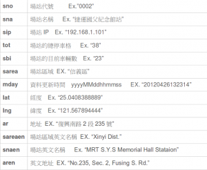
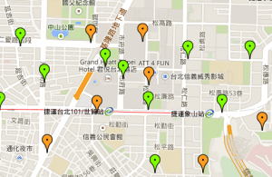
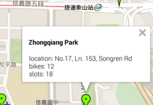

在看過  [Part I](https://tech.mozilla.com.tw/posts/5762/where-am-i%EF%BC%9F%EF%BC%8Dpart-i%EF%BC%8D%E4%BD%BF%E7%94%A8-google-maps-%E5%9C%B0%E5%9C%96%E5%BF%AB%E9%80%9F%E7%B0%A1%E5%96%AE%E6%9F%A5%E7%9C%8B%E4%BD%A0%E7%9A%84%E4%BD%8D%E7%BD%AE) 部分，相信大部分人都可以了解如何完成一個 Firefox OS 地圖應用程式。在了解了地圖的基本應用之後，我也想要做一個簡單的程式。我想要完成一個可以在地圖上呈現更多資訊的地圖應用程式。除了顯示個人地理位置資訊，可以把我們感興趣的地圖資訊也呈現出來。

我們生活中常用的就是交通的資訊，以一個台北市民來說，可以使用微笑單車是很方便的事。不過在騎單車前可以了解目前附近單車的使用狀況會很有幫助。所以在這篇文章中，我希望可以以 Part I 中的地圖為基礎來開發一個應用去呈現台北市微笑單車即時資訊。

所以本篇文章會呈現的內容如下:

1. 微笑單車的即時資訊的取得及分析。

2. 在地圖上利用 Google Maps 提供的工具標示及顯示微笑單車使用情況。

目前台北市政府把微笑單車的即時資訊以 json 的格式對外公開，所以任何人都可以根據自已的需求來使用這些資訊。我們使用的方式就是從台北市政府抓到最新的資料，從中取出我們感興趣的內容。在微笑單車的資料中，我們需要知道單車站點的位置資訊及單車數量。在研究的過程中，我們知道資料中有提供站點資訊的英文訊息，所以也可以針對不是中文語係的裝置以英文來提供資訊。

我們需要的資料包含了 : sna, tot, sbi, lat, lng, ar, snaen, aren

首先需要從台北市的 opendata 中把 json 資料抓回來。

		
		

function httpGet(url) {
 xmlHttp = new XMLHttpRequest({mozSystem:true});
 xmlHttp.open( "GET", url, false );
 xmlHttp.send( null );
 return xmlHttp.responseText;
}
			
				
					
				
					123456
				
						function httpGet(url) { xmlHttp = new XMLHttpRequest({mozSystem:true}); xmlHttp.open( "GET", url, false ); xmlHttp.send( null ); return xmlHttp.responseText;}
					
				
			
		

利用 
			JSON.parse 把傳回來的資料轉換成 javascript object 。就可以利用得到的資料去呈現在地圖上。

平常我在使用微笑單車時最關心的有下列訊息:

1. 附近有那些微笑單車站據點。

2. 那些據點還有車可以借，是不是有位置可以讓我們還車。

3. 為了一目了然用顏色來標示空車及空位的據點，可以更快讓使用者掌握情況。

4. 為了呈現即時的資訊，我們知道台北市是每五分鐘更新一次資料，所以我們也根據這項特性來更新我們地圖上的資訊。

一般我們在找附近的微笑單車的資訊時，最關心的是單車據點，可以很快知道有沒有車可以借，可以避免到達站點後才知道沒有車或是需要點開詳細資訊才知道。我們可以設定三種顏色來分別最簡單的站點資訊 – 沒有車 ( 橘色 )，有車有位 ( 綠色 ) 及 沒有車位 ( 紅色 ) 。

站點位置可以用 lat 及 lng 在 Google Maps 上以 marker 的方式標式出來。為了讓使用者可以了解更細節的資訊，在使用者在 marker 上點選之後，可以了解站點名稱 ( sna ) , 站點位置 ( ar  ), 單車數 ( sbi ),  空位數 ( tot – sbi )。

[

英文的資訊可以用 snaen 及 aren 來根據 
			navigator.language 調整去呈現中文以外的資訊。

		
		

 latlng = new google.maps.LatLng(retVal[i].lat, retVal[i].lng);
 var image = okImage;
 if ( retVal[i].sbi == 0 ) {
 image = emptyImage;
 } else if ( (retVal[i].tot-retVal[i].sbi) == 0 ) {
 image = fullImage;
 }

 var marker = new google.maps.Marker({
 position: latlng,
 map: map,
 icon: image,
 shadow: pinShadow,
 //animation: google.maps.Animation.DROP,
 title: infoTitle
 });
			
				
					
				
					12345678910111213141516
				
						 latlng = new google.maps.LatLng(retVal[i].lat, retVal[i].lng); var image = okImage; if ( retVal[i].sbi == 0 ) { image = emptyImage; } else if ( (retVal[i].tot-retVal[i].sbi) == 0 ) { image = fullImage; }  var marker = new google.maps.Marker({ position: latlng, map: map, icon: image, shadow: pinShadow, //animation: google.maps.Animation.DROP, title: infoTitle });
					
				
			
		

最後為了呈現最即時的資訊，可以利用 javascript 的 
			setTimeout 來定期每五分鐘更新一次地圖上的標示及站點資訊。

		
		

 setTimeout(function() {
 updateMap(map);
 }, 5 * 60 * 1000); // update the ubike information every 5 minutes.
			
				
					
				
					123
				
						 setTimeout(function() { updateMap(map); }, 5 * 60 * 1000); // update the ubike information every 5 minutes.
					
				
			
		

相信在這樣的簡單說明下，大家對於這樣的地圖有了進一步的認識。等待大家來開發更多更棒的應用。

參考:

1. [Where am I? – Part I – 使用 Google Maps 地圖快速簡單查看你的位置](https://tech.mozilla.com.tw/posts/5762/where-am-i%EF%BC%9F%EF%BC%8Dpart-i%EF%BC%8D%E4%BD%BF%E7%94%A8-google-maps-%E5%9C%B0%E5%9C%96%E5%BF%AB%E9%80%9F%E7%B0%A1%E5%96%AE%E6%9F%A5%E7%9C%8B%E4%BD%A0%E7%9A%84%E4%BD%8D%E7%BD%AE)

2. [台北市政府的開放資料](https://ppt.cc/-BSH)
