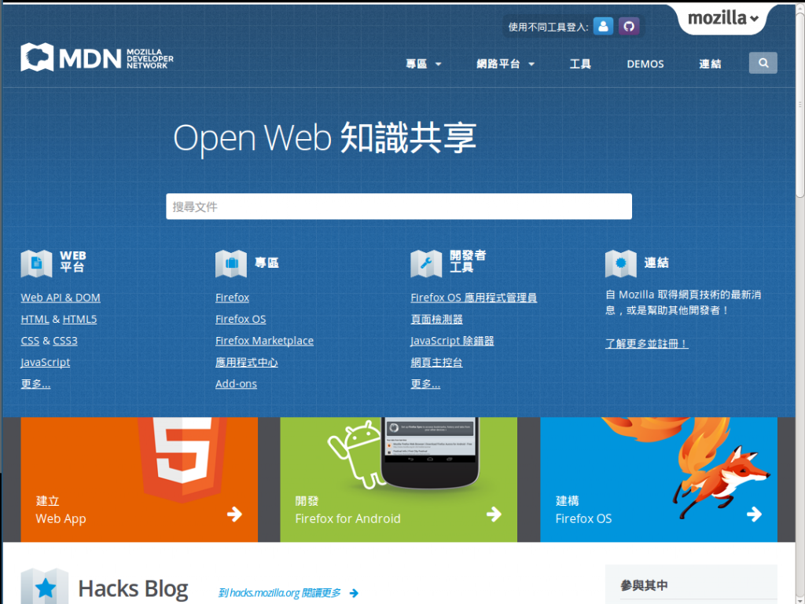
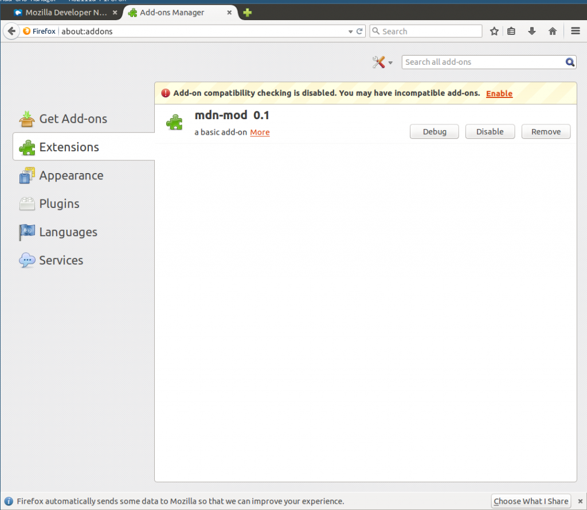
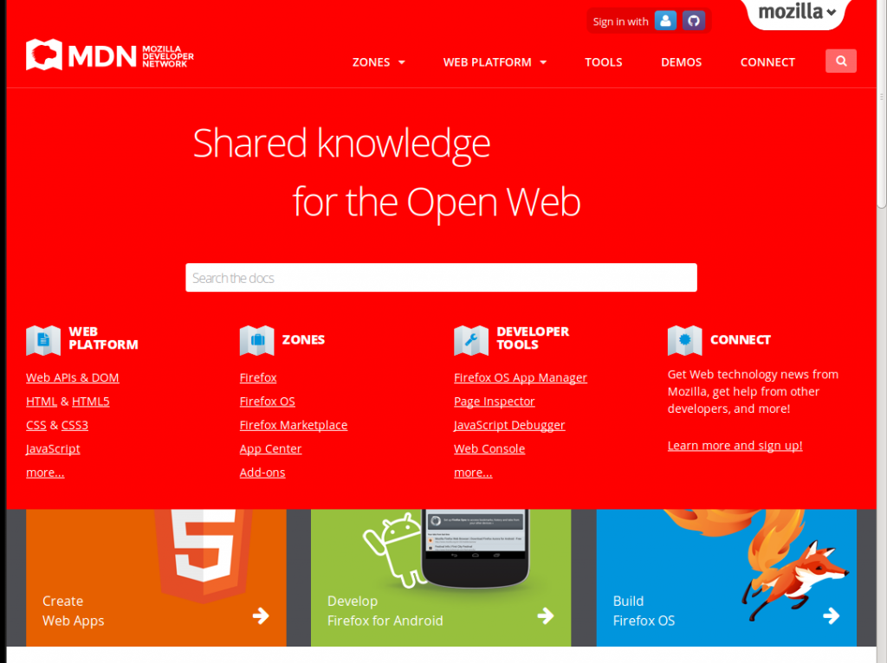
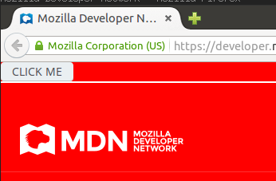
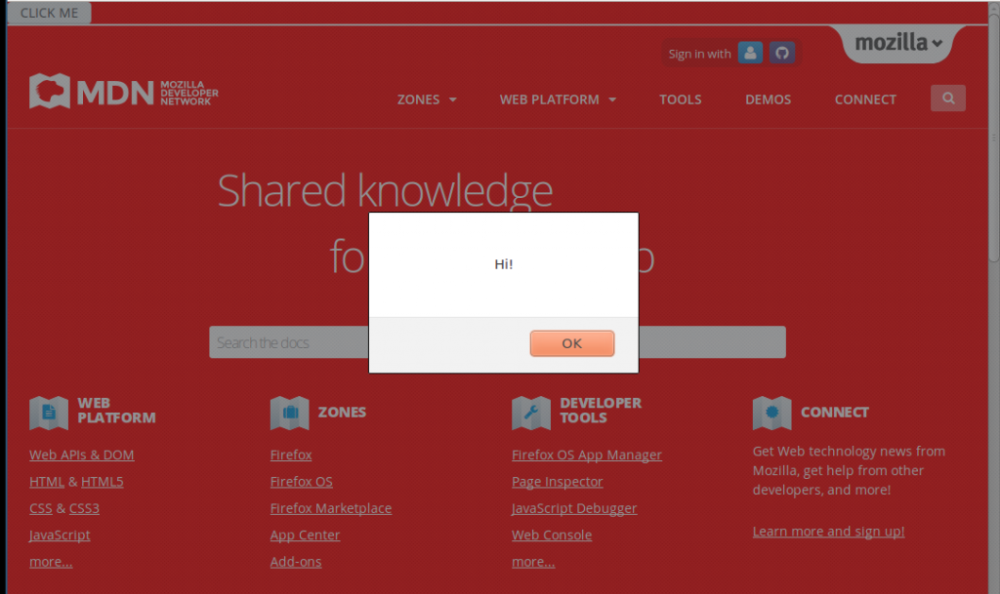

Firefox 最受歡迎的特色之一就是量多而且質精的附加元件 (Add-on)，在 Firefox Add-ons 網站 [[1]](https://tech.mozilla.com.tw/#ref-1) 您可以找到各式各樣的附加元件滿足您的各種上網需求。在這篇文章中我們將會介紹如何利用 Firefox Add-on SDK [[2]](https://tech.mozilla.com.tw/#ref-2) 來撰寫簡單的附加元件。我們會教您如何利用附加元件來改變網頁的外觀與行為，即使不是自己架設的網站，我們也能隨心所欲的改善它們的使用經驗。

## 準備工作

為了減輕開發者的負擔，Mozilla 推出了 Add-on SDK [[2]](https://tech.mozilla.com.tw/#ref-2) 來取代原來基於 XUL 技術 [[3]](https://tech.mozilla.com.tw/#ref-3) 的附加元件框架。相較於傳統的 XUL， Add-on SDK 提供了更多簡單易用的 API 來簡化開發流程，另外也提供了許多新的使用者介面元素來配合新版的 Firefox 介面。

為了能夠使用最新的 API，建議您先更新Firefox到最新版 [[4]](https://tech.mozilla.com.tw/#ref-4) 。

您還需要安裝最新版的 Add-on SDK [[5]](https://tech.mozilla.com.tw/#ref-5)，以下將以 Linux 平台作為教學範例 ( OS X 也適用 )，若是使用 Windows 請參考 [[5]](https://tech.mozilla.com.tw/#ref-5)。

首先下載最新版的 [Add-on SDK](https://ftp.mozilla.org/pub/mozilla.org/labs/jetpack/jetpack-sdk-latest.zip)，解壓縮以後執行裡面的 activate 指令：

		
		

source bin/activate #如果你用 bash
bash bin/activate   #如果你用其他的 shell
			
				
					
				
					12
				
						source bin/activate #如果你用 bashbash bin/activate   #如果你用其他的 shell
					
				
			
		

此時您會注意到您的 shell prompt 前面會出現以下字串：

		
		

(Add-on-sdk-1.17) $    #版本號可能不同
			
				
					
				
					1
				
						(Add-on-sdk-1.17) $    #版本號可能不同
					
				
			
		

這樣表示您已經在 Add-on SDK 的環境下了，您會得到一個新的指令 — cfx，我們將會仔細介紹它的用法。（註：當您關閉 shell 以後就會自動退出 Add-on SDK，當您下次要繼續使用時必須重新執行 bin/activate。）

## 初始化一個新的專案

Web 工程師都知道要學習 HTML, JavaScrprt, CSS 最好的資源就是 Mozilla Developer Network [[6]](https://tech.mozilla.com.tw/#ref-6)。我們就試著用 Firefox Add-on 來把 MDN 調教改造成我們想要的樣子。我們會先示範如何插入 JavaScript 來改變 MDN的背景顏色，接著我們再示範如何在 MDN 的首頁上插入自己的按鈕，並且可以讓按鈕執行我們自己定義的 JavaScript。

套用 Add-on 之前的 MDN 網站

假設我們把這個新的專案叫作 mdn-mod ，第一步我們先讓 Add-on SDK 幫我們生成必要的檔案與目錄結構：

		
		

mkdir mdn-mod
cd mdn-mod
cfx init
			
				
					
				
					123
				
						mkdir mdn-modcd mdn-modcfx init
					
				
			
		

當執行完 cfx init之後，我們的  mdn-mod 資料夾就會出現以下的檔案：

		
		

.
├── data   // Add-on 需要的資源檔案
├── lib    // Add-on 主要的 JavaScript 程式碼
│   └── main.js    // 程式的進入點
├── package.json   // 定義這個 Add-on 的 metadata
└── test   // 測試檔案，之後再介紹
    └── test-main.js
			
				
					
				
					1234567
				
						.├── data   // Add-on 需要的資源檔案├── lib    // Add-on 主要的 JavaScript 程式碼│   └── main.js    // 程式的進入點├── package.json   // 定義這個 Add-on 的 metadata└── test   // 測試檔案，之後再介紹    └── test-main.js
					
				
			
		

首先我們需要打開 package.json 填寫程式名稱、版本號、作者、授權條款等等資料，只要照著自動生成的欄位填入即可，若是有不清楚的可以參考這篇文件 [[7]](https://tech.mozilla.com.tw/#ref-7)。

## 用 page-mod 插入 JavaScript 到指定網站

Add-on SDK 提供的一個實用 API 叫作 page-mod [[8]](https://tech.mozilla.com.tw/#ref-8)，其用途是當 Firefox 開到指定的網站時，就插入一段自己的 JavaScript 到頁面上，因此可以改變特定網站的行為。

首先我們打開 lib/main.js，加入以下幾行程式碼：

		
		

var pageMod = require("sdk/page-mod");
var data = require("sdk/self").data;

pageMod.PageMod({
    include: "*.mozilla.org",
    contentScriptFile: data.url("my-script.js")
});
			
				
					
				
					1234567
				
						var pageMod = require("sdk/page-mod");var data = require("sdk/self").data; pageMod.PageMod({    include: "*.mozilla.org",    contentScriptFile: data.url("my-script.js")});
					
				
			
		

第五行的 include: "*.mozilla.org" 就是我們希望套用的網址（"*" 代表萬用字元），只要 Firefox 開啟的網址是 mozilla.org 結尾的，就會被插入 contentScriptFile 指定的 JavaScript 檔案。在這裡我們使用了 data.url("my-script.js")，意思是放在 data/ 資料夾下的  my-script.js  檔案。

## 改變 MDN 背景顏色

但是目前為止我們還沒真的定義 my-script.js 要執行什麼，所以我們馬上新增一個檔案 data/my-script.js，插入以下一行簡單的程式碼：

		
		

document.body.style.background="red";
			
				
					
				
					1
				
						document.body.style.background="red";
					
				
			
		

這行代碼把 body tag 的背景設成紅色，等同於以下這段 CSS 的效果：

		
		

body {
   background-color: red;
}
			
				
					
				
					123
				
						body {   background-color: red;}
					
				
			
		

## 使用乾淨的瀏覽器進行測試

完成上述步驟以後，我們的 Add-on 已經可以準備測試了。但是我們日常使用的 Firefox 可能有很多個人設定，或是安裝了很多其他 Add-on，會干擾我們的測試。此時我們只要執行

		
		

cfx run
			
				
					
				
					1
				
						cfx run
					
				
			
		

Add-on SDK 就會幫我們開啟一個完全乾淨的 Firefox profile，讓我們可以在近乎出廠設定的 Firefox 底下測試我們的 Add-on。

乾淨的 Firefox Profile

當我們在新開的 Firefox 裡面開啟 [http://developer.mozilla.org/](https://developer.mozilla.org/)，毫不意外的 MDN 的背景就變成紅色了！

MDN 的背景已經被改成紅色

## 添加新按鈕

除了改變現有的頁面以外，我們也可以自由的插入任何自己想要的元件。讓我們再次打開data/my-script.js，加入以下程式碼：

		
		

var button = "<button onClick='alert(\"Hi!\")'>CLICK ME</button>";
document.body.innerHTML = button + document.body.innerHTML;
			
				
					
				
					12
				
						var button = "<button onClick='alert(\"Hi!\")'>CLICK ME</button>";document.body.innerHTML = button + document.body.innerHTML;
					
				
			
		

再這段程式碼裡面，我們定義了一個 html5 的按鈕，並且讓它被按下 (觸發 onClick 事件) 時會跳出一個訊息框說「Hi!」 ( alert("Hi!") )。

下一行緊接著就把這個按鈕插入到 body tag 的最前面，於是當我們再次執行  cfx run 來瀏覽 MDN 時，就會看到畫面最上方出現了一個按鈕。

出現了 CLICK ME 按鈕

按下按鈕馬上跳出寫著「Hi!」的訊息框。

跳出了寫著「Hi!」的訊息框

## 打包出貨

如此一來我們的 Add-on 就大功告成了！如果要把這個 Add-on 包裝成可以分享的 xpi [[9]](https://tech.mozilla.com.tw/#ref-9) 格式，只要執行

		
		

cfx xpi
			
				
					
				
					1
				
						cfx xpi
					
				
			
		

即可。Add-on SDK 會生成一個副檔名為 .xpi 的安裝檔，不論是要直接傳給親朋好友或是拿去 Firefox 官方的附加元件商城 [[1]](https://tech.mozilla.com.tw/#ref-1) 上架都可以！

以上就是一個簡單的 Add-on 教學，在後續的文章中我們還會介紹如何讓您的附加元件可以有自己的設定頁面，以及如何增加工具列按鈕、右鍵選單等等更進階的技巧，下回分曉！

## References

[1] Firefox Add-on Gallery [https://Add-ons.mozilla.org](https://add-ons.mozilla.org/)

[2] Firefox Add-on SDK (MDN) [https://developer.mozilla.org/en-US/Add-ons/SDK](https://developer.mozilla.org/en-US/Add-ons/SDK)

[3] Overlay Extension using XUL [https://developer.mozilla.org/en-US/Add-ons/Overlay_Extensions](https://developer.mozilla.org/en-US/Add-ons/Overlay_Extensions)

[4] Get Firefox [http://moztw.org/firefox/](https://moztw.org/firefox/)

[5] Install the Add-on SDK [https://developer.mozilla.org/en-US/Add-ons/SDK/Tutorials/Installation](https://developer.mozilla.org/en-US/Add-ons/SDK/Tutorials/Installation)

[6] MDN 中文版 [https://developer.mozilla.org/zh-TW/](https://developer.mozilla.org/zh-TW/)

[7] package.json 格式說明 [https://developer.mozilla.org/en-US/Add-ons/SDK/Tools/package_json](https://developer.mozilla.org/en-US/Add-ons/SDK/Tools/package_json)

[8] page-mod [https://developer.mozilla.org/en-US/Add-ons/SDK/High-Level_APIs/page-mod](https://developer.mozilla.org/en-US/Add-ons/SDK/High-Level_APIs/page-mod)

[9] cfx xpi [https://developer.mozilla.org/en-US/Add-ons/SDK/Tools/cfx#cfx_xpi](https://developer.mozilla.org/en-US/Add-ons/SDK/Tools/cfx#cfx_xpi)
