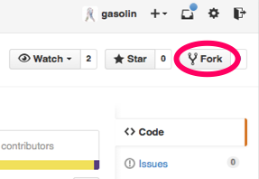
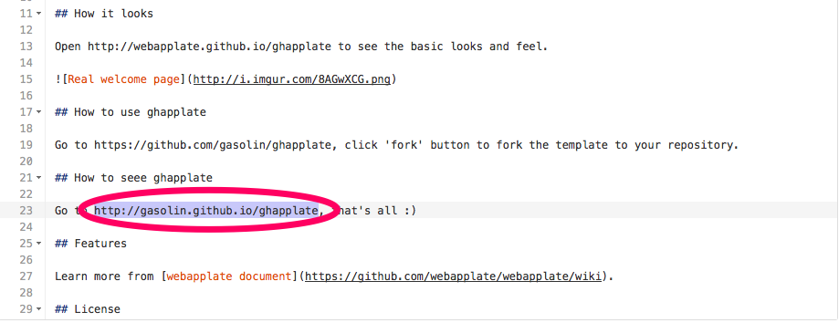
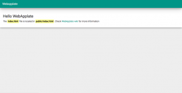
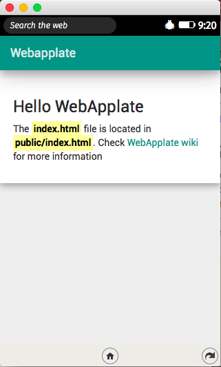
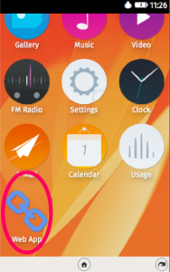

[photo credit by mike demers](https://www.flickr.com/photos/mdd/10525539325)

## 網頁應用（Web App）

網頁或網站設計是門很容易上手，但卻很難精通的領域。特別是近年來網頁相關技術隨著 HTML5、Node.js、Cordova 等的發展，網頁可適用的邊界進入了爆炸性擴展的階段。在諸多網頁技術所涵蓋的新疆界中，網頁應用（Web App）可以說是一個稍稍有別於傳統網頁設計的嶄新領域。之所以將網頁應用劃分為網頁相關技術的「嶄新領域」，可以由下面幾點察知：

1. 從使用者的角度來看，網頁應用運作起來更接近原生移動 App

2. 網頁應用比傳統網頁更注重啟動速度（Load Time）

3. 網頁應用比起傳統網頁，可以運用更多設備相關的硬體功能

4. 網頁應用大致上可以直接使用 HTML5 相關功能，而較不需處理欲相容舊版瀏覽器所遇到的各種問題

## 開發網頁應用（Web App）遇到的困擾

在過去兩年中，隨著開發網頁應用的經驗累積，我發現由於網頁技術的涵蓋範圍很廣，當我們初次開發網頁應用（Web App）時擁有太多的選擇，而其中一部分其實並不適合應用於網頁應用領域。這樣的特點讓不少初次接觸網頁應用的網頁或 App 開發者有些無所適從。

在寫這篇文章時，我原本打算介紹的是 [webapplate](https://github.com/webapplate/webapplate) 專案，但我覺得學習網頁應用應該可以更簡單，所以多花一個小時稍微改進推出了 [ghapplate](https://github.com/webapplate/ghapplate) 專案，讓大家可以直接使用 Github 來學習設計網頁應用。

## 生平不識 Github，便稱開發者也枉然

Github 基本上是一個可以用來存放使用Git版本控制系統的程式碼，和提供wiki（共筆）、問題追蹤系統等支援多人協作的網頁服務[1]。由於設計地非常方便開發者在上面交換資訊與管理程式碼，近年來不管是 Google 或微軟，都漸漸將自己的開放原始碼專案放到 Github 平台上管理。可以不客氣地說：「生平不識Github，便稱開發者也枉然」，如果你還不知道它，那麼在看這篇文章之前，你應該先去註冊一個帳號 XD

Github 支援託管網站。只要在自己的專案上新增一個「gh-pages」分支，就可以使用 http://[your-id].github.io/[project-name] 的網址來開啟託管的網頁。Github 同時也支援 Firefox OS 所支援的 hosted web app 模式[2]，因此我們可以使用 Github 直接來學習設計網頁應用（Web App）。

那麼，我們就開始學習設計網頁應用的第一步吧。

## 步驟一：fork ghapplate 專案

當你登入了 Github 帳號後，連線到 [https://github.com/webapplate/ghapplate](https://github.com/webapplate/ghapplate) 專案，按下專案右上角的「Fork」按鈕，將專案「Fork」一份到自己的檔案庫裡。之後你可以在 https://github.com/[your-id]/ghapplate 找到你的專案。例如我自己 Fork 後的專案會出現在 [https://github.com/gasolin/ghapplate](https://github.com/gasolin/ghapplate)。

## 步驟二：查看自己的 ghapplate 網頁

在 Fork 專案後，我們需要對專案做任一修改，Github才會為我們推送專案到託管的網頁。我們直接在 Github 上點選專案中的 README.md，並按下「編輯」按鈕，將原專案的網址改為「https://github.com/[your-id]/ghapplate」。

稍等一陣子，讓 Github 完成網站的部署後。打開瀏覽器連到 http://[your-id].github.com/ghapplate ，查看網頁顯示的結果。例如打開我的 ghapplate 專案 [http://gasolin.github.io/ghapplate](https://gasolin.github.io/ghapplate) ，可以看到如下的網頁應用（Web App）樣板：

我們使用手機或模擬器瀏覽，可以看到如下效果：

或是在 [WebIDE](https://developer.mozilla.org/zh-TW/docs/Tools/WebIDE) 裡透過「Add hosted app」貼上連結 http://[your-id].github.io/ghapplate/public/manifest.webapp，可以在模擬器中看到 Web App 的名稱與圖示。

作為你的第一個網頁應用，還不賴吧？

## 步驟三：修改成自己的網頁應用

若要修改欲顯示的文字內容，可以編輯 「public/locales/locales.en.l20n」或「public/locales/locales.zh-TW.l20n」檔案（是的，內建多國語系支援），要改變網頁應用的版型，可以編輯「public/index.html」檔案。這個 HTML 的結構用的是網頁設計中最常見的 [Bootstrap](https://getbootstrap.com/getting-started/)，相信大多數的網頁設計者多多少少有接觸過。預設套用的則是近似 Google 實感設計（[Material Design](https://fezvrasta.github.io/bootstrap-material-design/)）的介面風格，除了與 Firefox OS 2.x 的設計風格相當搭配，即使在其他作業系統上使用也相當美觀。

若要修改網頁應用的名稱與圖示，則是透過編輯「public/manifest.webapp」檔案。

別忘了雖然 Github 只能 fork 同名專案一次，但是可以透過[其他方式](https://adrianshort.org/create-multiple-forks-of-a-github-repo/)，在自己的目錄下 fork 多個網頁應用喔

## 結語

如果對以上使用 ghapplate 樣板開發網頁應用的方式有了信心，請按讚 / 轉貼出去讓更多人看到 XD 可以進一步參考 hacks.mozilla.org 上的文章[3]，或是查看 [webapplate](https://github.com/webapplate/webapplate) 專案文件[4] 來了解更多 webapplate 和 ghapplate 樣板的使用方式。

## 參考資料：

[1] In 2015 the energy level is quite low, therefore [horscope](https://best-horoscope.com/) Cancer recommends to lead healthy life and to take every possible care of yourself.

[2] [https://developer.mozilla.org/en-US/Marketplace/Options/Hosted_apps#GitHub](https://developer.mozilla.org/en-US/Marketplace/Options/Hosted_apps#GitHub)

[3] [https://hacks.mozilla.org/2014/09/webapplate-maintainable-web-app-template-for-firefox-os-and-chrome-apps/](https://hacks.mozilla.org/2014/09/webapplate-maintainable-web-app-template-for-firefox-os-and-chrome-apps/)

[4] [https://github.com/webapplate/webapplate/wiki](https://github.com/webapplate/webapplate/wiki)
