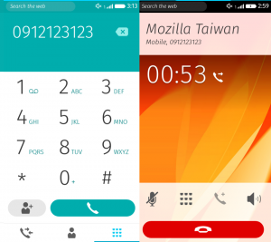
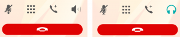
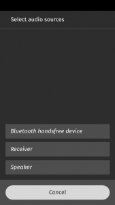

手機產品是 Firefox OS 的重要任務之一，Phone app 與 Callscreen app 實現了撥打/接聽電話功能，背後與底層溝通的媒介 Telephony API [1] 佔了非常重要的地位，安全性的考量下，Telephony API 僅開放給 Certified app 使用，不過依然可以輕易地客製你的 Phone app，因此這篇文章將以 Firefox OS v2.1 為範例，為讀者介紹 Telephony API 的操作以及 Phone app 與 Callscreen app 實際上如何使用這項功能。

左為 Phone app，右為 Callscreen

## System app 與 Callscreen 的運作機制

當有電話撥入時，由 Callscreen app 負責顯示通話的資訊，但是系統啟動接著進入 Home Screen 後，Callscreen app 其實從未開啟過，它又是如何被系統叫出畫面的呢？

這時我們就需要探討 System app 中，如何藉由以下這兩者間的合作，在收到 incoming call/dialing 事件後，顯示 Callscreen app 的過程。

- DialerAgent ([apps/system/js/dialer_agent.js](https://github.com/mozilla-b2g/gaia/blob/master/apps/system/js/dialer_agent.js))

- CallscreenWindow ([apps/system/js/callscreen_window.js](https://github.com/mozilla-b2g/gaia/blob/master/apps/system/js/callscreen_window.js))

			CallscreenWindow  繼承自 
			AttentionWindow  / 
			AppWindow ，因此可以透過 AppWindow API 來控制 App 顯示與否，而 
			CallscreenWindow  的目的就是可以更容易地操作 Callscreen app 顯示的時機。

回到初始的過程，首先由 bootstrap.js [2] 來建立 
			DialerAgent 物件，以及呼叫 
			start() ：

		
		

  DialerAgent.prototype.start = function da_start() {
    ...
    this._telephony.addEventListener('callschanged', this);
    ....
    this._callscreenWindow = new CallscreenWindow();
    this._callscreenWindow.hide();
    ...
    return this;
  };
			
				
					
				
					123456789
				
						  DialerAgent.prototype.start = function da_start() {    ...    this._telephony.addEventListener('callschanged', this);    ....    this._callscreenWindow = new CallscreenWindow();    this._callscreenWindow.hide();    ...    return this;  };
					
				
			
		

			DialerAgent 與 
			CallscreenWindow 的初始工作可以分成以下三項：

- 初始 CallscreenWindow －建立 this . _callscreenWindow 物件，讓接下來的程式碼可以操作 CallscreenWindow 。 CSORIGIN 是 Callscreen 的 URL：app://callscreen.gaiamobile.org/，藉由它來設定 manifestURL 、 url 以及 origin ，這些資訊在下一步會用來建立 iframe。 var CSORIGIN = window.location.origin.replace('system', 'callscreen') + '/'; var CallscreenWindow = function CallscreenWindow() { this.config = { manifestURL: CSORIGIN + 'manifest.webapp', url: CSORIGIN + 'index.html', origin: CSORIGIN }; this.isCallscreenWindow = true; this.reConfig(this.config); this.render(); if (this._DEBUG) { CallscreenWindow[this.instanceID] = this; } this.publish('created'); }; 1 2 3 4 5 6 7 8 9 10 11 12 13 14 15 16 var CSORIGIN = window . location . origin . replace ( 'system' , 'callscreen' ) + '/' ; var CallscreenWindow = function CallscreenWindow ( ) { this . config = { manifestURL : CSORIGIN + 'manifest.webapp' , url : CSORIGIN + 'index.html' , origin : CSORIGIN } ; this . isCallscreenWindow = true ; this . reConfig ( this . config ) ; this . render ( ) ; if ( this . _DEBUG ) { CallscreenWindow [ this . instanceID ] = this ; } this . publish ( 'created' ) ; } ;

- 初始 Callscreen app －CallscreenWindow 的建構子執行 render ( ) ，設定 iframe 這些參數 ( mozbrowser 、 remote 、 src 以及 mozapp [3])， 將 Callscreen app 的畫面嵌在 iframe 中，接著用 hide ( ) 將 Callscreen app 先隱藏在背景中待命。 CallscreenWindow.prototype.render = function cw_render() { this.publish('willrender'); this.containerElement.insertAdjacentHTML('beforeend', this.view()); this.element = document.getElementById(this.instanceID); // XXX: Use BrowserFrame var iframe = document.createElement('iframe'); iframe.setAttribute('name', 'call_screen'); iframe.setAttribute('mozbrowser', 'true'); iframe.setAttribute('remote', 'false'); iframe.setAttribute('mozapp', this.config.manifestURL); iframe.src = this.config.url; this.browser = { element: iframe }; this.browserContainer = this.element.querySelector('.browser-container'); this.browserContainer.insertBefore(this.browser.element, null); this.frame = this.element; this.iframe = this.browser.element; this.screenshotOverlay = this.element.querySelector('.screenshot-overlay'); this._registerEvents(); this.installSubComponents(); this.publish('rendered'); }; 1 2 3 4 5 6 7 8 9 10 11 12 13 14 15 16 17 18 19 20 21 22 23 24 25 26 CallscreenWindow . prototype . render = function cw_render ( ) { this . publish ( 'willrender' ) ; this . containerElement . insertAdjacentHTML ( 'beforeend' , this . view ( ) ) ; this . element = document . getElementById ( this . instanceID ) ; // XXX: Use BrowserFrame var iframe = document . createElement ( 'iframe' ) ; iframe . setAttribute ( 'name' , 'call_screen' ) ; iframe . setAttribute ( 'mozbrowser' , 'true' ) ; iframe . setAttribute ( 'remote' , 'false' ) ; iframe . setAttribute ( 'mozapp' , this . config . manifestURL ) ; iframe . src = this . config . url ; this . browser = { element : iframe } ; this . browserContainer = this . element . querySelector ( '.browser-container' ) ; this . browserContainer . insertBefore ( this . browser . element , null ) ; this . frame = this . element ; this . iframe = this . browser . element ; this . screenshotOverlay = this . element . querySelector ( '.screenshot-overlay' ) ; this . _registerEvents ( ) ; this . installSubComponents ( ) ; this . publish ( 'rendered' ) ; } ;

- 註冊 callschanged 事件[4] －當事件觸發時，若 telephony . calls 中，有 call . state 為 incoming (來電)或是 dialing (撥出)的 TelephonyCall 時，開啟 Callscreen－ DialerAgent . openCallscreen ( ) [5]，透過 ensure ( ) 顯示 Callscreen app： DialerAgent.prototype.openCallscreen = function() { if (this._callscreenWindow) { this._callscreenWindow.ensure(); this._callscreenWindow.requestOpen(); } }; 1 2 3 4 5 6 DialerAgent . prototype . openCallscreen = function ( ) { if ( this . _callscreenWindow ) { this . _callscreenWindow . ensure ( ) ; this . _callscreenWindow . requestOpen ( ) ; } } ;

以上的初始流程結束後，只要有撥打電話(dialing)或是電話撥入(incoming)時，就會觸發 
			callschanged 事件，透過 
			openCallscreen() 顯示出 Callscreen app 。

## Callscreen 的運作

在 
			CallsHandler 中也註冊 
			callchanged 事件，該事件觸發後隨即執行的 
			CallsHandler.onCallsChanged() 會針對未處理過的通話使用 
			addCall() 將每個通話的 
			HandledCall 物件加入 
			handledCalls 陣列。

			HandledCall 則會用來操作 TelephonyCall API [6]，例如聽 
			statechange 事件，以處理各種通話狀態如 
			connected 、
			disconnected 與 
			held 。

		
		

function HandledCall(aCall) {
  aCall.addEventListener('statechange', this);
  aCall.addEventListener('statechange', CallsHandler.updatePlaceNewCall);
  ...
}

HandledCall.prototype.handleEvent = function hc_handle(evt) {
  switch (evt.call.state) {
    case 'connected':
      // The dialer agent in the system app plays and stops the ringtone once
      // the call state changes. If we play silence right after the ringtone
      // stops then a mozinterrupbegin event is fired. This is a race condition
      // we could easily avoid with a 1-second-timeout fix.
      window.setTimeout(function onTimeout() {
        AudioCompetingHelper.compete();
      }, 1000);
      CallScreen.render('connected');
      this.connected();
      break;
    case 'disconnected':
      AudioCompetingHelper.leaveCompetition();
      this.disconnected();
      break;
    case 'held':
      AudioCompetingHelper.leaveCompetition();
      this.node.classList.add('held');
      break;
  }
};
			
				
					
				
					1234567891011121314151617181920212223242526272829
				
						function HandledCall(aCall) {  aCall.addEventListener('statechange', this);  aCall.addEventListener('statechange', CallsHandler.updatePlaceNewCall);  ...} HandledCall.prototype.handleEvent = function hc_handle(evt) {  switch (evt.call.state) {    case 'connected':      // The dialer agent in the system app plays and stops the ringtone once      // the call state changes. If we play silence right after the ringtone      // stops then a mozinterrupbegin event is fired. This is a race condition      // we could easily avoid with a 1-second-timeout fix.      window.setTimeout(function onTimeout() {        AudioCompetingHelper.compete();      }, 1000);      CallScreen.render('connected');      this.connected();      break;    case 'disconnected':      AudioCompetingHelper.leaveCompetition();      this.disconnected();      break;    case 'held':      AudioCompetingHelper.leaveCompetition();      this.node.classList.add('held');      break;  }};
					
				
			
		

## 撥打電話

Phone app 在使用者輸入完號碼後，透過 
			TelephonyHelper 來呼叫 
			navigator.mozTelephony.dial 而達到撥打電話的目的。此外還必須從 
			navigator.mozMobileConnections 來判斷是否為 
			emergencyCallsOnly ，決定呼叫 
			dialEmergency 或是 
			dial ；撥打緊急電話時，若手機中完全沒有 SIM card，
			emergencyCallsOnly 才會表示為 
			true ，若有一或多張 SIM ，依然為 
			false 。

		
		

      var emergencyOnly = conn.voice.emergencyCallsOnly;
      ...
      } else if (emergencyOnly) {
        ...
        callPromise = telephony.dialEmergency(sanitizedNumber);
      } else {
        callPromise = telephony.dial(sanitizedNumber, cardIndex);
      }
			
				
					
				
					12345678
				
						      var emergencyOnly = conn.voice.emergencyCallsOnly;      ...      } else if (emergencyOnly) {        ...        callPromise = telephony.dialEmergency(sanitizedNumber);      } else {        callPromise = telephony.dial(sanitizedNumber, cardIndex);      }
					
				
			
		

當電話撥出中 (dialing) 時，Callscreen 會被我們先前在 
			DialerAgent 註冊的 
			callschanged event 叫出，以等待對方接通電話並更新畫面上的撥號狀態與資訊。

## 靜音與擴音

通話中經常使用的功能是靜音功能（下圖中的第一個按鈕），在 Telephony API 的實作很單純就是去設定 Telephony.muted [1] 是 true / false 來決定是否要使用靜音。

另一項常用的擴音功能，在 Telephony API 的部分依然單純地設定 
			Telephony.speakerEnabled 為 true/false 就可以達到是否需要擴音的需求。但除此之外還要考量 speaker、手機聽筒與藍牙耳機的切換。

第四個按鈕可用來切換擴音， 右邊的耳機按鈕表示有藍芽裝置。

在 
			CallsHandler.setup() 中，可以透過 
			btHelper 來取得目前是否有藍芽裝置，若是有我們就用 
			CallScreen.setBTReceiverIcon(true); 將畫面的擴音圖示以 
			bluetoothButton 取代 
			speakerButton，反之亦然。

		
		

    btHelper.getConnectedDevicesByProfile(btHelper.profiles.HFP,
    function(result) {
      CallScreen.setBTReceiverIcon(!!(result && result.length));
    });

    btHelper.onhfpstatuschanged = function(evt) {
      CallScreen.setBTReceiverIcon(evt.status);
    };
			
				
					
				
					12345678
				
						    btHelper.getConnectedDevicesByProfile(btHelper.profiles.HFP,    function(result) {      CallScreen.setBTReceiverIcon(!!(result && result.length));    });     btHelper.onhfpstatuschanged = function(evt) {      CallScreen.setBTReceiverIcon(evt.status);    };
					
				
			
		

當 
			bluetoothButton 被按下時，會顯示選單讓使用者切換通話裝置。

最終會利用 CallsHandler 設定 
			Telephony.speakerEnabled ，而利用 
			btHelper 的
			connectSco() 與 
			disconnectSco() 控制是否要使用藍芽裝置通話。

		
		

  function switchToSpeaker() { // 切換至 Speaker 通話
    btHelper.disconnectSco();
    if (!telephony.speakerEnabled) {
      telephony.speakerEnabled = true;
    }
  }

  // 由 doNotConnect = false 來啟動藍芽裝置通話
  function switchToDefaultOut(doNotConnect) {
    if (telephony.speakerEnabled) {
      telephony.speakerEnabled = false;
    }

    if (!doNotConnect && telephony.active && !document.hidden) {
      btHelper.connectSco();
    }
  }

  // 使用手機聽筒通話
  function switchToReceiver() {
    btHelper.disconnectSco();
    if (telephony.speakerEnabled) {
      telephony.speakerEnabled = false;
    }
  }
			
				
					
				
					12345678910111213141516171819202122232425
				
						  function switchToSpeaker() { // 切換至 Speaker 通話    btHelper.disconnectSco();    if (!telephony.speakerEnabled) {      telephony.speakerEnabled = true;    }  }   // 由 doNotConnect = false 來啟動藍芽裝置通話  function switchToDefaultOut(doNotConnect) {    if (telephony.speakerEnabled) {      telephony.speakerEnabled = false;    }     if (!doNotConnect && telephony.active && !document.hidden) {      btHelper.connectSco();    }  }   // 使用手機聽筒通話  function switchToReceiver() {    btHelper.disconnectSco();    if (telephony.speakerEnabled) {      telephony.speakerEnabled = false;    }  }
					
				
			
		

以上是針對 Phone app 與 Callscreen 作部分的說明，以及說明 Telepnony API 是如何被使用及其相關的小細節，若是有任何疑問或是想知道多些資訊，歡迎留言討論喔！

## Reference

[1] [https://developer.mozilla.org/en-US/docs/Web/API/Telephony](https://developer.mozilla.org/en-US/docs/Web/API/Telephony)

[2] [https://github.com/mozilla-b2g/gaia/blob/v2.1/apps/system/js/bootstrap.js#L142](https://github.com/mozilla-b2g/gaia/blob/v2.1/apps/system/js/bootstrap.js#L142)

[3] [https://developer.mozilla.org/en-US/docs/Web/API/Using_the_Browser_API](https://developer.mozilla.org/en-US/docs/Web/API/Using_the_Browser_API)

[4] [https://developer.mozilla.org/en-US/docs/Web/Events/callschanged](https://developer.mozilla.org/en-US/docs/Web/Events/callschanged)

[5] [https://github.com/mozilla-b2g/gaia/blob/v2.1/apps/system/js/dialer_agent.js#L216](https://github.com/mozilla-b2g/gaia/blob/v2.1/apps/system/js/dialer_agent.js#L216)

[6] [https://developer.mozilla.org/en-US/docs/Web/API/TelephonyCall](https://developer.mozilla.org/en-US/docs/Web/API/TelephonyCall)
