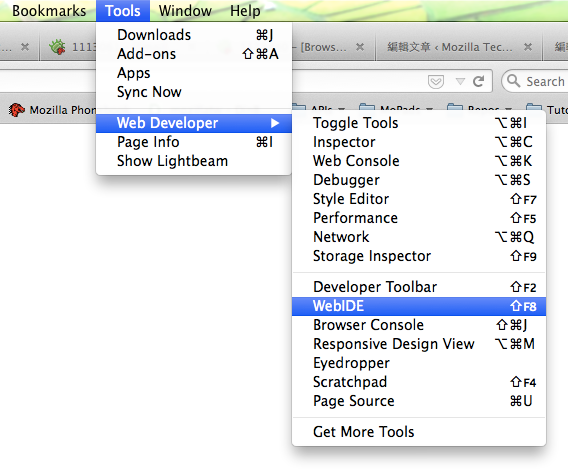
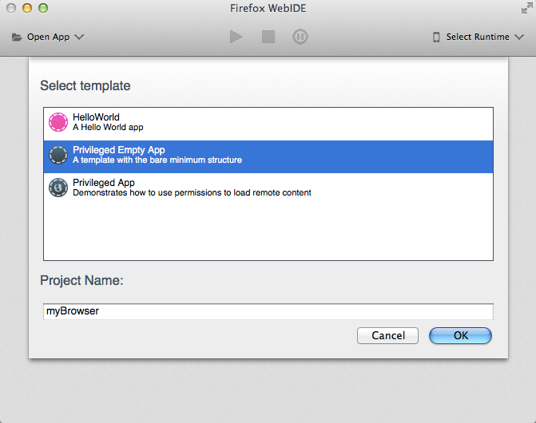
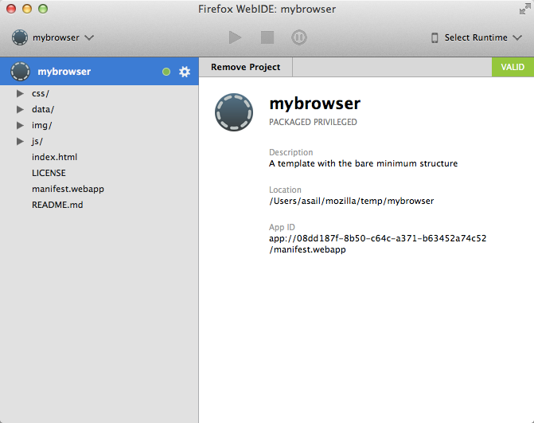
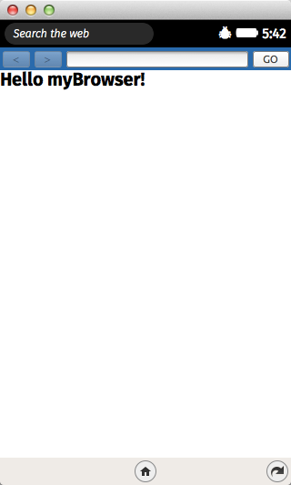
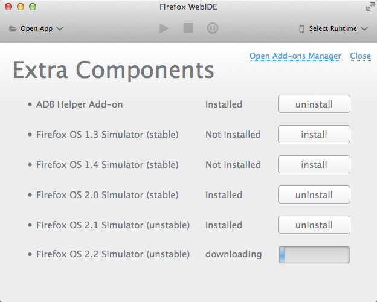
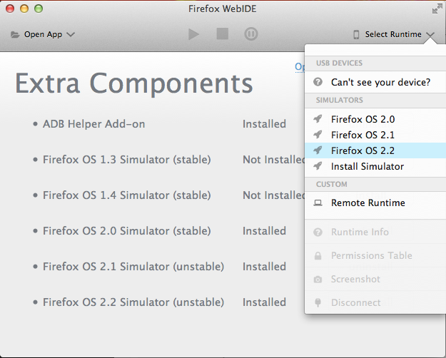
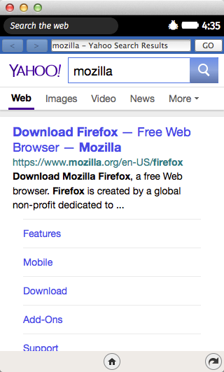

Firefox OS 上的瀏覽器 APP 利用 Gecko 提供的 Browser API 來管理網頁瀏覽，並利用 HTML5 技術提供使用者界面。根據不同的實作它可以實現分頁，瀏覽歷史，書籤… 等等功能。這篇文章示範如何建立一個可以在 Firefox OS 裝置上使用的瀏覽器 APP，它包含了最基本的網誌列跟上一頁/下一頁功能。

文章範例的原始碼可以在這裡下載：

[https://github.com/begeeben/firefox-os-browser-sample](https://github.com/begeeben/firefox-os-browser-sample)

## 基本工具： WebIDE

Firefox 34 以及之後的版本都包含了 WebIDE。開發瀏覽器 APP 的並不一定需要一台 Firefox OS 手機，我們可以在 WebIDE 上用 Firefox OS simulator 來執行這個 APP。使用 WebIDE 可以很容易的從範本建立一個 APP，並做 HTML/CSS/JS 編輯。要開啟 WebIDE，從上面的標題列選 Tools > Web Developer > WebIDE :

## 使用範本建立 APP：

首先，從 WebIDE 的空白範本建立一個 APP。Privileged APP 才能有 browser 權限使用 Browser API，它提供了一些在 Firefox OS 上才能用的 method 和 event 來管理 
			iframe。

建好的 APP 看起來像下面這張圖，接下來我們要開始寫 code 做瀏覽器 APP 需要的功能。

## 設定 manifest.webapp：

從範本建立好的 APP 已經在 manifest.webapp 裡設定 
			type  為 
			privileged：

		
		

  "type": "privileged",
			
				
					
				
					1
				
						  "type": "privileged",
					
				
			
		

要使用 Browser API 我們需要加上 
			browser 權限：

		
		

  "permissions": {
    "browser": {}
  },
			
				
					
				
					123
				
						  "permissions": {    "browser": {}  },
					
				
			
		

## HTML 結構:

這個瀏覽器 APP 上面會有一條工具列，畫面中央會拿來放用來瀏覽網頁用的 
			iframe，之後將用 javascript 來產生這個 
			iframe。這個 APP 剛開啟的時候預設顯示 “Hello myBrowser!"。

		
		

<!-- browser toolbar -->

    <button id="goback-button" type="button" disabled><</button>
    <button id="goforward-button" type="button" disabled>></button>
    <!-- url bar displays page url or page title -->
    <form id="url-bar">
        <input id="url-input" type="text"></input>
    </form>
    <button id="url-button" form="url-bar">GO</button>

<!-- the container for the browser frame -->

    

        <h1>Hello myBrowser!</h1>
    

			
				
					
				
					12345678910111213141516
				
						<!-- browser toolbar -->
    <button id="goback-button" type="button" disabled><</button>    <button id="goforward-button" type="button" disabled>></button>    <!-- url bar displays page url or page title -->    <form id="url-bar">        <input id="url-input" type="text"></input>    </form>    <button id="url-button" form="url-bar">GO</button>
<!-- the container for the browser frame -->
    
        <h1>Hello myBrowser!</h1>    

					
				
			
		

預設看起來長這樣：

## 管理瀏覽網頁的 iframe：

要提供 iframe 裡面網頁的資訊到使用者界面上，需要接收處理 
			mozbrowser event。在 
			iframe 上加 
			mozbrowser 參數，就可以在這 
			iframe 上使用 Browser API。在這裡為了要把 UI 和 mozbrowser 的處理邏輯分開，我們建立一個 tab.js，這樣也預留了未來可以做多分頁瀏覽的彈性。

		
		

/**
 * Returns an iframe which runs in a child process with Browser API enabled
 * and fullscreen is allowed
 *
 * @param  {String} [url] Optional URL
 * @return {iframe}       An OOP mozbrowser iframe
 */
function createIFrame (url) {
  var iframe = document.createElement('iframe');
  iframe.setAttribute('mozbrowser', true);
  iframe.setAttribute('mozallowfullscreen', true);
  iframe.setAttribute('remote', true);

  if (url) {
    iframe.src = url;
  }

  return iframe;
}
			
				
					
				
					12345678910111213141516171819
				
						/** * Returns an iframe which runs in a child process with Browser API enabled * and fullscreen is allowed * * @param  {String} [url] Optional URL * @return {iframe}       An OOP mozbrowser iframe */function createIFrame (url) {  var iframe = document.createElement('iframe');  iframe.setAttribute('mozbrowser', true);  iframe.setAttribute('mozallowfullscreen', true);  iframe.setAttribute('remote', true);   if (url) {    iframe.src = url;  }   return iframe;}
					
				
			
		

在 
			iframe 加上 
			mozallowfullscreen 參數可以允許網頁使用全螢幕。在網頁裡面在要顯示全螢幕的 element 上呼叫 
			Element.mozRequestFullscreen 。

加了 
			remote 參數讓 
			iframe 跑在另一個獨立的 child process 上。這是為了避免惡意的網站直接存取瀏覽器 APP 本身。(目前的 Firefox OS 版本還沒有允許 Nested OOP，因此這個參數在我們的範例還沒有作用，需要等 [Bug 1020135](https://bugzilla.mozilla.org/show_bug.cgi?id=1020135) – (nested-oop) [meta] Allow nested oop <iframe mozbrowser>)

Tab object 在建構的時候會建立一個 
			iframe ，並且開始聽這個 
			iframe 上的 
			mozbrowser event。

		
		

/**
 * The browser tab constructor.
 *
 * Creates an iframe and attaches mozbrowser events for web browsing.
 *
 * Implements EventListener Interface.
 *
 * @param {String} url An optional plaintext URL
 */
function Tab (url) {
  this.iframe = createIFrame(url);
  this.title = null;
  this.url = url;

  this.iframe.addEventListener('mozbrowserloadstart', this);
  this.iframe.addEventListener('mozbrowserlocationchange', this);
  this.iframe.addEventListener('mozbrowsertitlechange', this);
  this.iframe.addEventListener('mozbrowserloadend', this);
  this.iframe.addEventListener('mozbrowsererror', this);
};
			
				
					
				
					1234567891011121314151617181920
				
						/** * The browser tab constructor. * * Creates an iframe and attaches mozbrowser events for web browsing. * * Implements EventListener Interface. * * @param {String} url An optional plaintext URL */function Tab (url) {  this.iframe = createIFrame(url);  this.title = null;  this.url = url;   this.iframe.addEventListener('mozbrowserloadstart', this);  this.iframe.addEventListener('mozbrowserlocationchange', this);  this.iframe.addEventListener('mozbrowsertitlechange', this);  this.iframe.addEventListener('mozbrowserloadend', this);  this.iframe.addEventListener('mozbrowsererror', this);};
					
				
			
		

除了這五個 event 以外，這個簡單的 APP 還有很多 
			mozbrowser event 沒用到。這些 event 提供很多 
			iframe 有用的資訊，比如說 
			title ，URL，讀取進度，context menu 等等。

例如，我們可以用 
			mozbrowsertitlechange event 來收到 
			iframe 裡面網頁的 
			title 。在 tab.js 裡面當收到 
			title 的時候，發出一個 
			CustomEvent  ‘
			tab:titlechange’ 通知其他組件更新頁面的 title。

		
		

Tab.prototype.mozbrowsertitlechange = function _mozbrowsertitlechange (e) {
  if (e.detail) {
    this.title = e.detail;
  }

  var event = new CustomEvent('tab:titlechange', { detail: this });
  window.dispatchEvent(event);
};
			
				
					
				
					12345678
				
						Tab.prototype.mozbrowsertitlechange = function _mozbrowsertitlechange (e) {  if (e.detail) {    this.title = e.detail;  }   var event = new CustomEvent('tab:titlechange', { detail: this });  window.dispatchEvent(event);};
					
				
			
		

這裡示範在 ‘
			tab:titlechange ‘ event 的時候更新網頁 
			title。如果要做分頁總覽功能，也要用一樣的方式更新各個頁面的 
			title。

		
		

/**
 * Display the title of the currentTab on titlechange event.
 */
window.addEventListener('tab:titlechange', function (e) {
  if (currentTab === e.detail) {
    urlInput.value = currentTab.title;
  }
});
			
				
					
				
					12345678
				
						/** * Display the title of the currentTab on titlechange event. */window.addEventListener('tab:titlechange', function (e) {  if (currentTab === e.detail) {    urlInput.value = currentTab.title;  }});
					
				
			
		

## 在使用者送出 input 的時候瀏覽網頁：

在網址列裡面直接打搜尋條件很普遍而且很方便。當使用者送出 URL 的時候，先判斷這是不是一個有效的 URL，如果不是，就當做搜尋條件，使用搜尋引擎 URI 來搜尋。

		
		

/**
 * The default search engine URI
 *
 * @type {String}
 */
var searchEngineUri = 'https://search.yahoo.com/search?p={searchTerms}';

/**
 * Using an input element to check the validity of the input URL. If the input
 * is not valid, returns a search URL.
 *
 * @param  {String} input           A plaintext URL or search terms
 * @param  {String} searchEngineUri The search engine to be used
 * @return {String}                 A valid URL
 */
function getUrlFromInput(input, searchEngineUri) {
  var urlValidate = document.createElement('input');
  urlValidate.setAttribute('type', 'url');
  urlValidate.setAttribute('value', input);

  if (!urlValidate.validity.valid) {
    var uri = searchEngineUri.replace('{searchTerms}', input);
    return uri;
  }

  return input;
}
			
				
					
				
					123456789101112131415161718192021222324252627
				
						/** * The default search engine URI * * @type {String} */var searchEngineUri = 'https://search.yahoo.com/search?p={searchTerms}'; /** * Using an input element to check the validity of the input URL. If the input * is not valid, returns a search URL. * * @param  {String} input           A plaintext URL or search terms * @param  {String} searchEngineUri The search engine to be used * @return {String}                 A valid URL */function getUrlFromInput(input, searchEngineUri) {  var urlValidate = document.createElement('input');  urlValidate.setAttribute('type', 'url');  urlValidate.setAttribute('value', input);   if (!urlValidate.validity.valid) {    var uri = searchEngineUri.replace('{searchTerms}', input);    return uri;  }   return input;}
					
				
			
		

接下來確認有沒有 Tab object，沒有的話就新建一個，把 URL 傳給 Tab 並設定成 
			iframe 的 
			src 。

		
		

/**
 * Check the input and browse the address with a Tab object on url submit.
 */
window.addEventListener('submit', function (e) {
  e.preventDefault();

  if (!currentUrlInput.trim()) {
    return;
  }

  if (frameContainer.classList.contains('empty')) {
    frameContainer.classList.remove('empty');
  }

  var url = getUrlFromInput(currentUrlInput.trim(), searchEngineUri);

  if (!currentTab) {
    currentTab = new Tab(url);
    frameContainer.appendChild(currentTab.iframe);
  } else if (currentUrlInput === currentTab.title) {
    currentTab.reload();
  } else {
    currentTab.goToUrl(url);
  }
});
			
				
					
				
					12345678910111213141516171819202122232425
				
						/** * Check the input and browse the address with a Tab object on url submit. */window.addEventListener('submit', function (e) {  e.preventDefault();   if (!currentUrlInput.trim()) {    return;  }   if (frameContainer.classList.contains('empty')) {    frameContainer.classList.remove('empty');  }   var url = getUrlFromInput(currentUrlInput.trim(), searchEngineUri);   if (!currentTab) {    currentTab = new Tab(url);    frameContainer.appendChild(currentTab.iframe);  } else if (currentUrlInput === currentTab.title) {    currentTab.reload();  } else {    currentTab.goToUrl(url);  }});
					
				
			
		

			currentTab.reload 裡面用了 
			iframe.reload 這個 Browser API 來重新讀取頁面。

		
		

/**
 * Reload the current page.
 */
Tab.prototype.reload = function _reload () {
  this.iframe.reload();
};
			
				
					
				
					123456
				
						/** * Reload the current page. */Tab.prototype.reload = function _reload () {  this.iframe.reload();};
					
				
			
		

## 開啟或關閉上一頁或下一頁按鈕：

最後要用 Browser API 檢查網頁能不能回上一頁或到下一頁。
			iframe.getCanGoBack 會回傳一個 
			DOMRequest，在 
			onsuccess callback 裡面我們可以知道檢查的結果。這邊用 Promise 包起來讓他比較方便存取。

		
		

/**
 * Check if the iframe can go backward in the navigation history.
 *
 * @return {Promise} Resolve with true if it can go backward.
 */
Tab.prototype.getCanGoBack = function _getCanGoBack () {
  var self = this;

  return new Promise(function (resolve, reject) {
    var request = self.iframe.getCanGoBack();

    request.onsuccess = function () {
      if (this.result) {
        resolve(true);
      } else {
        resolve(false);
      }
    };
  });
};
			
				
					
				
					1234567891011121314151617181920
				
						/** * Check if the iframe can go backward in the navigation history. * * @return {Promise} Resolve with true if it can go backward. */Tab.prototype.getCanGoBack = function _getCanGoBack () {  var self = this;   return new Promise(function (resolve, reject) {    var request = self.iframe.getCanGoBack();     request.onsuccess = function () {      if (this.result) {        resolve(true);      } else {        resolve(false);      }    };  });};
					
				
			
		

在網頁讀取完以後檢查能不能回上一頁，也就是當 
			mozbrowserloadend event 發生的時候。

		
		

/**
 * Enable/disable goback and goforward buttons accordingly when the
 * currentTab is loaded.
 */
window.addEventListener('tab:loadend', function (e) {
  if (currentTab === e.detail) {
    currentTab.getCanGoBack().then(function(canGoBack) {
      gobackButton.disabled = !canGoBack;
    });

    currentTab.getCanGoForward().then(function(canGoForward) {
      goforwardButton.disabled = !canGoForward;
    });
  }
});
			
				
					
				
					123456789101112131415
				
						/** * Enable/disable goback and goforward buttons accordingly when the * currentTab is loaded. */window.addEventListener('tab:loadend', function (e) {  if (currentTab === e.detail) {    currentTab.getCanGoBack().then(function(canGoBack) {      gobackButton.disabled = !canGoBack;    });     currentTab.getCanGoForward().then(function(canGoForward) {      goforwardButton.disabled = !canGoForward;    });  }});
					
				
			
		

## 執行 APP：

手邊可能沒有 Firefox OS 手機能用，不過你還是可以在 WebIDE 裡面用 Firefox OS simulator 來跑 APP：

按右上方的 Select Runtime 選一個版本：

當 Firefox OS 跑起來後，按上面中間的那些按鈕，你就可以執行和 debug 這個 APP。現在你有了一個新的 Firefox OS 瀏覽器 APP！

## 結語：

要讓這個簡單的瀏覽器 APP 好用還缺很多功能，比如說書籤，設定，搜尋建議，分享… 等。你將會需要 HTML storage 和 
			mozActivity 來實現這些功能。歡迎實現你的點子，然後分享到 Firefox OS 的 Marketplace 上！

## 參考閱讀：

[https://hacks.mozilla.org/2014/08/building-the-firefox-browser-for-firefox-os/](https://hacks.mozilla.org/2014/08/building-the-firefox-browser-for-firefox-os/)

[https://developer.mozilla.org/en-US/docs/Web/API/Using_the_Browser_API](https://developer.mozilla.org/en-US/docs/Web/API/Using_the_Browser_API)
