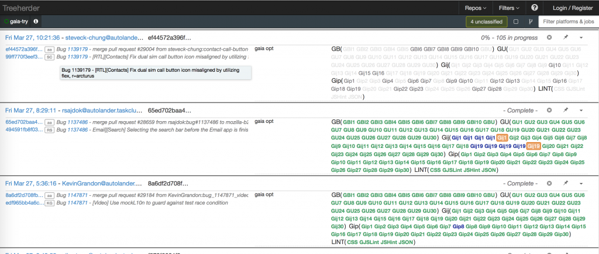
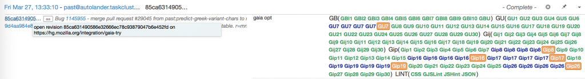
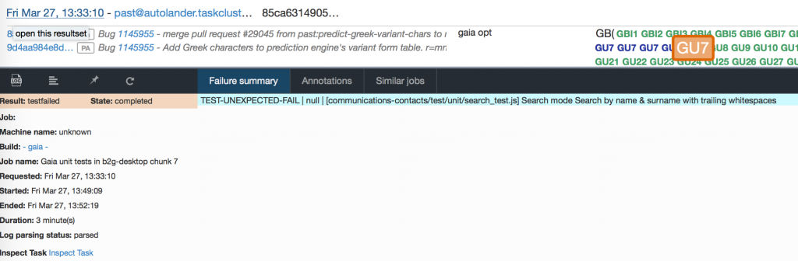
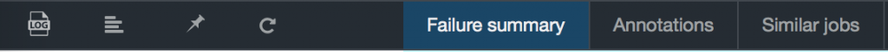
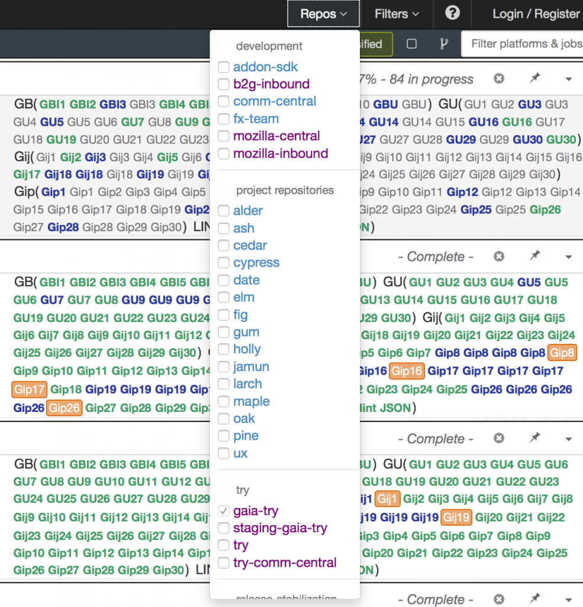
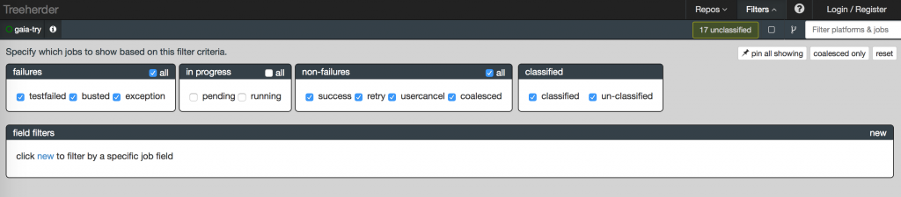

[Treeherder](https://treeherder.mozilla.org/) 是一個彙集所有測試結果的地方，它將 CI (Continuous Integration) 的測試結果彙整起來變成一個精美的報表，好讓開發者可以直接透過網頁來查看各種測試項目的最新狀態或是錯誤訊息，甚至是幫你分析發生錯誤的測試項目是否是目前某些不穩定 Bug ( Intermittent failure  ) 所引起的，然後幫你標上 Bug number。說起來 [Treeherder](https://treeherder.mozilla.org/) 就只是一個呈現 Mozilla 專案測試結果的網站，實際上背後隱藏了許多伺服器來負責幫我們分配任務、建立執行環境、跑各種不同類型的測試並輸出結果，最後由 [Treeherder](https://treeherder.mozilla.org/) 負責統整所有訊息給開發者。而有時候為了溝通方便，Mozilla 的工程師們常常將這整套的 CI 環境稱之為 Try server。

## Treeherder 的背景與幕後守護者

而 [Treeherder](https://treeherder.mozilla.org/) 的前身為 [TBPL](https://tbpl.mozilla.org/) ( Tinderboxpushlog )，它的介面與功能當然都略遜於新版的 [Treeherder](https://treeherder.mozilla.org/) 啦！然而 [TBPL](https://tbpl.mozilla.org/) 也將在 2015/03/31 日停止運作，有興趣了解舊版 [TBPL](https://tbpl.mozilla.org/) 介紹的人也可以參考 [我也想成為-mozillian！-part-2-你也來try-try-看](https://tech.mozilla.com.tw/posts/4243/%E6%88%91%E4%B9%9F%E6%83%B3%E6%88%90%E7%82%BA-mozillian%EF%BC%81-part-2-%E4%BD%A0%E4%B9%9F%E4%BE%86try-try-%E7%9C%8B)。[Treeherder](https://treeherder.mozilla.org/) 專案背後是由 [A team](https://wiki.mozilla.org/Auto-tools/The_Ateam) 打造，這個厲害的 team 聚集了許多在自動化工具領域耕耘多年的高手，專門為 Mozilla 開發部署測試環境，加速開發流程並保護軟體品質。

另外一個偉大的守護者是 [Release Engineer](https://wiki.mozilla.org/ReleaseEngineering) ，如果把專案中的原始碼 Commit History 與 Branch 想成一棵樹，[Release Engineer](https://wiki.mozilla.org/ReleaseEngineering) 之中有負責在掌管整棵大樹狀態 ( Tree status ) 的警長 ( [Sheriff](https://wiki.mozilla.org/Sheriffing/Sheriff_Duty) )，每一天都會有人輪流負責監控 Tree status 並且如果發現有合併到 tree 上的 patch 導致測試錯誤，則會進行以下處理：

- 確認是否為嚴重 / 必現問題

- 若是嚴重 / 必現問題，我們會將 trunk 的 merge 權限進行關閉 ( tree close )

- 至 Bugzilla 開 Bug 並詳述的問題發生原因

- 寄信發問

- 試著縮小問題範圍

- 找到相關的開發者或是專案 Owner 處理

- 在信上更新處理狀況

- 問題解決後，會重新將 merge 權限開啟 ( tree open )

警長的確是個不容易的工作，尤其是第5點提到的縮小問題範圍，代表警長必須對該專案有一定程度的瞭解，才能找到發生問題的範圍並通知相關開發者處理。

## Treeherder 基本介紹

接下來就讓我們來好好介紹 [Treeherder](https://treeherder.mozilla.org/) 吧！

### 主要介面

首先，一打開 [Treeherder](https://treeherder.mozilla.org/) 就會發現畫面上出現琳瑯滿目的測試項目，右半邊顯示各種類別的 Test suite 像是：GB, GU, Gij, Gip, LINT…等等，分別代表著 Gaia build test ( Gaia build system 整合測試 ), Gaia unit test ( Gaia 所有 built-in apps 的單元測試 ), Gaia javascript integration test ( Gaia 所有built-in apps 的整合測試，用 JavaScript 撰寫的版本 ), Gaia python integration test ( 與前者相似，以 python 語言撰寫的測試框架  )，LINT ( Linters 為 coding style & syntax 的檢查，就是說如果你的原始碼沒有符合我們規範的話，是無法被合併到 Mozilla codebase 中的！ )。

### Test suite 與 Try server hook

至於為什麼一個 Test suite 例如 GB 上會有好多個子項目呢？這是因為我們的 CI 系統背後利用 [Task Cluster](https://docs.taskcluster.net/) 將單一 Test suite 再進行切割並且平行處理 ( 畢竟隨著專案增長，有些 Test suite 上的 Test case 數量已經破萬了，若沒有平行處理可能會跑超過2個小時 )。所有測試項目的詳細資訊可以點選畫面右上方的 ? 來查看。

[Treeherder](https://treeherder.mozilla.org/) 的某項強大功能就是 Try server hook ，在 Gaia-try 這個分支上可以偵測 Github 的 Pull request 來啟動一次的 Treeherder Job，然後 Try server hook 還會幫你在 Pull request 的註解附上 Treeherder Job 的連結，方便我們進行追蹤，這樣一來就能在 Pull request 尚未 merge 之前就先得知自己修改的 patch 是否可以通過測試。

### 測試項目的除錯方式

除錯方面，通常有錯誤結果的測試項目都會被標示成橘色 ( Test failed ) 或紅色 ( Busted )，橘色 Test failed 表示在跑測試時有 Test case 沒有通過，而紅色的 Busted 表示該測項在尚未開始執行測試之前的環境建立階段就發生問題，例如 building failed，使得後面的測試無法正常執行，此時就會標上 Busted。

點開錯誤結果的測試項目即可查看詳細的資訊。如上圖所示，這邊有許多好用的工具列，從最左邊開始為：

- Log viewer – 測試紀錄訊息，一般除錯如果 Failure summary 資訊太少可以透過它來尋找錯誤訊息，這是新版 Treeherder 才有的新介面哦。

- Raw log – 與 Log viewer 相似，是未經任何處理的原始紀錄。

- Pin – 警長會將該錯誤 Pin 起來後加以分類，甚至標上對應的 Related bug，[Treeherder](https://treeherder.mozilla.org/) 會重新自動分析所有出現錯誤測項 的錯誤訊息，如果跟這個測項的錯誤訊息相似，就會同時被標上 Related bug，然後 Bugzilla 上會出現 Treeherder Robot 在 Related bug 上加上相關註解以便追蹤。這個功能相當重要，因為我們常常會碰到不穩定的 Intermittent bug，以為 bug 已經被解決了，但依然在之後的測試中看到相同的錯誤訊息，此時 Treeherder Robot 就會再次幫我們在那個已經 Resolved Fixed 的 Bug 上加上註解，如果被確認是個問題，該 Bug 將被再次開啟 ( Reopen )，通知相關人來處理。

- Re-trigger – 重跑測試，有時候可能是系統發生了問題或是其他原因想要重跑，我們可以直接透過 re-trigger 按鈕來重跑測試 ( 不過這項功能需要有 Mozilla 的 LDAP 權限登入後才能使用 )。

- Failure summary – Test case 只要有錯誤就會被列在這個地方，錯誤訊息則較為簡略，如果要進一步除錯，需要透過 Log viewer 或是 Raw log。

- Annotations – 此功能與 Pin 有關，主要是被加入到 Pin-board 的項目都會顯示在這裡，並且列出被分類的種類。這些功能主要是給警長等管理人員使用。

- Similar jobs – 這是 [Treeherder](https://treeherder.mozilla.org/) 另外一個非常便利的新功能，有時測試項目發生錯誤時，可能是因為他人的 patch 搞壞了整個專案，這時就可以直接透過 Similar jobs 來快速查看其他 job 上的相同測項，快速判斷是否其他人也碰到相同的錯誤，因為搞不好其他人也發生了相同錯誤，那我就不必擔心是我 patch 的問題啦！

### 選擇 Repos 來查看不同分支或專案

點開右上方的 Repos ( Repositories )，我們會看到它列出了許多 Try server 上的 repos ，有些分類依照專案區分，有些依照開發的方式區分。筆者是開發 B2G 的 Gaia developer ，所以通常都會專注觀察 b2g-inbound 與 gaia-try 這兩個分支的狀態。

### Filters 過濾測試項目的好幫手

Repos 旁邊的 Filters 功能主要是讓開發人員或擔任警長角色的管理者可以過濾出錯誤訊息，方便觀察整個 Tree status 。

### 結語

Treeherder 與其背後的 CI 系統是守護 Mozilla B2G 專案的偉大幫手，畢竟 Mozilla 開源專案 24 小時都會有來自世界各地的人在貢獻新的程式碼，Treeherder 當然也是需要 24 小時全天待命來維護專案的運作，而最後當然也要感謝 Mozilla 的 A-team 與 Release Engineer 在背後的辛苦付出，才能夠讓我們的軟體品質越來越好。
