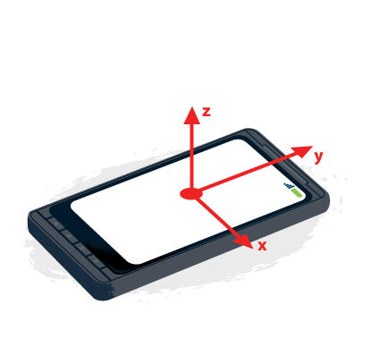

感測器元件是連接實體世界和數位世界的橋樑，將物理現象轉化為電子訊號帶入軟體的次元。感測器元件的存在更是人機互動體驗的必要條件，如利用加速規（accelerometer）、陀螺儀（gyroscope）等動作感測器把手機當方向盤的 [REAL RACING](https://www.youtube.com/watch?v=_oV3ksYrRyA#t=3m38s)賽車遊戲、 利用近距感測器（proximity sensor）當伏地挺身計數器的 [Runtastic Fitness](https://www.youtube.com/watch?v=6yW_D_Suj64#t=6m44s)、或是利用振動馬達（vibration motor）自動旋轉的全景相機 [Cycloramic](https://www.youtube.com/watch?v=Brfr7--6ESc)，都是常見的應用範例，另外還有一些瘋狂的應用像 [Send Me To Heaven](https://www.youtube.com/watch?v=pXr84w1cWIU#t=5s)。正因感測器扮演穿梭兩界的角色，所以制定它的界面也格外重要。接下來我們會先回顧目前的 W3C Sensor API，並參考 iOS與 Android上的 Sensor API設計，最後綜合討論下一代 W3C Sensor API可能的發展。

## 回顧目前的 W3C Sensor API

如果我們想要藉由 W3C Sensor API來取得裝置的感測器資料，可以使用 DeviceMotion與 DeviceOrientation來實作。DeviceMotion可以藉由加速規與陀螺儀來讀取裝置的瞬間加速度，而 DeviceOrientation則可透過磁力計與地磁比較來取得裝置的旋轉角度。

### DeviceMotion

DeviceMotion是一種 Event，固定的週期會讀取一次，我們可以透過事先設定的 Event Handler來拿到當前最新的資料：

		
		

function handler(event) {

    var x = event.acceleration.x;
    var y = event.acceleration.y;
    var z = event.acceleration.z;

    // Process data here.
}

window.addEventListener("devicemotion", handler, true);
			
				
					
				
					12345678910
				
						function handler(event) {     var x = event.acceleration.x;    var y = event.acceleration.y;    var z = event.acceleration.z;     // Process data here.} window.addEventListener("devicemotion", handler, true);
					
				
			
		

### DeviceOrientation

如 DeviceMotion，DeviceOrientation也是一種 Event，每次有新資料時就會觸發：

		
		

function handler(event) {

    // alpha: rotation around z-axis
    var rotateDegrees = event.alpha;
    // beta: rotation around x-axis
    var frontToBack = event.beta;
    // gamma: rotation around y-axis
    var leftToRight = event.gamma;

    // Process data here.
}

window.addEventListener("deviceorientation", handler, true);
			
				
					
				
					12345678910111213
				
						function handler(event) {     // alpha: rotation around z-axis    var rotateDegrees = event.alpha;    // beta: rotation around x-axis    var frontToBack = event.beta;    // gamma: rotation around y-axis    var leftToRight = event.gamma;     // Process data here.} window.addEventListener("deviceorientation", handler, true);
					
				
			
		

### Sensor API目前的缺點

上面簡單的回顧目前的功能後，我們來看看目前的 API有哪些缺點。

#### 無法取得 Sensor的 raw data

…The information provided by the events is not raw sensor data, but rather high-level data which is agnostic to the underlying source of information. Common sources of information include gyroscopes, compasses and accelerometers.

從 [Device API的介紹](https://w3c.github.io/deviceorientation/spec-source-orientation.html#introduction)來看，Low Level的 API並不存在，它的目的是為了提供 “rather high-level data"，希望程式設計師可以忽略感測器的原始資料，直接得到計算後的旋轉角度、加速度等，更專注於開發上層的應用。而從負責制定 API的 [Device Working Group](https://www.w3.org/2009/dap/#mission)的成立宗旨來看：

…enable the development of Web Applications and Web Widgets that interact with devices services such as Calendar, Contacts, Camera, etc.

W3C的目標更像是制定 Service而非 API。原始的作者之一 Jose Cantera曾經[向 W3C反應](https://lists.w3.org/Archives/Public/public-geolocation/2011Oct/0000.html)過他當初的設計是希望有 Low level的 Sensor API，但似乎沒有獲得回應。雖然很感謝 W3C替程式設計師們著想，但這樣的設計反而會限制我們無法取得原始的感測器資料。

#### 無法在任意的時間點拿到感測器資料

我們[無法在任意的時間點拿到感測器資料](https://bugzilla.mozilla.org/show_bug.cgi?id=1057185)，只有在 Sensor Event的 Callback被觸發時才能拿到感測器的資料，而觸發的條件是感測器的值有改變或是週期到了。

## iOS與 Android上的 Sensor api

知己知彼，百戰不殆；不知彼而知己，一勝一負；不知彼不知己，每戰必殆。

— 《孫子兵法》

初步了解現在 W3C Sensor API的問題和現況後，我們來看看 Sensor API在其他(對手)平台是如何運作的，借鏡他人的發展或許有助於下一代 W3C Sensor API的設計。

- iOS 從各別獨立的 UIXXX API(e.g. [UIAcceleration](https://developer.apple.com/library/prerelease/ios/documentation/UIKit/Reference/UIAcceleration_Class/index.html))邁向使用統一的 framework：[CoreMotion](https://developer.apple.com/library/ios/documentation/CoreMotion/Reference/CoreMotion_Reference/)來取得感測器資料

- 感測器都繼承同一個 base class：CMLogItem

- 使用 CMMotionManager作為讀取所有動作感測器(accel , gyro, … )的界面

- 每種感測器種類都有獨特的資料結構，讓資料處理變得更簡易

- Android 有[好幾種 framework](https://developer.android.com/guide/topics/sensors/sensors_overview.html#sensors-intro)可以選擇 [SensorManager](https://developer.android.com/reference/android/hardware/SensorManager.html):支援各種類型的感測器，有多種讀取方式可供選擇

- [Sensor](https://developer.android.com/reference/android/hardware/Sensor.html):提供數種方法讀取某一種類型的感測器

- …..

- 有 [Batch mode](https://source.android.com/devices/sensors/batching.html)的機制

- 各類感測器沒有獨特的資料結構，而是使用陣列(Array)來存取資料。與 iOS相比，這樣的設計更易於新增感測器種類，但缺點是在處理資料時需要額外的資訊。

- 兩個平台都可以提供感測器的原始資料及校正資料([Sensor fusion](https://en.wikipedia.org/wiki/Sensor_fusion))。關於兩種資料的差異及使用時機可以看 Dave Edson寫的 [Using the Accelerometer on Windows Phone 7](https://blogs.windows.com/buildingapps/2010/09/08/using-the-accelerometer-on-windows-phone-7/)來了解。

- 兩個平台都可以設定感測器的讀取頻率

W3C Sensor API未來的發展或許可以如 iOS般， 由各自獨立邁向使用統一的界面，並引進如 Android的Batch機制來減少 I/O，讓感測器更方便被管理。提供原始資料與提供 “rather high-level data"這件事其實沒有衝突，Low Level API的消失也限制了使用者設定感測器的讀取頻率的能力，這些都是我們希望在下一代 Sensor API可以改善的地方。

## 下一代 Sensor API可能的發展

總結上面的問題與需求，想像中的下一代 W3C Sensor API會長得像:

		
		

// 確認裝置上有沒有加速規
if (sensors.Accelerometer === undefined) {
  console.error('No accelerometer found');
  return;
}

// 創建加速規物件並設定讀取頻率和batch
var num = 10;
var accel = new sensors.Accelerometer({ frequency: 50 }, { batch: num });

// 開始讀取加速規
accel.start()

accel.onupdate = function() {
  // 讀取第n筆資料
  for(var n = 0 ; n < num ; n++) {
    console.log("x-axis: ", accel.x[n]);
    console.log("y-axis: ", accel.y[n]);
    console.log("z-axis: ", accel.z[n]);
  }
};

// 停止讀取加速規
if (accel.isActive()) {
  accel.stop()
}
			
				
					
				
					123456789101112131415161718192021222324252627
				
						// 確認裝置上有沒有加速規if (sensors.Accelerometer === undefined) {  console.error('No accelerometer found');  return;}  // 創建加速規物件並設定讀取頻率和batchvar num = 10;var accel = new sensors.Accelerometer({ frequency: 50 }, { batch: num }); // 開始讀取加速規accel.start() accel.onupdate = function() {  // 讀取第n筆資料  for(var n = 0 ; n < num ; n++) {    console.log("x-axis: ", accel.x[n]);    console.log("y-axis: ", accel.y[n]);    console.log("z-axis: ", accel.z[n]);  }}; // 停止讀取加速規if (accel.isActive()) {  accel.stop()}
					
				
			
		

目前 W3C下一代 Sensor API的討論都有[公開在Github](https://github.com/w3c/sensors), 有興趣的讀者可以直接上去參與討論，一起為明天的Web貢獻一份心力。

參考資料：[http://smus.com/web-sensor-api/](https://smus.com/web-sensor-api/)
