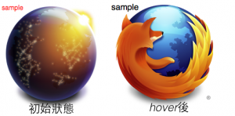

一個「生動」的網站絕對少不了 Javascript (JS) 的幫忙，很多有趣的特效交給 JS 或甚至丟給 Jquery 就對了！不過我們仔細看看 JS 裡到底做了什麼事讓我們的網站活起來呢，其實大部分的特效，JS 只是幫我們動態的去改變元素的 CSS 而已。那可以直接就在 CSS 中完成特效嗎？！完。全。沒。問。題。

舉例來說，最常見的特效就是當滑鼠移過去的時候，可以換個底圖或改變字的顏色，我們來瞧瞧 CSS 怎麼辦到的吧：

html：

		
		

    sample
 

			
				
					
				
					123
				
						
    sample 

					
				
			
		

css：

		
		

.sample{
    margin:10px;
    background:url(b.png);
    width:220px;
    height:220px;
    color:#f00;
}
.sample:hover{
   background:url(a.png);
   color:#000;
   font-size:18px;
}
			
				
					
				
					123456789101112
				
						.sample{    margin:10px;    background:url(b.png);    width:220px;    height:220px;    color:#f00;}.sample:hover{   background:url(a.png);   color:#000;   font-size:18px;}
					
				
			
		

我們只要多定義該元素的 “:hover" 這個虛擬類別 (pesudo class) 的 CSS 就可以了！！

不相信嗎？！這裡有 [live demo](https://jsfiddle.net/mpizza/3tKh6/2/)

除此之外，當滑鼠移到導覽列上，會出現下拉式選單，也可以單純用 CSS 就做出來哦！！

先來看一下 [live demo](https://jsfiddle.net/mpizza/ZNZ4N/)

在 demo 中我們可以發現到下拉式選單 (class level_2) 的 CSS 是透過 top:-1000px; 把他丟到外太空去

		
		

 .navlist>li .level_2{
  position:absolute;
  top:-1000px;
  left:-1px;
 }
			
				
					
				
					12345
				
						 .navlist>li .level_2{  position:absolute;  top:-1000px;  left:-1px; }
					
				
			
		

當滑鼠移到的父元素 .navlist>li 時，我們再設定他的 top:20px;  讓他回到地球上，登登~就完成了！！！

		
		

 .navlist>li:hover .level_2{
  top:20px;
 }
			
				
					
				
					123
				
						 .navlist>li:hover .level_2{  top:20px; }
					
				
			
		

上面兩個例子，可以發現「香蕉人」是用 :hover 去取代 JS 中 mouseover 發生後所做的事情，除此之外 :active 對應的 event 就是 mousedown。這時候一定會有人客會問，那要怎麼解決 click 這個 event 呢？！ 嗯…這時候只能問香蕉了！！好的～香蕉現在就來告訴人客，click event 並沒有辦法靠 CSS 單槍匹馬，[扑克牌制作](https://www.kylinpoker.com/) 這時候真的就需要 JS 協助了，只需要少少的幾行 JS 就可以了~

一樣我們先來看 [live demo](https://jsfiddle.net/mpizza/h2yGB/4/)

在這個例子中，香蕉人想做一個簡單的開關，當 user 點下去的時候會由「關到開」或「開到關」，

JS 的部分，只要 #handle 這個元素"聽"到 click 這個 event，就會去更改 #container 的 class

		
		

 $(function(){
  var box=$('#container');
  $('#handle').click(function(){
      if(box.attr('class')==='on-status'){
        box.removeClass('on-status');
        box.addClass('off-status');
       }else{
        box.removeClass('off-status');
        box.addClass('on-status');
       }
   });
 });
			
				
					
				
					123456789101112
				
						 $(function(){  var box=$('#container');  $('#handle').click(function(){      if(box.attr('class')==='on-status'){        box.removeClass('on-status');        box.addClass('off-status');       }else{        box.removeClass('off-status');        box.addClass('on-status');       }   }); });
					
				
			
		

接下來所有的變化全部交給 CSS 囉！！

先設定 .content 以及 #handle 預設的 CSS

		
		

 div.content{
  position:absolute;
  top:7px;
  left:10px;
  width:15px;
  height:15px;
}
div#handle{
  top:0px;
  left:0px;
  border:1px solid #f00;
  width:28px;
  height:28px;
  border-radius: 28px;
  -webkit-border-radius:28px;
  -moz-border-radius:28px;
  background:#f00;
}
			
				
					
				
					123456789101112131415161718
				
						 div.content{  position:absolute;  top:7px;  left:10px;  width:15px;  height:15px;}div#handle{  top:0px;  left:0px;  border:1px solid #f00;  width:28px;  height:28px;  border-radius: 28px;  -webkit-border-radius:28px;  -moz-border-radius:28px;  background:#f00;}
					
				
			
		

當#handle 聽到 click event 後，將 #container 的 class 改成 off-status

在 off-status 的 CSS 定義:

		
		

div.off-status div#off{
 left:40px;
}
div.off-status div#on{
  display:none;
}
			
				
					
				
					123456
				
						div.off-status div#off{ left:40px;}div.off-status div#on{  display:none;}
					
				
			
		

反之，在 on-status 的 css

		
		

div.on-status div#off{
 display:none;
}

div.on-status div#handle{
 left:40px;
 background:#00f;
 border:1px solid #00f;
}
			
				
					
				
					123456789
				
						div.on-status div#off{ display:none;} div.on-status div#handle{ left:40px; background:#00f; border:1px solid #00f;}
					
				
			
		

是不是很酷呢！！！

在 CSS3 定義更多的 animation *1 之後，各元素之間都可以靠 CSS 做出更 fancy 的效果，例如 Mozilla Taiwan [社群頁面](https://mozilla.com.tw/community/) 中切換角色時的動畫也是透過同樣的原理做出來的。

說了這麼多，一定有人會問說 JS 用起來很舒服很開心啊，為什麼要改成 CSS 呢？其實也沒有什麼不好，但是當你的網頁碰到不同 layout 的時候，其中透過 JS 處理 CSS 的部分就會很難解了，那單純用 CSS 怎麼救呢? 哈哈～這時候就要靠 Media Queries *2了！

揪~~竟~~ Media Queries 的出現帶給 CSS 什麼樣的助力呢? 讓我們再看看香蕉人下一篇的分析囉~

[](https://tech.mozilla.com.tw/wp-content/uploads/2012/08/GaryNaNa1.png)

*1 [https://developer.mozilla.org/en/CSS/CSS_animations](https://developer.mozilla.org/en/CSS/CSS_animations)

*2 [http://www.w3.org/TR/css3-mediaqueries/](https://www.w3.org/TR/css3-mediaqueries/)

*3 圖片創作 by Sarah Deng
