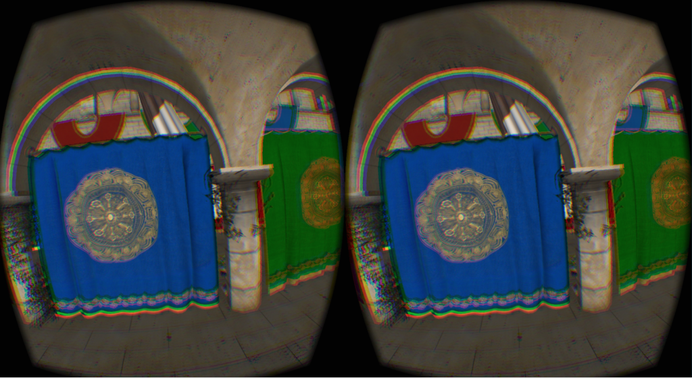
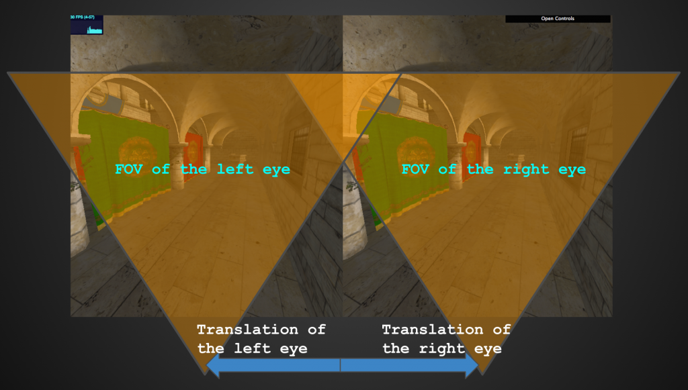

近年來在資訊業最火熱的話題無疑就是虛擬實境 (Virtual Reality，VR) 了。除了 [Oculus](https://www.oculus.com/en-us/) 推出 Oculus Rift 之外，其他如 HTC、Google、Samsung 等科技大廠亦各別推出自己的解決方案。VR 目前在遊戲、 電影、多媒體內容都有其龐大的市場需求。Mozilla 的工程師與設計師正著手將 VR 帶到 Open Web 之上，讓每個人都能透過瀏覽器輕鬆享受 VR 世界。因此我們跟 Google 合作開發實驗性的 WebAPI ── [WebVR](https://developer.mozilla.org/en-US/docs/Web/API/WebVR_API)。希望能讓這些應用透過瀏覽器的力量，使更多使用者能夠接觸到 VR。本文將會介紹 WebVR 是如何基於 HTML5 標準達到跨平台的能力，並將使用 Oculus DK2、Google Cardboard 來展示在 Firefox 桌面版、行動版 (Firefox for Android)，以及 Firefox OS 裝置上的結果。

圖 1. 使用 WebVR 的結果

## WebVR API

目前 WebVR API 定義了 Oculus 以及 Cardboard 兩種裝置，在 Firefox 桌面版可執行 Oculus 與 Cardboard 兩種模式，而行動裝置就只有 Cardboard 模式。此外是以 Oculus Rift 為 API 設計時的主要參考對象。Oculus 頭戴裝置分為兩個部分：頭戴顯示器 (Head mounted display) 以及深度攝影機 (Position sensor camera)，因此針對這兩個部分定義出 1).  [HMDVRDevice](https://developer.mozilla.org/en-US/docs/Web/API/HMDVRDevice)，來協助我們得到頭戴顯示器的顯示資訊，以及 2). [PositionSensorVRDevice](https://developer.mozilla.org/en-US/docs/Web/API/PositionSensorVRDevice) 告知我們的頭戴顯示器在三維空間中的位置 (Position) 與轉動 (Orientation)。另由於 Cardboard 模式不具備深度攝影機，所以 [PositionSensorVRDevice](https://developer.mozilla.org/en-US/docs/Web/API/PositionSensorVRDevice) 僅將告知轉動資訊。

## GetVRDevices

我們可透過 navigator.getVRDevices 取得目前使用平台可支援的裝置資訊。

		
		

navigator.getVRDevices().then(vrDeviceCallback);

function vrDeviceCallback(devices) {
  // Here, we would get all available devices.
  for (var i = 0; i < devices.length; ++i) {
    if (devices[i] instanceof HMDVRDevice) {
       vrHMD = devices[i];
    }
    // Pair HMDVRDevice and PositionSensor via hardwareUnitId
    if (vrHMD && devices[i] instanceof PositionSensorVRDevice
&& devices[i].hardwareUnitId == vrHMD.hardwareUnitId) {
      vrPosSensor = devices[i];
      // We just want to get the first VR device.
      break;
    }
  }
}
			
				
					
				
					1234567891011121314151617
				
						navigator.getVRDevices().then(vrDeviceCallback); function vrDeviceCallback(devices) {  // Here, we would get all available devices.  for (var i = 0; i < devices.length; ++i) {    if (devices[i] instanceof HMDVRDevice) {       vrHMD = devices[i];    }    // Pair HMDVRDevice and PositionSensor via hardwareUnitId    if (vrHMD && devices[i] instanceof PositionSensorVRDevice&& devices[i].hardwareUnitId == vrHMD.hardwareUnitId) {      vrPosSensor = devices[i];      // We just want to get the first VR device.      break;    }  }}
					
				
			
		

## HMDVRDevice

在 VR 裝置的設計中，最重要的部分就是模擬人類視覺。人類的雙眼視覺有其固定的可視範圍 (FOV，Field of view) 以及位移量。

在 WebVR API 中，HMDVRDevice 負責提供開發者 VR 視覺相關的參數。

		
		

// Get eye parameters from HMDVRDevice
var eyeParamsL = vrHMD.getEyeParameters( 'left' );
var eyeParamsR = vrHMD.getEyeParameters( 'right' );
// Get the translation of eyes
var eyeTranslationL = eyeParamsL.eyeTranslation;
var eyeTranslationR = eyeParamsR.eyeTranslation;
// Get the field of view of eyes
var eyeFOVL = eyeParamsL.recommendedFieldOfView;
var eyeFOVR = eyeParamsR.recommendedFieldOfView;
			
				
					
				
					123456789
				
						// Get eye parameters from HMDVRDevicevar eyeParamsL = vrHMD.getEyeParameters( 'left' );var eyeParamsR = vrHMD.getEyeParameters( 'right' );// Get the translation of eyesvar eyeTranslationL = eyeParamsL.eyeTranslation;var eyeTranslationR = eyeParamsR.eyeTranslation;// Get the field of view of eyesvar eyeFOVL = eyeParamsL.recommendedFieldOfView;var eyeFOVR = eyeParamsR.recommendedFieldOfView;
					
				
			
		

這些參數能夠讓我們產生人類視覺的立體繪圖 (Stereoscopic Rendering) [1]效果。根據立體繪圖的理論，我們使用 [WebGL](https://developer.mozilla.org/en-US/docs/Web/API/WebGL_API) 處理三維繪圖 (3D Renderering) 時，需要對同一個三維場景分別使用左右眼的視覺參數進行兩次繪圖作業。

		
		

// Setup camera projection matrix
cameraL.projectionMatrix = fovToProjection( eyeFOVL, viewNear, viewFar );
cameraR.projectionMatrix = fovToProjection( eyeFOVR, viewNear, viewFar );
// Set the view translation to camera
cameraL.translateX( eyeTranslationL.x );
cameraR.translateX( eyeTranslationR.x );

var rendererWidth = window.innerWidth * 0.5;
var rendererHeight = window.innerHeight;
// WebGL render left eye
renderer.setViewport( 0, 0, rendererWidth, rendererHeight );
renderer.setScissor( 0, 0, rendererWidth, rendererHeight );
renderer.render( sceneL, cameraL );

// WebGL render right eye
renderer.setViewport( rendererWidth, 0, rendererWidth, rendererHeight );
renderer.setScissor( rendererWidth, 0, rendererWidth, rendererHeight );
renderer.render( sceneR, cameraR );
			
				
					
				
					123456789101112131415161718
				
						// Setup camera projection matrixcameraL.projectionMatrix = fovToProjection( eyeFOVL, viewNear, viewFar );cameraR.projectionMatrix = fovToProjection( eyeFOVR, viewNear, viewFar );// Set the view translation to cameracameraL.translateX( eyeTranslationL.x );cameraR.translateX( eyeTranslationR.x ); var rendererWidth = window.innerWidth * 0.5;var rendererHeight = window.innerHeight;// WebGL render left eyerenderer.setViewport( 0, 0, rendererWidth, rendererHeight );renderer.setScissor( 0, 0, rendererWidth, rendererHeight );renderer.render( sceneL, cameraL ); // WebGL render right eyerenderer.setViewport( rendererWidth, 0, rendererWidth, rendererHeight );renderer.setScissor( rendererWidth, 0, rendererWidth, rendererHeight );renderer.render( sceneR, cameraR );
					
				
			
		

## PositionSensorVRDevice

PositionSensorVRDevice 提供關於 VR 裝置的三維座標位置與轉動方面的資訊，目前使用方式如下：

		
		

var state = vrPosSensor.getState();
// If it has orientation data.
if ( state.hasOrientation ) {
  cameraL.quaternion.set(
    state.orientation.x, 
    state.orientation.y, 
    state.orientation.z, 
    state.orientation.w);

  cameraR.quaternion.set(
    state.orientation.x, 
    state.orientation.y, 
    state.orientation.z, 
    state.orientation.w);
}
// If it has position data.
if ( state.hasPosition ) {
  cameraL.position.set(
    state.position.x, 
    state.position.y, 
    state.position.z);

  cameraR.position.set(
    state.position.x, 
    state.position.y, 
    state.position.z);
}
			
				
					
				
					123456789101112131415161718192021222324252627
				
						var state = vrPosSensor.getState();// If it has orientation data.if ( state.hasOrientation ) {  cameraL.quaternion.set(    state.orientation.x,     state.orientation.y,     state.orientation.z,     state.orientation.w);   cameraR.quaternion.set(    state.orientation.x,     state.orientation.y,     state.orientation.z,     state.orientation.w);}// If it has position data.if ( state.hasPosition ) {  cameraL.position.set(    state.position.x,     state.position.y,     state.position.z);   cameraR.position.set(    state.position.x,     state.position.y,     state.position.z);}
					
				
			
		

在更新各個幀數 (Frame) 時，即從感測器取得最新的數值，再將此數值傳給三維空間中的相機，來更新目前使用者在 VR 場景中的位置。

## Fullscreen

Fullscreen API 目前僅能用於 Oculus。在 Oculus 啟動全螢幕模式時，會像圖 1 所示開啟全螢幕濾鏡 (fullscreen filter)，其中包含幾項功能：

- 將 VR 畫面投射到頭戴顯示器。

- 校正鏡片扭曲 (Distortion) 因為 Oculus 搭配一種特殊的超廣角鏡片，讓使用者可達到 90 度的水平可視角度。此副作用就像魚眼鏡頭拍攝廣角時發生的畫面邊緣扭曲，所以需要校正。

- 校正幀率 (Framerate) 以及時空扭曲 (Timewarp) Oculus DK2 建議幀率應高於 75 Hz，低於此標準會讓使用者不舒服。Oculus 在 Windows 版本 App 中即時 (real-time) 使用預測 (prediction) 方式做到時空扭曲，藉以協助 App 補間不足的幀數。

- 顏色像差校正 (Chromatic aberration correction) 校正鏡片影響的色差，並處理立體繪圖的像差問題。

啟動方式：

		
		

canvas.mozRequestFullScreen( { vrDisplay: vrHMD } );
			
				
					
				
					1
				
						canvas.mozRequestFullScreen( { vrDisplay: vrHMD } );
					
				
			
		

## 行動裝置上的 WebVR

WebVR API 雖可用於 Firefox for Android 與 Firefox OS 之上，但並未完全支援，以下幾點要注意：

- 不支援全螢幕濾鏡 目前僅 Oculus 可用，所以整體畫面尚不夠立體，配戴 Cardboard 多少有些失真。

- PositionSensorVRDevice 支援不完全 只支援方向狀態 (orientation state)，但不支援位置狀態 ( position state)。畢竟 Cardboard 沒有深度攝影機。

- 某些裝置的方向狀態並無法運作。而我們所用的 GAME_ROTATION_VECTOR 僅支援 Android 4.3 或更高版本。可透過 [deviceorientation](https://developer.mozilla.org/en-US/docs/Web/API/Detecting_device_orientation) API 偵測是否支援該裝置。

目前 WebVR API 已進入 Firefox 每夜更新版 (Nightly)。首先可於桌機上安裝 Oculus runtime；但Firefox for Android 與 Firefox OS 上則不需安裝任何 runtime。接著下載 [Firefox Nightly](https://nightly.mozilla.org/) 並開啟之：

- 在 Firefox 的瀏覽列輸入 about:config

- layout.frame_rate 改為「75」

- 開啟「偏好設定 (Preferences)」，取消勾選「Enable multi-process Nightly」

值得注意的是，Oculus runtime 的 Mac 版本已於 [version 0.5.0.1](https://developer.oculus.com/downloads/pc/0.5.0.1-beta/Oculus_Runtime_for_OS_X/) 停止更新，主因是 Oculus 要將主力放在 Windows 平台。而目前的 [version 0.8.0.0](https://developer.oculus.com/downloads/pc/0.7.0.0-beta/Oculus_Runtime_for_Windows/) 也是 WebVR API 在跟隨的主要版本。瀏覽器先前的垂直同步率 (VSync) 最多只能到 60Hz，但此一限制會嚴重影響 Oculus 顯示器的效果 (其規格為 75Hz，低於此規格會讓使用者頭暈)。layout.frame_rate 可協助我們將目前的更新頻率提高到 Oculus 的建議值，以提供更好的使用者體驗。

## 結語

VR 的應用吸引了許多開發者的目光。為了支援立體繪圖，其整體圖形效能需求比以往高出許多，其幀率約為 VR 關閉時的一半。目前很多繪圖卡廠商為了此一熱門的產業，也都開始優化自己的整體繪圖程序，期待能夠讓使用者更容易接觸到這些應用。另一方面，體感控制對於 VR 也是很重要的議題。在 WebVR 的應用上，可考慮透過 [Gamepad API](https://developer.mozilla.org/en-US/docs/Web/API/Gamepad_API) 以抓到電腦上安裝的搖桿驅動程式，同時也可嘗試使用 [Leapmotion](https://www.leapmotion.com/) 手勢操作三維場景中的三維物件。此影片是筆者在 Whistler Workweek 做的 Leapmotion 整合 Firefox OS WebVR 展示：x

如果讀者對於 VR 應用有興趣，歡迎來試試 WebVR API。此外，Mozilla 的 VR 團隊剛發表的 [A-Frame](https://aframe.io/) 也可讓開發者透過標記 (markup) 與基本組裝元件 (building block)，在 Web 上快速建構 VR 內容。有了 A-Frame，即便你沒時間了解底層的 WebVR API，也能單純地使用 HTML5 標記來打造酷炫的跨裝置 VR 內容。如果想進一步了解 Web 的開發方式，則可參考範例 [2][3]。當然另也可以聯絡筆者，一起在 Web 上帶來更多創新的 VR 應用吧！

[1] [https://hacks.mozilla.org/2015/09/stereoscopic-rendering-in-webvr/](https://hacks.mozilla.org/2015/09/stereoscopic-rendering-in-webvr/)

[2] Demo source code, [http://daoshengmu.github.com/ConsoleGameOnWeb/](https://daoshengmu.github.com/ConsoleGameOnWeb/)

[3] three.js VR demo, [http://threejs.org/examples/#vr_cubes](https://threejs.org/examples/#vr_cubes)
