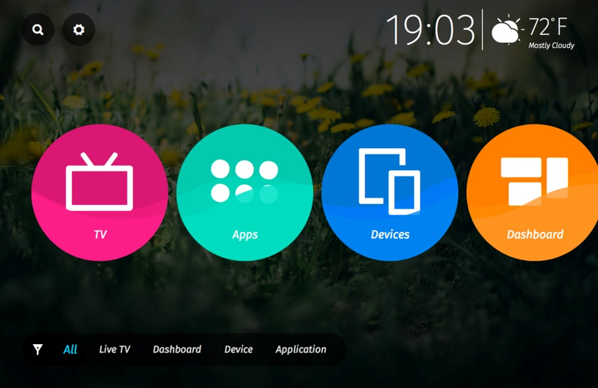
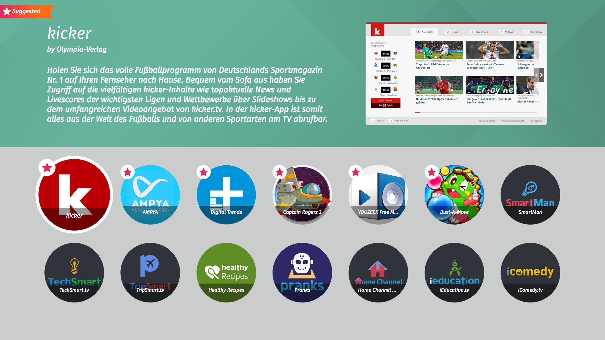
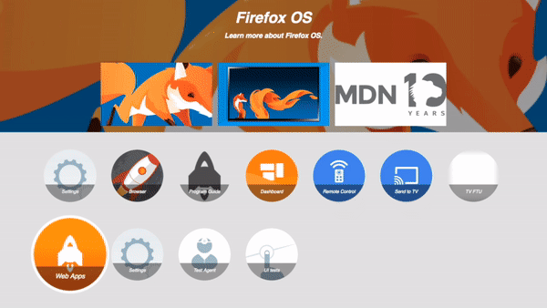
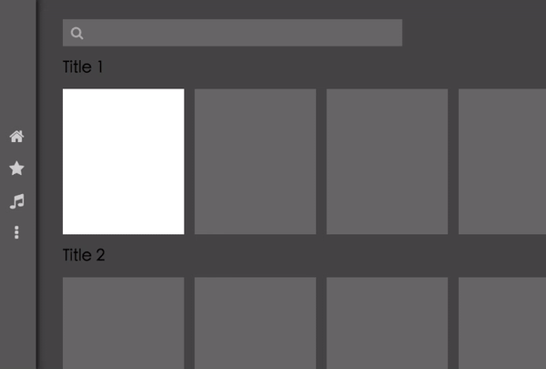

當初我們決定要將 Firefox OS 應用到智慧電視 (Smart TV) 上時，第一個遇到的問題便是操作介面的不同。在一般的電視使用情境下，使用者通常不會有滑鼠或是觸碰螢幕，能拿來操作的是那少少幾個按鍵的電視遙控器 (好吧，其實現在電視遙控器上的按鍵還不少)。在將 Firefox OS 這樣一個 Web 平台作為手機作業系統時，開發 App 就像是在做手機版的網頁，兩者的操作並沒有什麼不同；但換到 TV 上，想像你還是在做一個網站，但使用者手邊卻只有鍵盤可以和你的網站互動，那樣的體驗似乎不太自然！

事實上，只用按鍵來操作系統的需求，早在我們開發 TV 之前就遇到了。當時我們曾討論過到底要做多少修改，才能將 Firefox OS 套用到只有非觸碰式螢幕的手機上 (像是傳統的功能性手機)。其實這比 TV 更複雜得多。因為 TV 本來就打算重新設計介面，所以使用者經驗 (User Experience；UX) 可以重新設計並適應鍵盤。但如果想維持既有的 Firefox OS 手機介面又要額外支援按鍵操作，可就是個大工程了。

我們一般將這個按鍵操作機制稱為「[空間巡航 (Spatial Navigation)](https://en.wikipedia.org/wiki/Spatial_navigation)」。相信大多數人對這個機制並不陌生，因為傳統手機幾乎都是透過方向鍵操作的，遊戲機與電視機上盒等設備的介面也都是用方向鍵操作；此外，包含 Firefox 在內的許多 Android 版本瀏覽器，也都能讓人用實體方向鍵瀏覽網頁中可互動的元素。因此，為了實現這個機制，我們首先想到的就是去研究 Firefox for Android 裡是如何實作這個功能的。

這[程式碼並不難找](https://dxr.mozilla.org/mozilla-central/source/toolkit/modules/SpatialNavigation.jsm)，但可惜其功能單純且沒有客制化的空間，基本上就是按 Tab 鍵切換的加強版。這倒不是批評，我們理解 Firefox for Android 支援按鍵操作的目的，是為了讓所有的網頁都能「基本上正常使用」。換句話說，Firefox for Android 並沒有要最佳化按鍵操作的體驗。畢竟對沒有預期要應用在 TV 上的網頁來說，「最佳」的操作體驗必然來自於滑鼠或觸碰式螢幕。

但如果想用 Web 技術來做 TV 原生應用程式，例如主畫面、App 列表、節目表、設定畫面等，單只是「基本上正常使用」還不夠。讓我們以現在 Firefox OS TV 上的主畫面為例：

根據 UX 設計，當目前游標停在中間排的「Devices」圖示上時，我們希望按下「上」方向鍵應會讓游標直接跳到左上角的「搜尋 (即放大鏡的圖示)」上。但依照 Firefox for Android 的演算法，其實右邊的「設定 (即齒輪圖示)」才是下一個目標。換個角度，當游標停在「搜尋」圖示上時按了「下」方向鍵，較好的體驗應該是讓游標回到上一次選到的應用程式圖示，也就是「Devices」。然而，Gecko 理論上會將游標跳回距離最近的圖示，卻不是你心裡想要的圖示。因此我們發現，這件事不是只靠演算法就可以解決的問題。

於是，我們把希望放到了一份 [W3C 的「草稿 (Draft)」](https://drafts.csswg.org/css-ui/#nav-dir)上。其中的「Directional focus navigation」正符合我們所需。先來看看用法：

		
		

button { position:absolute }

button#b1 {
  top:0; left:50%;
  nav-right:#b2; nav-left:#b4;
  nav-down:#b2; nav-up:#b4;
}

button#b2 {
  top:50%; left:100%;
  nav-right:#b3; nav-left:#b1;
  nav-down:#b3; nav-up:#b1;
}

button#b3 {
  top:100%; left:50%;
  nav-right:#b4; nav-left:#b2;
  nav-down:#b4; nav-up:#b2;
}

button#b4 {
  top:50%; left:0;
  nav-right:#b1; nav-left:#b3;
  nav-down:#b1; nav-up:#b3;
}
			
				
					
				
					12345678910111213141516171819202122232425
				
						button { position:absolute } button#b1 {  top:0; left:50%;  nav-right:#b2; nav-left:#b4;  nav-down:#b2; nav-up:#b4;} button#b2 {  top:50%; left:100%;  nav-right:#b3; nav-left:#b1;  nav-down:#b3; nav-up:#b1;} button#b3 {  top:100%; left:50%;  nav-right:#b4; nav-left:#b2;  nav-down:#b4; nav-up:#b2;} button#b4 {  top:50%; left:0;  nav-right:#b1; nav-left:#b3;  nav-down:#b1; nav-up:#b3;}
					
				
			
		

很清楚可以看到，這份草稿定義了「nav-left」、「nav-right」、「nav-up」、「nav-down」共四個 CSS 屬性（統稱 nav-dir），用以指定游標在某方向所應跳往的下個元素；這也可以指定「auto」，讓瀏覽器自行計算畫面上符合條件的下一個元素。如果畫面上另嵌入不同的框架 (frame) 時，這份規格 (Specification) 甚至定義了該如何指定 frame 中的元素。此份草稿可解決我們在 TV 上的大多數需求，不過問題就在於這目前還只是草稿，包含 Gecko 在內的大部分瀏覽器均尚未實作。

但就算使用了 nav-dir 的 CSS 屬性，我們還需要考慮些次要問題。回到上面舉的主畫面範例，我們當然可以讓每個 App 圖示的 nav-up 指向「搜尋」，但是卻沒辦法預先定義好「搜尋」的 nav-down；這是因為使用者最後一次選到的 App 不盡相同。又或者我們設計了一個對話框在畫面上，雖然在對話框底下的元素都仍可見，但不代表在對話框的邊緣按方向鍵時應該要跑出對話框以外 (所以我們不能單純設定 nav-dir 為 auto)。

以上需求促使我們必須採用 JavaScript，以因應不同的情境而動態改變 nav-dir 的值。但在這個時候，我們可能會需要一個與「當我們指定 nav-dir 為 auto 時」相同的演算法來尋找所需元素，以便在 JavaScript 和 CSS 互動時能保有一致性。但可惜的是這個 API 還沒好 (可參考 [bug 449165](https://bugzilla.mozilla.org/show_bug.cgi?id=449165))。

退而求其次，既然一定得動用到 JavaScript，那何不仿照 nav-dir 的概念，用純粹的 JavaScript 做一套函式庫，讓網頁立刻能支援 Spatial Navigation，而不用等待 API 的實作？

所以我們試著在 Gaia 中實作了一個 [spatial_navigator.js 函式庫](https://github.com/luke-chang/gaia/blob/master/shared/js/smart-screen/spatial_navigator.js)。功能很簡單，就是指定某個元素的四個方向範圍內，計算出最靠近的元素。首先套用這個函式庫的就是正在開發中的 TV 主畫面。在反覆測試的過程中，我們也一步步改良了演算法，讓程式的行為能盡量符合使用者的期待。如果你對此函式庫的演算法有興趣，可以[參考 MDN 上的文件](https://developer.mozilla.org/en-US/docs/Mozilla/Firefox_OS/TV/TV_remote_control_navigation#Algorithm_design)。

在第一版 Firefox OS TV 上市後，我們希望將 Gaia 已經在用的一部分函式庫推廣給社群，幫助他們能更輕鬆開發 TV 最佳化的 Web App，當然其中也包含了 spatial_navigator.js。

由於這套函式庫當初是為了 Gaia 設計，用了很多 ES6 語法，對舊的瀏覽器相容性沒有那麼好；又因為一開始是給 Gaia 使用，一些對 Gaia 套件的相依性導致它不易推廣，所以就有了重構的計畫，也出現了後來的 [js-spatial-navigation 函式庫](https://github.com/luke-chang/js-spatial-navigation)。

你可以想像 js-spatial-navigation 是個跨瀏覽器的「封裝 (wrapper)」，包裝了 spatial_navigator.js 演算法。其基本的用法如下：

		
		

window.addEventListener('load', function() {
  SpatialNavigation.init();
  SpatialNavigation.add({ selector: 'a' });
  SpatialNavigation.makeFocusable();
  SpatialNavigation.focus();
});
			
				
					
				
					123456
				
						window.addEventListener('load', function() {  SpatialNavigation.init();  SpatialNavigation.add({ selector: 'a' });  SpatialNavigation.makeFocusable();  SpatialNavigation.focus();});
					
				
			
		

(可以在 [GitHub 上找到更多的範例頁面](https://luke-chang.github.io/js-spatial-navigation/demo/))

與舊版相較，此版函式庫引入了「section」的概念，目的是把畫面上所有可讓游標停駐的元素分成不同區塊以利管理，且讓不同的 section 可以有各自不同的客制化設定。例如上述的對話框就可以是獨立的一個 section，只要設定成對話框以內的元素都沒辦法巡航到對話框的範圍之外，也就解決了我們剛剛提到的問題了。

前後這兩版函式庫不僅幫助我們開發出第一版 Firefox OS TV 所有的內建 App，也在後續的 TV 開發專案中扮演著很重要的角色。像是 [TV 專用的「市集」網站](https://marketplace.firefox.com/tv/)也是基於新版函式庫來實現按鍵操作。而且因為已經是跨瀏覽器相容，所以也能在桌機上用不同的瀏覽器來操作。

同時另外一個計畫是希望在 TV 專用的「設定 (Settings)」App 完成前，先讓 Firefox OS Phone 上的「設定」 App 也能正常運作在 TV 環境中，以便開發及測試之時能立即修改 TV 的設定值。這個計畫即借助了 js-spatial-navigation，在盡可能不改變「設定」App 的程式架構下，成功讓方向鍵可以操作「設定」App。下圖的影片是真實操作的情況。你也可以找到 Gaia 的 master branch，親自建置出 TV 的 profile 體驗。

最後再提一個有趣的開發過程好了。

在開發此函式庫期間，我會試著用此一函式庫模仿一些市面上現成的 TV 最佳化網站 UI，幫自己找出這個函式庫不足的地方，或是無法輕易實作的功能，以便在未來作為改進的方向。下圖就是尚未完成的仿 Youtube TV 介面的展示頁，[原始碼可以參考這裡](https://github.com/luke-chang/js-spatial-navigation/blob/demo_3.2/demo/3.2_like_youtube_tv.html)。

我相信基於 JavaScript 的空間巡航函式庫只是一個過渡產品。長遠來看，讓瀏覽器能原生支援 Spatial Navigation 相關的 API 才會是最佳的結果。不過在那之前，我希望 js-spatial-navigation 能或多或少幫助到一些有需要的人。此外，js-spatial-navigation 一定還有很多進步空間，也歡迎提出任何心得或問題。
