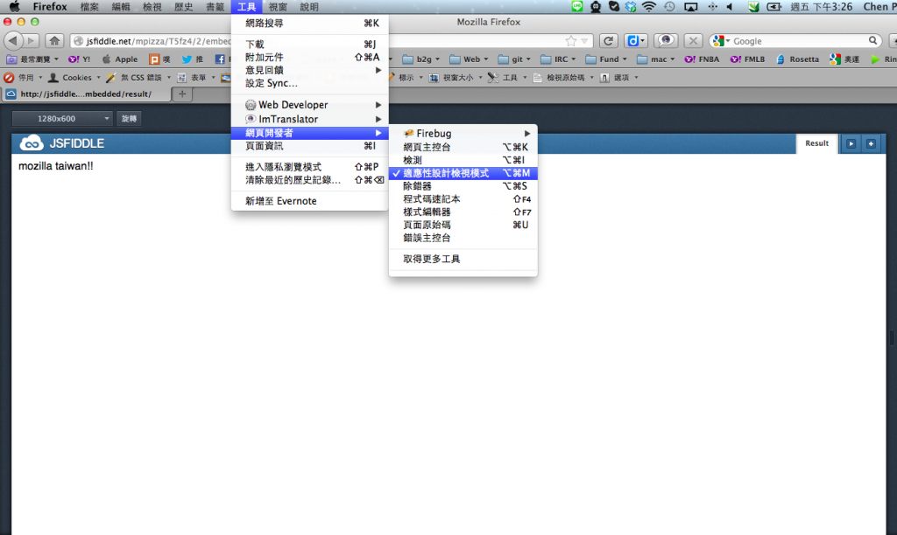

接續上週的介紹，今天來談談，為~~~什麼我們要多用 CSS 而少用 JS 來做動畫呢? 原因之一，就是今天的主角 media queries 啦！Media queries 主要可以用來對付來自四面八方，奇奇怪怪的解析度。

你或許會問，這些奇奇怪怪的解析度打哪來的呢?! 除了現在人手 N 支智慧型手機，每一支 Device 的尺寸都不同，還有桌機上的營幕一個比一個大，未來還有 Smart TV 的加入，可怕的解析度戰國時代，真是搞的前端工程師一個頭兩個大啊!!!!還好我們有 media queries。到底有多神奇呢? 我們繼續看下去:

		
		

@media all and (min-width: 768px) and (max-width: 1280px) {
    body{
      font-size:16px;
    }
}
@media all and (min-width: 480px) and (max-width: 768px) {
    body{
      font-size:22px;
    }
}
@media all and (min-width: 320px) and (max-width: 480px) {
    body{
      font-size:28px;
    }
}
@media all and (max-width: 320px) {
    body{
      font-size:32px;
    }
}
			
				
					
				
					1234567891011121314151617181920
				
						@media all and (min-width: 768px) and (max-width: 1280px) {    body{      font-size:16px;    }}@media all and (min-width: 480px) and (max-width: 768px) {    body{      font-size:22px;    }}@media all and (min-width: 320px) and (max-width: 480px) {    body{      font-size:28px;    }}@media all and (max-width: 320px) {    body{      font-size:32px;    }}
					
				
			
		

上面的 CSS 一口氣定義了四種不同解析度的 font-size 能確保同一個網頁在不同的解析度中，user 都可以舒服的閱讀網頁。

問題來了~ 用 media queries 寫好的 CSS 要怎麼測試呢? 如果你沒有 Wozniak 的背包 *1， 最簡單的方式就是，手動調整瀏覽器的視窗。但是，生在高科技，資訊爆炸的時代，有沒有更棒的方法呢?! 登~登~登~ Firefox 就是這麼貼心!!

[Firefox 15.0](https://www.mozilla.com.tw/firefox/) 版提供了一個超酷，超方便的工具，點選「工具」-> 「網頁開發者」 -> 「適應性檢視模式」如圖:

貼心的 Firefox 就可以輕鬆幫你模擬各種解析度，甚至還可以「旋轉」，太誇張了!!!!

好了，我們收下 Firefox 帶給我們驚奇的心，來看看 [Live Demo](https://jsfiddle.net/mpizza/T5fz4/2/embedded/result/)! 這真是~太神奇了，我們的字型大小隨著不同的解析度變大了!!! 或許你會說，這 JS 也辦的到或者透過 PHP,  python 等等去偵測解析度，然後去設定不同的 CSS 就好了，沒錯! 這你知道，我知道，獨眼龍也知道!

但是香蕉人光是想上面四個不用 RANGE 解析度的判斷式，[扑克牌制作](https://www.kylinpoker.com/) 頭腦就要打結了，更何況 media queries 輕鬆寫意就達成了!!! 何不就使用media queries呢? 哦~大家還記得使用 :hover 這個方式來改變背景圖，來取代 mouseover 更換背景圖的這件事嗎([這篇來幫你復習一下](https://tech.mozilla.com.tw/posts/642/%E6%B2%92%E6%83%B3%E5%88%B0css%E4%B9%9F%E5%81%9A%E7%9A%84%E5%88%B0%EF%BC%9F%EF%BC%81))?! 如果加上media queries 就更有搞頭了，我們可以在media queries 中，在不同的解析度設定不同大小的背景圖，這件事我想用JS處理就很麻煩了!!

		
		

@media all and  (min-width: 768px) and (max-width: 1024px) {
 div.bt{
    background:url(<strong>bk-a-1024-768.jpg</strong>)
 }
 div.bt:hover{
    background:url(<strong>bk-b-1024-768.jpg</strong>)
 }
}
@media all and (<strong>max-width: 320px</strong>) {
 div.bt{
    background:url(<strong>bk-a-320-480.jpg</strong>)
 }
 div.bt:hover{
    background:url(<strong>bk-n-320-480.jpg</strong>)
 }
}
			
				
					
				
					12345678910111213141516
				
						@media all and  (min-width: 768px) and (max-width: 1024px) { div.bt{    background:url(<strong>bk-a-1024-768.jpg</strong>) } div.bt:hover{    background:url(<strong>bk-b-1024-768.jpg</strong>) }}@media all and (<strong>max-width: 320px</strong>) { div.bt{    background:url(<strong>bk-a-320-480.jpg</strong>) } div.bt:hover{    background:url(<strong>bk-n-320-480.jpg</strong>) }}
					
				
			
		

所以啦，如果我們，利用 JS 在不同 event 下，去改變元素的 class 屬性，儘可能的都透過不同 class 的 CSS 去控制我們的網頁 layout，再加上 media queries 這利器，網頁就會乖乖的在不同的解析度上正常呈現啦!! 最後再來個 Live Demo啦，嘿嘿，這次的 Demo 是[Mozilla Taiwan](https://mozilla.com.tw/)的官網首頁。登~登~登~~行動版登場啦~~~

[](https://tech.mozilla.com.tw/wp-content/uploads/2012/08/mobile.png)

香蕉領進門，修行在個人 更多的 [Media_queries](https://developer.mozilla.org/en/CSS/Media_queries/) 在這裡 https://developer.mozilla.org/en/CSS/Media_queries/

*1 Wozniak 的背包 http://chinese.engadget.com/2012/07/18/the-amazing-contents-of-steve-wozniaks-travel-backpac/
