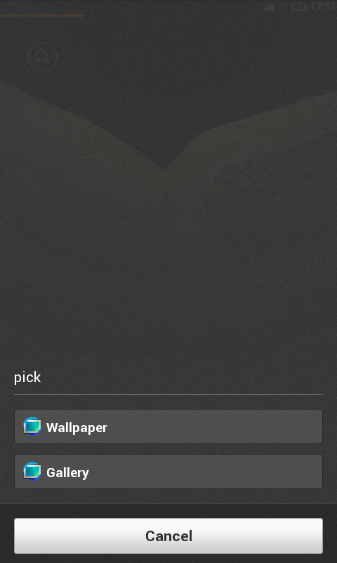

Web activity 是由 Mozilla 設計並開發，用來使 web app 之間共享資源的框架。在 Firefox OS 中已經存在 Platform/UI 上的實作，並且有一些內建的主要 Web app 已經利用 Web activity 來達成跨應用程式溝通的目的。（如：Gallery 使用它來讓其他程式從它挑選圖片，也用同一技術來實現圖片分享到不同應用）

### 請求者 (Requester)

假設今天 E-mail 應用程式需要從圖片集中挑選圖片來寄送，那麼它必須新增一個 Activity 物件如下：

		
		

var a = new MozActivity({
  name: 'pick',
  data: {
    type: 'image/png'
  }
});
			
				
					
				
					123456
				
						var a = new MozActivity({  name: 'pick',  data: {    type: 'image/png'  }});
					
				
			
		

type 欄位是用來當 filter 用的

在 data 中的其他欄位可以傳你想要的資料給接收方。

當收到資料後，處理回呼函數的方式：

		
		

a.onsuccess = function on_success() {
  var image = a.result;
};
a.onerror = function on_error() {
  console.warn('error when picking!');
};
			
				
					
				
					123456
				
						a.onsuccess = function on_success() {  var image = a.result;};a.onerror = function on_error() {  console.warn('error when picking!');};
					
				
			
		

### 接收者 (Receiver)

接受某個 Activity 的 App 必須在 Manifest.webapp 中宣告：

		
		

"activities": {
  "pick": {
    "filters": {
      type: ["image/png", "image/gif"],
    },
    "disposition": "window"
  }
}
			
				
					
				
					12345678
				
						"activities": {  "pick": {    "filters": {      type: ["image/png", "image/gif"],    },    "disposition": "window"  }}
					
				
			
		

並且在自己的 javascript 檔中寫好當 Activity 產生時的處理函式

		
		

navigator.setMozMessageHandler('activity', function(a) {
  var image = getImageToReturn();
  if (!image) {
    a.postError("NoImage");
    return;
  }
  a.postResult({ type: "image/png", url: image });
});
			
				
					
				
					12345678
				
						navigator.setMozMessageHandler('activity', function(a) {  var image = getImageToReturn();  if (!image) {    a.postError("NoImage");    return;  }  a.postResult({ type: "image/png", url: image });});
					
				
			
		

### data/type的用法

如聯絡人程式可以接受同一個叫做 pick 的 Activity，但是電子郵件程式需要的是’email’這類資料，而電話程式需要的是’號碼’這類資料，對於這兩類資料需要呈現的 UI 與最後傳回去的資料當然會是不一樣的。

解決方法就是利用不同的 data type 來區分同種 activity 的不同需求：

		
		

// Email app
var a = new MozActivity({
  name: 'pick',
  data: {
    type: 'web-content/email'
  }
});
			
				
					
				
					1234567
				
						// Email appvar a = new MozActivity({  name: 'pick',  data: {    type: 'web-content/email'  }});
					
				
			
		

		
		

// Dialer app
var a = new MozActivity({
  name: 'pick',
  data: {
    type: 'web-content/numbers'
  }
});
			
				
					
				
					1234567
				
						// Dialer appvar a = new MozActivity({  name: 'pick',  data: {    type: 'web-content/numbers'  }});
					
				
			
		

在聯絡人程式中

		
		

navigator.setMozMessageHandler('activity', function(a) {
  switch(a.source.data.type) {
  case 'webcontacts/numbers':
    // ...
    break;
  case 'webcontacts/email':
    // ...
    break;
  }
});
			
				
					
				
					12345678910
				
						navigator.setMozMessageHandler('activity', function(a) {  switch(a.source.data.type) {  case 'webcontacts/numbers':    // ...    break;  case 'webcontacts/email':    // ...    break;  }});
					
				
			
		

如此一來就可以分開處理 UI 變化及後續回傳資料的部分。

### 多於一個可以處理的 Reciever?

比如挑選 Homescreen 的 Wallpaper 有兩個以上的應用程式可以挑的時候，

Firefox OS 的系統 UI 便會自動列出可用的應用程式清單，如圖：

GAIA 時其實是收到一個從 GECKO 發出的事件 (mozChromeEvent），包含 activity 來源資料以及可以處理該 activity 的應用程式列表。當使用者點選某個選項後，GAIA 會再發另一個事件 (mozContentEvent）到 Gecko 告訴他要用哪一支程式來處理，Gecko 則會再透過另一個 mozChromeEvent 來叫 GAIA 的 Window manager 來開啟該應用程式。這是目前 GAIA 跟GECKO 溝通運作的方式。

### 實際在應用程式之間傳圖片的方式？

因為 Web activity 目前只能傳送純文字資料，所以實際上是先用 HTML5 的 Canvas 載入圖片後，將整個 Canvas 轉成dataURL，如此一來就變成一個很長的文字可以傳送了，sample code 如下：

		
		

function getBase64Image(img) {
  var canvas = document.createElement("canvas");                                                                             
  canvas.width = img.width;
  canvas.height = img.height; 
  var ctx = canvas.getContext("2d");
  ctx.drawImage(img, 0, 0); 
  var dataURL = canvas.toDataURL("image/png", 0.2);
  return dataURL;
}
			
				
					
				
					123456789
				
						function getBase64Image(img) {  var canvas = document.createElement("canvas");                                                                               canvas.width = img.width;  canvas.height = img.height;   var ctx = canvas.getContext("2d");  ctx.drawImage(img, 0, 0);   var dataURL = canvas.toDataURL("image/png", 0.2);  return dataURL;}
					
				
			
		

接收方如果是要拿來當背景圖的話只要直接把 url(dataURL) 塞進 backgroundImage 屬性就可以了。

### disposition 屬性的差異

定義 activity 時的 disposition 欄位目前有 window 跟 inline 兩種選項。[麻将牌](https://www.kylinpoker.com/mahjong.htm) 主要不同點在於呼叫接收方時，window 是會真正切換到該應用程式，而且預設並不會回傳資料給請求方。如點 email/http link 時會啟動 email 程式或瀏覽器的行為。inline 用在需要從接收方選某些資料來使用時，此時接收方只是暫時出現在前景程式上方，選完資料就會關閉。
